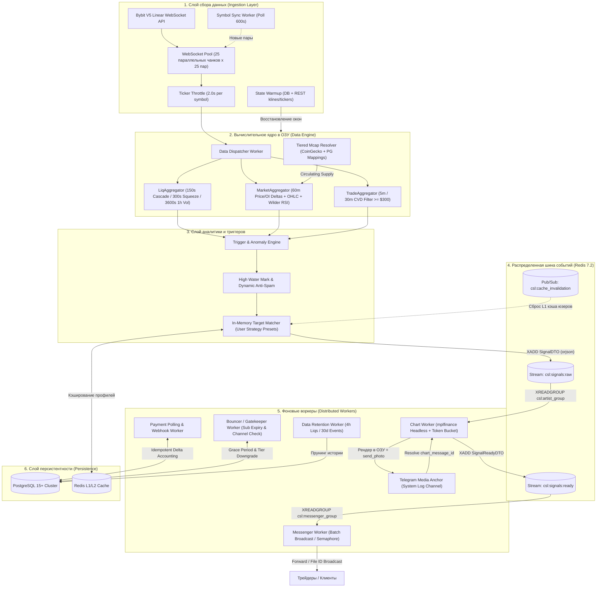
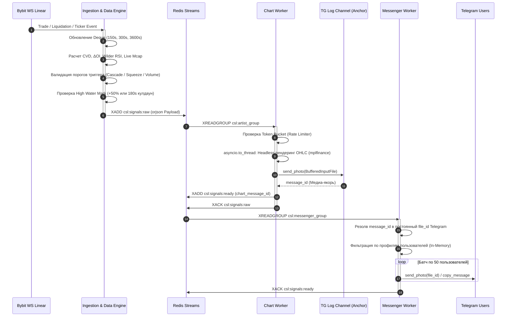

# ⚡ Bybit Liquidation Terminal

[](https://python.org)
[](https://docs.aiogram.dev)
[](https://bybit-exchange.github.io/docs/v5/intro)
[](https://redis.io)
[](https://postgresql.org)
[](https://docs.sqlalchemy.org)
[](https://alembic.sqlalchemy.org)
[](https://docker.com)

Высоконагруженный распределенный аналитический терминал для потокового мониторинга ликвидаций, дельты открытого интереса ($\Delta OI$) и кумулятивной дельты объемов ($CVD$) по всему фьючерсному рынку **Bybit V5 Linear (620+ торговых пар)** в режиме реального времени.

Архитектура построена по событийно-ориентированной модели (EDA) с разделением контуров сбора данных, генерации аналитики, рендеринга медиа и многопоточной доставки алертов через шину событий на базе **Redis Streams**.

---

## 🏗️ Архитектура системы (High-Level System Design)

Система декомпозирована на изолированные сервисы с асинхронным межпроцессным взаимодействием через брокер Redis:



---

## ⚡ Потоковый пайплайн обработки сигнала (Sequence Diagram)



---

## 🚀 Ключевые инженерные решения

### 1. Отказоустойчивый пул WebSocket-соединений (Ingestion Pool)
* **Чанкирование сокетов:** Для параллельного стриминга 620+ тикеров создается пул из 25 постоянных TCP-соединений (`config.WS_CHUNK_SIZE = 25`). Инициализация чанков выполняется с градиентной задержкой ($\ge 2.0$ сек), исключая срабатывание WAF Bybit на этапе handshake.
* **Троттлинг тикеров:** Поток котировок топика `ticker` искусственно сглаживается с помощью скользящего окна (`TICKER_THROTTLE_SEC = 2.0s`), разгружая Event Loop от миллионов избыточных апдейтов в сутки.
* **Активный супервизор (Watchdog):** Фоновый воркер проверяет таймстампы `last_heartbeat` сокетов. Если конкретный чанк не передает данные дольше 180 секунд, он автоматически изолируется и переподключается на лету (`reconnect_chunk`) без перезапуска всего процесса.
* **Синхронизация новых листингов (`symbol_sync`):** Каждые 10 минут система запрашивает спецификации биржи и бесшовно подключает новые торговые пары в сокеты с доступной емкостью.

### 2. Алгоритмический In-Memory Data Engine
* **Скользящие окна на `collections.deque`:** Полный отказ от дисковых запросов в горячем цикле аналитики. В памяти ведутся независимые структуры очередей:
  * 150 сек — детекция каскадов (15+ событий с высокой плотностью);
  * 300 сек — выявление сквизов ($\text{sum\_5m} \ge 30\%$ от часового объема);
  * 3600 сек — планомерное накопление крупных объемов;
  * 60 мин — поминутные срезы цен и открытого интереса ($\Delta OI$ / $\Delta Price$).
* **Изолированная аналитика Long / Short:** Механика закрытия позиций Bybit V5 разделена на независимые структуры данных, исключая смешивание встречных ликвидационных волн.
* **Вычисление RSI Уайлдера без внешних C-библиотек:** Реализован нативный расчет показателя RSI (RMA) на чистом Python с L1-мемоизацией свечей. Отказ от `TA-Lib` устранил сложности контейнеризации и снизил оверхед.
* **Double-Gate Fundamental Filter (Market Cap):** Фильтрация щиткоинов базируется на расчете динамической капитализации через связку с CoinGecko API и ручной таблицей маппинга тикеров в PostgreSQL. Сигнал валидируется одновременно по USD-порогу и относительному объему от эмиссии монеты.

### 3. Паттерн «Медиа-Якорь» и оптимизация сети Telegram
* **Проблема:** Генерация и загрузка уникального графика каждому из сотен пользователей парализует сеть и приводит к блокировкам по `TelegramRetryAfter`.
* **Решение:** Отрисованный в памяти график (`io.BytesIO`) загружается ровно один раз в закрытый системный канал (`LOG_CHANNEL_ID`). Воркер доставки извлекает полученный `file_id` Telegram и кэширует его в Redis. Массовая рассылка осуществляется по готовому `file_id` без повторного рендеринга и повторного аплоада байтов на сервера Telegram.
* **Защита CPU воркера рендеринга (Token Bucket):** Нагрузка на `matplotlib` контролируется алгоритмом корзины токенов (емкость 40, восстановление 0.36 токенов/сек). При экстремальной волатильности система автоматически отключает рендер графиков для второстепенных сигналов, сохраняя стабильность процессинга.

### 4. Идемпотентный финансовый учет (Delta Accounting)
* **Изоляция транзакций:** Поддержка нескольких провайдеров (P2P H2H эквайринг банковских карт РФ/СБП через CactusPay, криптовалютный эквайринг Cryptomus, CryptoPay и ручные переводы на холодные кошельки с админской верификацией чеков).
* **Защита от двойных начислений:** 
  1. Блокировка процесса распределенным Redis-локом `csl:lock:payment:user:{id}` на 15 сек.
  2. Селективная пессимистичная блокировка строк транзакции в PostgreSQL через `with_for_update()`.
  3. Дельта-учет: источником истины выступает фактическая разница между суммой инвойса и ранее зачисленными транзакциями `DEPOSIT`. Дублирование вебхуков исключено на уровне схемы БД.

### 5. Контекстно-независимая локализация (Fluent i18n)
* **Сложные грамматические формы:** Использование стандарта Mozilla Project Fluent (`.ftl`) с поддержкой специфических правил плюрализации славянских языков.
* **Decoupled Runtime:** Разработан собственный движок `background_i18n`, решивший фундаментальную проблему фреймворков, привязанных к `ContextVar` входящих апдейтов Telegram. Фоновые демоны (`bouncer`, `payment_worker`, `messenger_worker`) генерируют персонализированные сообщения на нужном языке пользователя без активного контекста диалога.

---

## 📂 Структура проекта

```text
signal_bot/
├── alembic/                    # Миграции базы данных (22 версионных скрипта)
├── assets/                     # Статические медиа и языковые пакеты
│   ├── images/                 # Продакшн-ассеты и инфографика воронки
│   └── locales/                # Словари Fluent FTL (en / ru)
├── docs/                       # Системная документация и спецификации архитектуры
│   ├── architecture/           # Data Engine, Ingestion и Interface слои
│   ├── RELEASES/               # Чейнджлоги ключевых релизов платформы
│   └── hive_structure.md       # Спецификация распределенного "Улья"
├── src/
│   ├── bot/                    # Presentation Layer (aiogram 3.x)
│   │   ├── filters/            # Пользовательские и админские фильтры
│   │   ├── handlers/           # Обработчики интерфейса, онбординга, шопа и BI
│   │   ├── keyboards/          # Фабрики инлайн-клавиатур и меню
│   │   ├── middlewares/        # Аналитика, защита от флуда, инъекция сессий БД
│   │   └── utils/              # Форматтеры дашбордов и экранов метрик
│   ├── core/                   # Core Utilities & Infrastructure
│   │   ├── config.py           # Pydantic v2 конфигурация окружения
│   │   ├── dto.py              # DTO-структуры данных (orjson сериализация)
│   │   ├── i18n_runtime.py     # Контекстно-независимый движок локализации
│   │   ├── redis_bus.py        # Клиент шины событий Redis Streams
│   │   └── security.py         # Хэширование и валидация подписей вебхуков
│   ├── database/               # Persistence Layer
│   │   ├── crud/               # Изолированные доменные сервисы данных (CRUD)
│   │   ├── models.py           # Декларативные схемы SQLAlchemy 2.0 (Mapped)
│   │   └── session.py          # Асинхронный пул сессий PostgreSQL (asyncpg)
│   ├── services/               # Business Logic & Distributed Workers
│   │   ├── aggregators/        # Скользящие окна (Liq, Market, Trade)
│   │   ├── indicators/         # Собственная имплементация Wilder's RSI
│   │   ├── ingestion/          # WebSocket пул Bybit, прогрев и синхронизация
│   │   ├── logic/              # Движок триггеров и платежный процессор
│   │   ├── monitoring/         # BI метрики, дашборды и рассыльщик
│   │   ├── payments/           # Клиенты эквайрингов (Cactus, Cryptomus, CryptoPay)
│   │   ├── rendering/          # Headless генератор графиков (mplfinance)
│   │   └── workers/            # Фоновые сервисы (Bouncer, Messenger, Retention)
│   └── main.py                 # Точка входа сервиса
├── docker-compose.yml          # Оркестрация контейнеров (Brain, Redis, Postgres)
├── docker-entrypoint.sh        # Скрипт миграций и запуска
├── Dockerfile                  # Оптимизированный мультистейдж образ
└── requirements.txt            # Зафиксированные производственные зависимости
```

---

## ⚙️ Конфигурация окружения (`.env.example`)

Для запуска системы настройте переменные окружения:

```env
# =================================================================
# ПАРАМЕТРЫ ОКРУЖЕНИЯ
# =================================================================
PROJECT_NAME=gruzbery_prod
EXTERNAL_DB_PORT=5433

# НАСТРОЙКИ БАЗЫ ДАННЫХ
DB_USER=postgres
DB_PASSWORD=пароль_сюда
DB_NAME=bybit_bot
# DB_URL формируется автоматически внутри docker-compose
REDIS_PASSWORD=пароль_redis_сюда
REDIS_PORT=6379
# REDIS_URL формируется автоматически из REDIS_PASSWORD и REDIS_PORT

# API ТОКЕНЫ И ИНТЕГРАЦИИ
BOT_TOKEN=токен_бота_сюда
PAYMENT_MANUAL_WALLET=TEc4cgRjPL5RBsqWpgqe23hHSCnhRvW6oJ
ADMIN_PAYMENT_CHAT_ID=-1004389834083
LOG_CHANNEL_ID=-100...
NEWS_CHANNEL_ID=-100...
COMMUNITY_GROUP_ID=-100...
COMMUNITY_GROUP_LINK=https://t.me/...
GUIDE_URL=ссылку_сюда
SUPPORT_URL=ссылку_сюда

# =================================================================
# ПАРАМЕТРЫ РАБОТЫ
# =================================================================
# Прокси (оставь пустым на сервере, если не нужно)
PROXY_URL= 
# Список монет-исключений в формате JSON
IGNORED_SYMBOLS='["BTCUSDT", "ETHUSDT", "SOLUSDT", "XRPUSDT", "DOGEUSDT", "ADAUSDT", "AVAXUSDT", "DOTUSDT"]'
```

---

## 🚀 Быстрый старт (Deployment)

### 1. Клонирование и инициализация окружения

```bash
git clone https://github.com/Curr3ncyV01D/signal_bot.git
cd signal_bot
cp .env.example .env
```

### 2. Запуск контейнеров через Docker Compose

```bash
docker compose up -d --build
```

Контейнер `db` поднимет кластер PostgreSQL, `redis` инициализирует шину потоков, а `app` автоматически применит миграции Alembic (`alembic upgrade head`), выполнит прогрев исторических срезов цен и открытого интереса через REST API Bybit и запустит параллельный WebSocket-пул.

---

## 🛠️ Стек технологий

* **Среда исполнения:** `Python 3.11+`, `Asyncio`
* **Фреймворк взаимодействия:** `aiogram 3.28+`
* **Биржевой протокол:** `Bybit V5 Linear WebSocket / REST` (`pybit`)
* **Очереди и шина событий:** `Redis 7.2` (Streams, Pub/Sub, Distributed Locks)
* **База данных:** `PostgreSQL 15+`, `SQLAlchemy 2.0 (Async Engine)`, `Alembic`
* **Сериализация данных:** `orjson` (High-Performance C-JSON)
* **Графический рендеринг:** `mplfinance (Agg headless)`, `matplotlib`, `io.BytesIO`
* **Локализация:** `Project Fluent (.ftl)`, `fluent.runtime`
* **Инфраструктура:** `Docker`, `Docker Compose`
