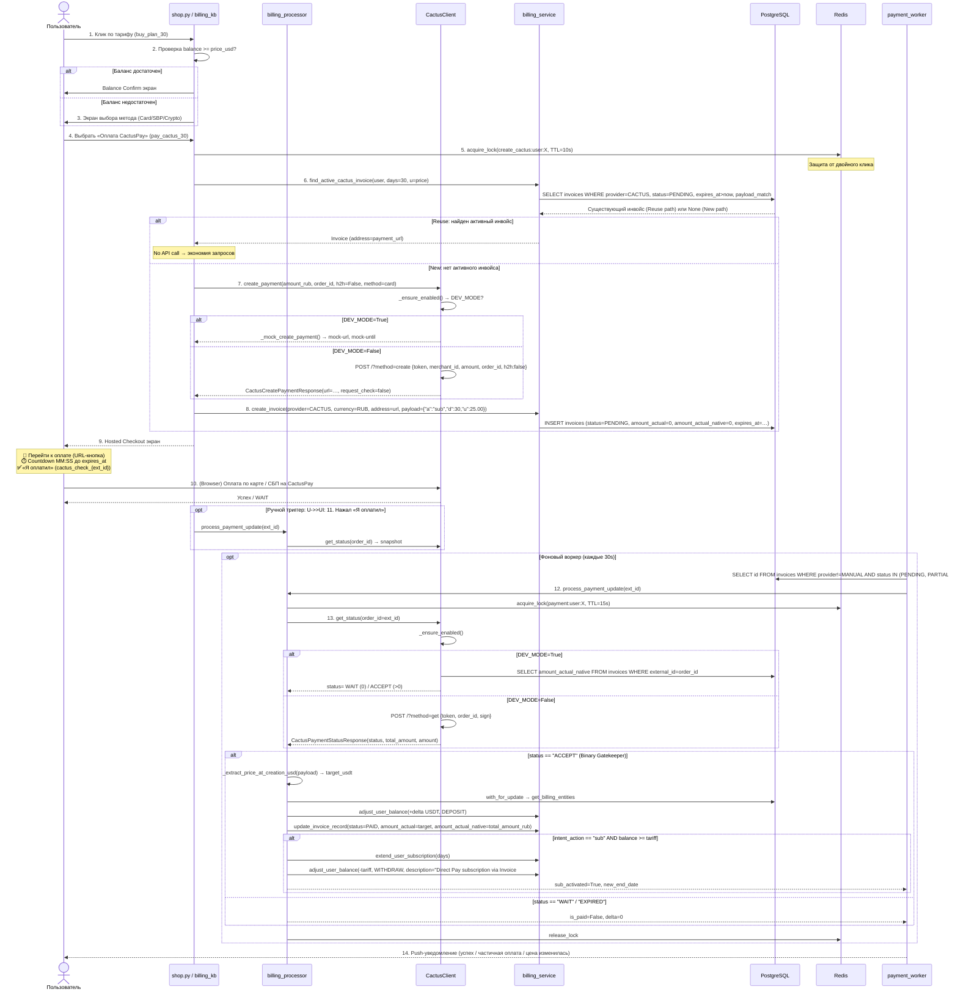

# CactusPay Integration (Фиатный шлюз: Карты РФ / СБП)

> **Документ класса Reference + Explanation (Diátaxis)**  
> Первичный источник истины — кодовая база CSL. Планы реализации `ICactus_pay_*.md` использованы только как контекст эволюции архитектуры.

---

## 1. Архитектурный обзор (Overview & Architecture)

### 1.1 Назначение провайдера CACTUS

Провайдер `CACTUS` реализует приём фиатных платежей в валюте **RUB** через платёжный агрегатор CactusPay без прохождения пользователем внешних верификаций (KYC). Поддерживаемые методы оплаты:
- 💳 Банковские карты РФ (Visa / MasterCard / МИР)
- ⚡ Система быстрых платежей (СБП)
- 📱 QR-код (через Hosted Checkout)

Ключевая характеристика: **Hosted Checkout** — пользователь переходит на внешнюю защищённую страницу CactusPay, выбирает метод оплаты и возвращается в бот.

### 1.2 Место CactusPay в структуре «Улья» (Hive Architecture)

```
┌─────────────────────────────────────────────────────────────────────────┐
│                         Interface Layer (UI)                             │
│  shop.py → billing_kb.py → shop.ftl (ru/en)                             │
│  • Выбор тарифа → Выбор метода оплаты → Hosted Checkout экран           │
│  • callback: cactus_check_{ext_id} (ручной триггер проверки)            │
└──────────────────────────────────┬──────────────────────────────────────┘
                                   │ PaymentUpdateDTO
                                   ▼
┌─────────────────────────────────────────────────────────────────────────┐
│                     Business Logic Layer (Processor)                    │
│  billing_processor.py::process_payment_update()                         │
│  • _get_provider_payment_snapshot(CACTUS) → с status-шлюзом ACCEPT      │
│  • Delta-Accounting: payload["u"] → credited_amount_usdt                │
│  • Redis-лок: csl:lock:payment:user:{user_id} (TTL=15s)                 │
│  • Транзакционные блокировки: with_for_update()                         │
└──────────────────────────────────┬──────────────────────────────────────┘
                                   │
                                   ▼
┌─────────────────────────────────────────────────────────────────────────┐
│                      Gateway Layer (Providers)                          │
│  cactus_client.py::CactusClient                                         │
│  • create_payment(h2h=False) → CactusCreatePaymentResponse(url=…)       │
│  • get_status(order_id) → CactusPaymentStatusResponse                   │
│  • Auth: token в JSON-body + MD5-sign (задел)                           │
│  • DEV_MODE: mock → «зеркало БД» (amount_actual_native → статус)        │
└──────────────────────────────────┬──────────────────────────────────────┘
                                   │
                                   ▼
┌─────────────────────────────────────────────────────────────────────────┐
│                    Persistence Layer (CRUD + Models)                    │
│  billing_service.py::create_invoice / find_active_cactus_invoice        │
│  models.py::Invoice (currency=RUB, native-поля, expires_at, payload)    │
│  • address = payment_url (Hosted Checkout)                              │
│  • payload["u"] = Price-At-Creation (USDT)                              │
└──────────────────────────────────┬──────────────────────────────────────┘
                                   │
                                   ▼
┌─────────────────────────────────────────────────────────────────────────┐
│                    Background Automation Layer                          │
│  payment_worker.py::payment_checker_worker()                            │
│  • Polling-цикл: CACTUS != MANUAL → попадает в очередь проверок        │
│  • Expire-политика: expires_at > INVOICE_EXPIRE_MINUTES (120)           │
│  • Уведомления: успех / частичная оплата / брошенная корзина            │
└─────────────────────────────────────────────────────────────────────────┘
```

### 1.3 Mermaid: Полный жизненный цикл Hosted Checkout



---

## 2. Слой хранения и Модель данных (Data Model & Schema)

### 2.1 Модель `Invoice`: Поля специфичные для фиатных/рублёвых шлюзов

Таблица `invoices` в [models.py](file:///root/signal_bot/src/database/models.py#L108-L134), колонки, добавленные специально для мультивалютности и CactusPay:

| Поле | Тип | Назначение для CACTUS | Значение по умолчанию |
|---|---|---|---|
| `currency` | `String(3)` | Код валюты native-полей. Для Cactus всегда `"RUB"`. Для крипто-провайдеров `"USD"`. | `"USD"` |
| `amount_expected_native` | `Float` | Ожидаемая сумма **в валюте провайдера** (например, `3000.00` RUB). Используется при рендере UI и clamp'е до `CACTUS_MIN_AMOUNT_RUB`. | `0.0` |
| `amount_actual_native` | `Float` | **Фактически оплаченная сумма в RUB**, полученная из `CactusPaymentStatusResponse.total_amount`. Обновляется ТОЛЬКО при `status=ACCEPT`. Используется в DEV_MODE mock-режиме как детерминирующий фактор статуса. | `0.0` |
| `expires_at` | `DateTime` (TIMESTAMP WITHOUT TZ → naive UTC) | Индивидуальный TTL платёжной ссылки CactusPay. Берётся из `requisite.until_timestamp` API или вычисляется как `now + CACTUS_INVOICE_LIFETIME_SEC`. Primary источник истины для экспирации в воркере (приоритет над глобальным 120-минутным таймаутом). | `NULL` |
| `address` | `String(128)` | Для крипты — адрес кошелька. **Для CACTUS — URL Hosted Checkout** (`payment_url` из `CactusCreatePaymentResponse.url`). Переиспользуется при `find_active_cactus_invoice()`. | `NULL` |
| `payload` | `String(255)` | JSON-строка с Price-At-Creation защитой и intent-метаданными. См. §2.2. | `NULL` |

Базовые семантические поля `Invoice`:
- `provider` = `"CACTUS"` (строка, регистронезависимо в CRUD)
- `amount_expected` — целевая сумма в USDT для зачисления (равна `payload["u"]`)
- `amount_actual` — фактически зачисленная USDT-сумма (обновляется процессором при ACCEPT)
- `status` — жизненный цикл: `PENDING → PARTIAL → PAID` или `PENDING → EXPIRED`

### 2.2 Спецификация `Invoice.payload`: Защита Price-At-Creation

Поле `payload` — JSON-объект, сериализованный в строку. Структура для Cactus-инвойсов (генерируется в `_build_subscription_payload()` в [shop.py](file:///root/signal_bot/src/bot/handlers/shop.py#L62-L69)):

```json
{
  "a": "sub",
  "d": 30,
  "u": 25.00
}
```

| Ключ | Тип | Назначение (Safety Rationale) |
|---|---|---|
| `"a"` | `string` | **Intent Action**: Действие, которое должен выполнить процессор после успешного платежа. Для подписок — `"sub"`. |
| `"d"` | `integer` | **Intent Days**: Количество дней подписки. Используется для разрешения тарифа в `config.TARIFFS[d]` при автоактивации и при поиске `find_active_cactus_invoice()`. |
| `"u"` | `float` (2 знака) | **Price-At-Creation in USDT**: Цена в USDT, **зафиксированная в момент создания инвойса**. Ключевая защита от: |
| | | • **Гонки изменения тарифов**: Если админ поменяет `config.TARIFFS[30].price_usd` с 25 на 30 во время оплаты пользователя, процессор начислит 25 USDT по старой цене. |
| | | • **Дрейфа курса**: RUB→USDT конвертация фиксирована на клиенте, не зависит от внешних курсов на момент подтверждения. |
| | | Восстановление: Первичный → `payload["u"]`. Fallback → `config.TARIFFS[d].price_usd`. Если fallback <=0 → `invoice.amount_expected` (ultimate defense). |

Парсинг в процессоре: `_extract_price_at_creation_usd()` и `_parse_invoice_intent()` в [billing_processor.py](file:///root/signal_bot/src/services/logic/billing_processor.py#L39-L98).

### 2.3 Order Flooding Protection: `find_active_cactus_invoice()`

Метод в [billing_service.py](file:///root/signal_bot/src/database/crud/billing_service.py#L248-L343) предотвращает создание дублирующих платёжных ссылок CactusPay для одного и того же тарифа пользователя.

**Условия переиспользования инвойса** (все должны совпасть):

1. **Провайдер**: `provider == "CACTUS"` или `"cactus"` (регистронезависимо)
2. **Статус**: `status == "PENDING"`
3. **Не истёк**: `expires_at IS NOT NULL` AND `expires_at > get_utc_now()` (с учётом naive UTC колонки)
4. **Intent-совпадение**: `payload.a == "sub"` AND `payload.d == days` (тот же тариф)
5. **Price-At-Creation совпадение**: `round(payload.u, 2) == round(amount_to_pay_usd, 2)` (та же цена в USDT)

Если совпадение найдено — возвращается самый свежий `ORDER BY created_at DESC` инвойс. UI восстанавливает:
- `external_id` (для callback `cactus_check_`)
- `address` (payment_url для кнопки-ссылки)
- `amount_expected_native` (сумма RUB для UI)
- `expires_at` (для countdown)

API-вызов в `CactusClient.create_payment()` — **не выполняется** (сэкономленный запрос к шлюзу).

Дополнительная защита на слое UI: **пер-пользовательский Redis-лок** `csl:lock:create_cactus:user:{user_id}` (TTL=10s) в `_start_cactus_payment_flow()` ([shop.py L218-L231](file:///root/signal_bot/src/bot/handlers/shop.py#L218-L231)), блокирующий Race Condition при двойном клике по кнопке.

---

## 3. Шлюзовый клиент `CactusClient`

Класс в [cactus_client.py](file:///root/signal_bot/src/services/cactus_client.py#L77-L562). Singleton-экземпляр: `cactus_client` (экспорт L685).

### 3.1 Конфигурация (из [config.py](file:///root/signal_bot/src/core/config.py#L61-L67))

| Переменная `.env` | Назначение | Дефолт |
|---|---|---|
| `CACTUS_MERCHANT_ID` | ID мерчанта CactusPay | `None` |
| `CACTUS_SECRET_KEY` | Секретный токен (используется как `token` в body) | `None` |
| `CACTUS_API_URL` | Базовый URL API | `"https://lk.cactuspay.pro/api"` |
| `CACTUS_INVOICE_LIFETIME_SEC` | Fallback-TTL инвойса (сек), если API не вернул `until_timestamp` | `480` (8 минут) |
| `CACTUS_H2H_METHOD` | Дефолтный H2H-метод (не используется в Hosted-режиме) | `"card"` |
| `CACTUS_REQUEST_TIMEOUT_SEC` | HTTP-timeout запросов | `15` |
| `DEV_MODE` | Глобальный флаг мок-режима (§3.4) | `False` |

Свойство `enabled`: `bool(CACTUS_SECRET_KEY) OR DEV_MODE`. Если `enabled=False` — `create_payment()` / `get_status()` поднимают `CactusConfigurationError` (кроме DEV_MODE, где `_ensure_enabled` — no-op).

### 3.2 Метод `create_payment()`

Сигнатура ([L395-L486](file:///root/signal_bot/src/services/cactus_client.py#L395-L486)):

```python
async def create_payment(
    amount_rub: float,
    order_id: str,
    *,
    description: str | None = None,
    h2h: bool = True,          # В реальном UI: h2h=False (Hosted)
    user_ip: str = "127.0.0.1",
    method: str | None = None, # "card" / "sbp"
    redirect_url: str | None = None,
) -> CactusCreatePaymentResponse
```

**Валидация на входе**:
- `amount_rub >= CACTUS_MIN_AMOUNT_RUB = 100.0` — иначе `CactusAPIError`. В UI это обработано clamp'ом вверх до 100 RUB (без изменения USDT-части).

**HTTP-структура запроса** (реальный режим, `_request` L332-L393):
- `POST {CACTUS_API_URL}/?method=create`
- `Content-Type: application/json`
- Body (JSON):
  ```json
  {
    "token": "<CACTUS_SECRET_KEY>",
    "merchant_id": "<CACTUS_MERCHANT_ID>",
    "amount": "3000.00",
    "order_id": "cactus_<user>_<uuid>",
    "h2h": false,
    "sign": "<MD5(merchant_id + amount + order_id + secret_key)>",
    "description": "CSL Subscription — 30 days",
    "user_ip": "127.0.0.1",
    "method": "card",
    "redirect_url": null
  }
  ```

**Нормализация ответа**: Метод `_normalize_requisite_payload()` ([L143-L237](file:///root/signal_bot/src/services/cactus_client.py#L143-L237)) выполняет defensive-парсинг H2H-реквизитов, но в **Hosted-режиме** (`h2h=False`) `shop.py` игнорирует поле `requisite` полностью — использует **только** `CactusCreatePaymentResponse.url`.

`CactusCreatePaymentResponse`:
- `url: str | None` — единственное используемое поле. Ссылка на Hosted Checkout.
- `request_check: bool` — флаг от API (логируется, не используется).
- `requisite: dict | None` — нормализованные H2H-реквизиты (используются mock-режимом и логируются).

### 3.3 Метод `get_status()`

Сигнатура ([L488-L556](file:///root/signal_bot/src/services/cactus_client.py#L488-L556)):

```python
async def get_status(*, order_id: str) -> CactusPaymentStatusResponse
```

**HTTP-структура запроса**:
- `POST {CACTUS_API_URL}/?method=get`
- Body:
  ```json
  {
    "token": "<CACTUS_SECRET_KEY>",
    "merchant_id": "<CACTUS_MERCHANT_ID>",
    "order_id": "cactus_<user>_<uuid>",
    "sign": "<MD5(merchant_id + '' + order_id + secret_key)>"
  }
  ```
  Примечание: Для `get_status` amount в sign — **пустая строка** (специфика Cactus API).

**Нормализация ответа** (L536-L546):
- `total_amount = result.total_amount OR result.paid_amount OR "0"` — фактически оплаченные RUB
- `status = (result.status OR result.payment_status OR "WAIT").upper()`
- `amount = result.amount OR "0"` — ожидаемые RUB

`CactusPaymentStatusResponse`:
- `status: str` — `"WAIT"` (в обработке), `"ACCEPT"` (успех), `"EXPIRED"`, `"FAIL"` и т.д.
- `amount: float` — ожидаемая сумма (RUB)
- `total_amount: float` — **фактически оплаченная сумма (RUB)** (используется в процессоре при ACCEPT)
- `profit: float` — комиссия шлюза (информационно)

### 3.4 Реактивный Mock-режим (`DEV_MODE`)

При `config.DEV_MODE=True` методы `create_payment` / `get_status` вызывают `_mock_create_payment()` / `_mock_get_status()` вместо реальных HTTP-запросов.

**Философия mock-режима: «Зеркало БД»** (а не независимый генератор).

Mock `create_payment` ([L239-L275](file:///root/signal_bot/src/services/cactus_client.py#L239-L275)):
- Генерирует детерминированные реквизиты (`cardNumber="2200123412341234"` / `receiverPhone="+79990000000"`, получатель `IVAN IVANOV`, банк `Sberbank`).
- Возвращает `url = https://pay.cactuspay.pro/mock/mock_cactus_<uuid>` (валидный https:// URL, проходит UI-валидацию).
- `until_timestamp = now + CACTUS_INVOICE_LIFETIME_SEC`.

Mock `get_status` ([L277-L330](file:///root/signal_bot/src/services/cactus_client.py#L277-L330)) — **критическая логика детерминированного тестирования**:
1. Открывает сессию к PostgreSQL, ищет `Invoice` по `external_id == order_id`.
2. Считывает `invoice.amount_actual_native` (фактическая сумма RUB, которую QA запишет руками в БД).
3. **Детерминированное правило**:
   ```
   amount_actual_native == 0 → status = "WAIT",   total_amount = 0
   amount_actual_native > 0  → status = "ACCEPT", total_amount = amount_actual_native
   ```
4. Если БД недоступна → fallback `status="WAIT"`.

**Почему «зеркало БД» вместо self-invented mock?**  
- Один источник истины для DEV-тестирования (и воркер, и «Я оплатил» идут через одну функцию `process_payment_update` → один `_mock_get_status`).
- Исключает drift mock-логики от процессора — процессор тестируется в тех же условиях, что и прод.
- Простой сценарий для QA: изменить одну ячейку в `invoices.amount_actual_native` → нажать «Я оплатил» или подождать воркера.

### 3.5 Аутентификация API: реальный механизм

**Реализовано в коде (Primary)**: **`token` в JSON-body запроса**.  
Поле `token` в каждом `create` и `get` запросе содержит значение `CACTUS_SECRET_KEY` «как есть» (без хеширования). Это соответствует актуальной документации CactusPay API.

**MD5-подпись (Secondary, задел)**: Метод `_generate_sign()` ([L120-L128](file:///root/signal_bot/src/services/cactus_client.py#L120-L128)) вычисляет `md5(merchant_id + amount_str + order_id + secret_key)`, отправляется в поле `sign`. Для `get_status` amount_str — пустая строка. В текущей версии API шлюз поле `sign` не запрашивает, но его отправка безвредна и гарантирует forward-совместимость.

### 3.6 Webhook-валидаторы (задел на будущее)

Функции, не привязанные к HTTP-роутеру (в проекте нет aiohttp/FastAPI, только aiogram polling). Подготовлены для будущего подключения.

**`validate_cactus_webhook_signature()`** ([L564-L624](file:///root/signal_bot/src/services/cactus_client.py#L564-L624)):
- Проверяет `received_signature` против 3 канонических вариантов (поскольку документация Cactus не экспортирует точный формат):
  1. Variant A: `MD5(body_bytes + secret_key).hexdigest().lower()`
  2. Variant B: `HMAC-SHA256(body_bytes, key).hexdigest().lower()`
  3. Variant C: `HMAC-SHA256(body_bytes, key)` → base64 (обычный + lowercase)
- Строгое сравнение через `hmac.compare_digest` (anti timing-attack).
- Без `secret_key` / пустого `body` / пустого `received_signature` → немедленно `False` (fail-fast).

**`validate_cactus_webhook_event_payload()`** ([L627-L682](file:///root/signal_bot/src/services/cactus_client.py#L627-L682)):
- Tolerant-извлечение `(order_id, status, amount_rub, cactus_internal_id)` с fallback на все вариации имён полей:
  - order_id: `order_id` / `orderId` / `invoice` / `invoice_id` / `external_id`
  - status: `status` / `payment_status` / `state` (upper())
  - amount: `amount` / `total_amount` / `paid_amount`
- Fail-fast если `order_id` отсутствует или `amount_rub < 0`.

---

## 4. Бизнес-логика: Процессор и Delta-Accounting

Ключевой модуль: [billing_processor.py](file:///root/signal_bot/src/services/logic/billing_processor.py).

### 4.1 Константы и Gatekeeper-статусы

```python
CACTUS_PROVIDER = "CACTUS"
CACTUS_SUCCESS_STATUS = "ACCEPT"   # Жёсткий шлюз для зачисления
PAYMENT_LOCK_TTL_SEC = 15         # TTL распределённого Redis-лока
EXPIRED_PROVIDER_STATUSES = {"expired", "cancel", "cancelled", ...}
```

### 4.2 Снапшот провайдера: `_get_provider_payment_snapshot()`

Функция ([L111-L154](file:///root/signal_bot/src/services/logic/billing_processor.py#L111-L154)) возвращает кортеж:
```
(provider_status_normalized: str, credited_amount_usdt: float, actual_native_amount: float)
```

**Логика для провайдера CACTUS** ([L136-L152](file:///root/signal_bot/src/services/logic/billing_processor.py#L136-L152)):

1. **Вызов шлюза**: `cactus_client.get_status(order_id=invoice.external_id)` → `response`.
2. **Статус-шлюз (Binary Gatekeeper)**:  
   `if response.status.lower() != "accept" → return (provider_status, 0.0, 0.0)`
   
   ⚠️ **Критически важный invariant**: Любой статус, кроме `ACCEPT`, **даёт нули** на выходе. Ни WAIT, ни EXPIRED, ни FAIL **не могут** записать что-либо в `amount_actual_native` или начислить баланс. Данные из API допускаются в систему ТОЛЬКО при буквальном совпадении `ACCEPT`.

3. **При ACCEPT — конвертация Delta-Accounting**:
   ```python
   price_at_creation_usd = _extract_price_at_creation_usd(invoice.payload)
   if price_at_creation_usd is None or <= 0:
       # Fallback-цепочка: config.TARIFFS[days].price_usd → invoice.amount_expected
       _, intent_days = _parse_invoice_intent(invoice.payload)
       tariff = config.TARIFFS.get(intent_days)
       fallback = tariff.price_usd if tariff else invoice.amount_expected
       target_usdt = fallback if fallback > 0 else invoice.amount_expected
   else:
       target_usdt = price_at_creation_usd   # Primary путь (99% кейсов)

   actual_native_rub = response.total_amount  # RUB факт (для логов/отображения)
   return ("paid", target_usdt, actual_native_rub)
   ```

**Отличие от крипто-провайдеров**:
- Cryptomus/CryptoPay: `credited_amount_usdt` = фактическая сумма от провайдера (в USDT)
- Cactus: `credited_amount_usdt` = **Price-At-Creation фиксация** (payload["u"]), а **фактические RUB (`response.total_amount`) записываются только в `amount_actual_native` как информационное поле** и **не участвуют в расчёте баланса**.

Это реализует паттерн **Delta-Accounting для cross-currency**: сумма к зачислению (delta в USDT) решается в момент создания инвойса, а не подтверждения.

### 4.3 `_resolve_effective_paid_amount()` и Отсутствие tolerance для Cactus

Для крипто-провайдеров работает механизм `PAYMENT_TOLERANCE_USD=0.5`:  
`actual_amount = 24.60 (ожидается 25.00) → shortfall=0.40 ≤ 0.5 → округляем до 25.00`

**Для CACTUS tolerance-логика физически отключена** (хотя функция существует):
- В `process_payment_update` ветка `provider_name == CACTUS_PROVIDER` ([L582-L586](file:///root/signal_bot/src/services/logic/billing_processor.py#L582-L586)):
  ```python
  effective_paid_amount = _round_money(api_amount)   # api_amount = target_usdt
  resolved_amount_actual = effective_paid_amount     # Без tolerance
  ```
- Крипто-провайдеры идут по ветке `else` ([L587-L592](file:///root/signal_bot/src/services/logic/billing_processor.py#L587-L592)) с вызовом `_resolve_effective_paid_amount()`.

Обоснование: для Cactus сумма к зачислению в USDT известна **до оплаты** (Price-At-Creation). Нет концепции «пользователь отправил чуть меньше USDT из-за комиссий сети». Пользователь оплачивает точную сумму RUB, эквивалент которой в USDT был зафиксирован на клиенте.

### 4.4 Защита от гонок и повторных начислений

Двухуровневая система защиты в `process_payment_update()` ([L483-L721](file:///root/signal_bot/src/services/logic/billing_processor.py#L483-L721)):

**Уровень 1: Распределённый Redis-лок** (до транзакции)
```python
lock_result, lock_token = await redis_bus.acquire_lock(
    "csl:lock:payment:user:{user_id}",
    ttl=PAYMENT_LOCK_TTL_SEC,  # 15 секунд
)
# BUSY → PaymentUpdateDTO(error="payment_processing")
# ERROR → PaymentUpdateDTO(error="lock_error")
```

Назначение: предотвращает параллельное выполнение `process_payment_update` для **одного пользователя** из разных источников (воркер polling + пользователь нажал «Я оплатил» 5 раз). Без лока возможны двойные DEPOSIT/WITHDRAW транзакции.

**Уровень 2: Транзакционные блокировки `with_for_update()`** (внутри `session.begin()`)
```python
# billing_service.get_billing_entities()
locked_invoice = await session.get(Invoice, invoice.id, with_for_update=True)
locked_user = await session.get(User, invoice.user_id, with_for_update=True)
```

Назначение: даже если Redis-лок пропустил (например, TTL истёк во время долгой транзакции), строки `users` и `invoices` в PostgreSQL блокируются на уровне БД до конца транзакции. Гарантирует атомарность «прочитать balance → изменить → записать».

**Уровень 3: Идемпотентность через историю транзакций**
```python
credited_total = await _get_invoice_credited_total(session, user_id, external_id)
delta = effective_paid_amount - credited_total
if delta > 0:  # Только положительная дельта → начисление
    adjust_user_balance(delta, DEPOSIT, f"…Invoice #{external_id}…")
```

Даже если всё сломалось: процессор суммирует все прошлые `DEPOSIT` транзакции для этого `external_id` и начисляет только **положительную разницу** между ожидаемой суммой и уже зачисленной. Повторный вызов с тем же `external_id` даст `delta = 0` — нет изменений.

Аналогично для автоактивации подписки: `_has_subscription_charge_for_invoice()` проверяет наличие WITHDRAW-транзакции с текстом `"Direct Pay subscription via Invoice #{ext_id}"`. Если уже есть → `sub_activated=True`, повторного списания нет.

### 4.5 Состояние гонки «воркер + ручной триггер»

Поток `payment_worker` и пользовательская кнопка `cactus_check_{ext_id}` вызывают **одну и ту же функцию** `process_payment_update()`. Redis-лок сериализует вызовы. Первый проходит и выполняет зачисления, второй получает `BUSY` / уже видит `status=PAID` и выходит с `is_paid=True`. Конечное состояние конвергирует к одному результату независимо от порядка.

---

## 5. Пользовательский интерфейс и UX

Связанные файлы:
- Хендлеры: [shop.py](file:///root/signal_bot/src/bot/handlers/shop.py)
- Клавиатуры: [billing_kb.py](file:///root/signal_bot/src/bot/keyboards/billing_kb.py)
- Локализация: [ru/shop.ftl](file:///root/signal_bot/assets/locales/ru/shop.ftl), [en/shop.ftl](file:///root/signal_bot/assets/locales/en/shop.ftl)

### 5.1 Целевой UX-Flow экранов

```
┌──────────────────────────────────────────────────────────────┐
│ 1. shop-subscription-menu (buy_subscription)                 │
│    • Список тарифов: get_subscription_tariffs_kb()           │
│    • Каждая кнопка: buy_plan_{days}                          │
└─────────────────────┬────────────────────────────────────────┘
                      ▼
┌──────────────────────────────────────────────────────────────┐
│ 2. callback_process_purchase (buy_plan_{days})               │
│    • Balance shortcut: если balance >= price_usd →           │
│      → shop-balance-purchase-confirm                         │
│      → confirm_balance_purchase_{days} / cancel              │
│    • Иначе: shop-payment-method-selection                    │
│      → Клавиатура: get_payment_method_selection_kb()         │
│        • 🔗 Оплата CactusPay → pay_cactus_{days}             │
│        • ₿ Оплата криптой → pay_manual_{days}                │
└─────────────────────┬────────────────────────────────────────┘
                      ▼
┌──────────────────────────────────────────────────────────────┐
│ 3. _start_cactus_payment_flow (pay_cactus_{days})            │
│    1. Redis-лок create_cactus:user:{id} (TTL=10s)            │
│    2. find_active_cactus_invoice() → REUSE or NEW            │
│    3. NEW: cactus_client.create_payment(h2h=False) → URL     │
│    4. INSERT INTO invoices (currency=RUB, address=URL, ...)  │
│    5. Render: shop-cactus-pay-hosted-screen                  │
└─────────────────────┬────────────────────────────────────────┘
                      ▼
┌──────────────────────────────────────────────────────────────┐
│ 4. Hosted Checkout UI                                        │
│    shop-cactus-pay-hosted-screen                             │
│    • 🔗 Кнопка-ссылка «Перейти к оплате» (url=payment_url)   │
│    • ⏱️ Countdown (MM:SS) до expires_at                      │
│    • ✅ «Я оплатил. Проверить статус» → cactus_check_{ext_id}│
│    • ⬅️ «Назад» → buy_subscription                           │
└─────────────────────┬────────────────────────────────────────┘
                      ▼
┌──────────────────────────────────────────────────────────────┐
│ 5. callback_cactus_check_payment (cactus_check_{ext_id})     │
│    → process_payment_update() → Результат:                   │
│    • sub_activated → shop-purchase-success (экран успеха)    │
│    • is_paid но нет sub → цена изменилась (баланс +, автоакт.│
│      скип) → shop-balance-credited-but-auto-activation-…    │
│    • invoice_status=EXPIRED → toast shop-cactus-expired      │
│    • PARTIAL → wallet-payment-partial-toast                  │
│    • WAIT → shop-cactus-wait-processing («подождите 1-2 мин»)│
└──────────────────────────────────────────────────────────────┘
```

### 5.2 Экран выбора методов оплаты

Клавиатура: `get_payment_method_selection_kb(days, show_cactus, show_manual)` ([billing_kb.py L96-L118](file:///root/signal_bot/src/bot/keyboards/billing_kb.py#L96-L118)).

**Симметрия UI (архитектурное решение)**:  
Кнопки CactusPay (Карта/СБП/QR) **всегда показываются** на экране выбора, независимо от `cactus_client.enabled`. Валидация происходит **только при клике**: если провайдер отключен → toast `shop-cactus-unavailable`.  
Почему: текст экрана `shop-payment-method-selection` содержит рекомендацию «оплата картой/СБП — мгновенно, без скриншотов». Кнопки должны визуально соответствовать тексту (No-Data Safety: не показываем текст без соответствующих интерактивных элементов).

Криптокнопка `pay_manual_{days}` показывается **только при** `PAYMENT_MANUAL_WALLET AND ADMIN_PAYMENT_CHAT_ID`.

### 5.3 Hosted Checkout экран: Ссылка, Countdown, «Я оплатил»

Клавиатура: `get_cactus_hosted_payment_kb(external_id, payment_url)` ([billing_kb.py L132-L155](file:///root/signal_bot/src/bot/keyboards/billing_kb.py#L132-L155)):
1. **Row 1** (опционально): `🔗 Перейти к оплате` — URL-кнопка Telegram, если `payment_url` валидный `http(s)://…`. В DEV_MODE mock-URL проходит валидацию.
2. **Row 2**: `✅ Я оплатил. Проверить статус` → callback `cactus_check_{external_id}`.
3. **Row 3**: `⬅️ Назад` → `buy_subscription`.

**Countdown-рендер** ([shop.py L100-L105](file:///root/signal_bot/src/bot/handlers/shop.py#L100-L105) + L437-L445):
```python
# expires_at — naive UTC из колонки TIMESTAMP WITHOUT TZ
exp_aware = expires_at.replace(tzinfo=timezone.utc)  # Если tzinfo не было
now = datetime.now(timezone.utc)
countdown_seconds = max(0, int((exp_aware - now).total_seconds()))
# Формат: "07:45" (minutes:seconds)
_format_cactus_countdown_seconds(countdown_seconds)
```

Если `expires_at is None` (крайний fallback): countdown берется из `CACTUS_INVOICE_LIFETIME_SEC` конфига.

### 5.4 Синхронизация TTL: Конфиг ↔ UI

**Единый источник истины** для времени жизни инвойса:
| Место | Константа/поле | Значение по умолчанию |
|---|---|---|
| [config.py](file:///root/signal_bot/src/core/config.py#L65) | `CACTUS_INVOICE_LIFETIME_SEC` | `480` (8 минут) |
| [shop.py](file:///root/signal_bot/src/bot/handlers/shop.py#L443-L444) | `lifetime_minutes = int(CACTUS_INVOICE_LIFETIME_SEC / 60)` | `8` минут |
| [shop.ftl ru L132](file:///root/signal_bot/assets/locales/ru/shop.ftl#L132-L133) | `⏳ Счёт действителен в течение { $lifetime_minutes } минут.` <br/> `⏱️ Осталось: { $countdown }` | Динамически |

**Приоритет конкретного инвойса над глобальным TTL**:
- `expires_at` в БД (из `requisite.until_timestamp` API Cactus) → **первичный источник** для countdown и expire-логики воркера.
- `CACTUS_INVOICE_LIFETIME_SEC` → только fallback, если API не вернул `until_timestamp`.

Это означает: если Cactus API вернёт `until_timestamp=…now + 600 секунд` (10 минут), countdown будет 10 минут, а не 8. Глобальный параметр — только «пол на случай ошибки API».

### 5.5 Clamp native_amount_rub до CACTUS_MIN_AMOUNT_RUB

Проблема ([shop.py L276-L291](file:///root/signal_bot/src/bot/handlers/shop.py#L276-L291)):  
Пользователь имеет `balance=24.50 USDT` из 25.00 USDT. Линейный расчёт RUB:
```
(0.50 / 25.00) * 3000 RUB = 60 RUB → < 100 RUB (CACTUS_MIN_AMOUNT_RUB)
```
→ `CactusAPIError: minimum amount is 100 RUB`.

**Решение (Safety Clamp)**: Если расчётная `native_amount_rub < CACTUS_MIN_AMOUNT_RUB` → **безопасно увеличиваем до 100 RUB**.  
USDT-часть (`payload["u"] = 0.50 USDT`) **не меняется**. Delta-Accounting в процессоре начислит ровно 0.50 USDT независимо от того, оплатил пользователь 60 RUB или 100 RUB. Overpayment в RUB → absorbed шлюзом / не влияет на внутренний баланс. Логируется warning с указанием clamp'а для последующего аудита.

---

## 6. Фоновая автоматизация (`payment_worker.py`)

Файл: [payment_worker.py](file:///root/signal_bot/src/services/payment_worker.py). Воркер запускается параллельно aiogram dispatcher, цикл `while True` с `asyncio.sleep(30)` между тиками.

### 6.1 Условия попадания Cactus-инвойсов в polling-цикл

Запрос в БД на каждом тике ([L217-L224](file:///root/signal_bot/src/services/payment_worker.py#L217-L224)):
```sql
SELECT id, external_id FROM invoices
WHERE
  (provider != 'MANUAL' AND status IN ('PENDING', 'PARTIAL'))
  OR
  (provider == 'MANUAL' AND status == 'PENDING' AND screenshot_file_id IS NULL)
```

Cactus инвойсы попадают под первую ветку **автоматически** (`provider='CACTUS' != 'MANUAL'` + `status='PENDING'`). Никаких исключений или дополнительных фильтров нет.

### 6.2 Умный polling: пер-пользовательский next_poll_at

Кэш `PaymentManager.next_poll_at: dict[str, datetime]` хранит, когда инвойс **следующий раз** можно проверять (чтобы не опрашивать API Cactus каждые 30 секунд для каждого инвойса):

```python
FAST_POLL_UNTIL_MINUTES = 15
FAST_POLL_INTERVAL_SECONDS = 30   # Первые 15 минут жизни: часто (каждые 30 сек)
SLOW_POLL_INTERVAL_SECONDS = 180  # После 15 минут: раз в 3 минуты
```

Логика ([L47-L48](file:///root/signal_bot/src/services/payment_worker.py#L47-L48), [L110](file:///root/signal_bot/src/services/payment_worker.py#L110)):
```python
age_minutes = (now - invoice.created_at).total_seconds() / 60
interval = 30 if age_minutes < 15 else 180
PaymentManager.next_poll_at[external_id] = now + timedelta(seconds=interval)
```

Это экономит rate-limit Cactus API: свежие инвойсы (высокая вероятность скорой оплаты) проверяются часто, «старые» — реже.

Конкуррентность: `POLLING_CONCURRENCY = 5` (asyncio.Semaphore) — максимум 5 параллельных проверок статуса.

### 6.3 Проверка экспирации: Приоритет `expires_at`

Для CACTUS-ветки ([L95-L108](file:///root/signal_bot/src/services/payment_worker.py#L95-L108)):

```python
if provider_upper == "CACTUS":
    # ПОЛЯ expires_at ПЕРВИЧЕН. Игнорируем глобальный 120-минутный.
    normalized_expires_at = invoice.expires_at  # naive UTC
    if now >= normalized_expires_at:
        inv.status = "EXPIRED"
        session.commit()
        next_poll_at.pop(ext_id)
        logger.info("Cactus invoice #%s закрыт по expires_at (%s)", ext_id, exp)
        return  # ВЫХОД. process_payment_update НЕ запускается.
```

**Почему expires_at приоритетен?** P2P-реквизиты Cactus (карты/СБП) живут ~8 минут. Глобальный таймаут `INVOICE_EXPIRE_MINUTES = 120` в 15 раз больше. Если использовать глобальный → пользователь видит истёкшие реквизиты ещё 112 минут и отдаёт деньги по уже недействительной карте → потеря средств.

Для остальных провайдеров (Cryptomus/CryptoPay) используется глобальный `INVOICE_EXPIRE_MINUTES = 120`.

После успешного `process_payment_update`:
- `sub_activated=True` → `next_poll_at.pop()` (удаляем из polling)
- `invoice_status ∈ {EXPIRED, PAID}` → `next_poll_at.pop()`
- Иначе → оставляем в очереди на следующий тик.

### 6.4 Push-уведомления воркера

После `process_payment_update()` воркер отправляет пользователю PM в Telegram (через `bot.send_message`):

| Сценарий | Локализационный ключ |
|---|---|
| Подписка успешно продлена через воркер | `payment-worker-subscription-paid-notification` |
| Цена изменилась → зачислен баланс, без автоактивации | `payment-worker-price-changed-notification` |
| Просто пополнение баланса (intent != sub или не хватило) | `payment-worker-balance-paid-notification` |
| Частичная оплата (PARTIAL) | `payment-worker-partial-payment-notification` |
| Брошенная корзина (30-120 мин, нет напоминания) | `payment-worker-reminder-active-link` |

---

## 7. Руководство по тестированию и отладке (Testing & Operations)

### 7.1 Предварительные условия для DEV_MODE

1. В `.env`:
   ```dotenv
   DEV_MODE=true
   # CACTUS_SECRET_KEY можно оставить пустым (DEV_MODE включает enabled автоматически)
   CACTUS_INVOICE_LIFETIME_SEC=480
   ```
2. Убедиться, что таблица `invoices` имеет колонки: `currency`, `amount_expected_native`, `amount_actual_native`, `expires_at` (иначе — запустить Alembic-миграцию).
3. Воркера `payment_checker_worker` должен быть запущен в отдельном процессе/таске.

### 7.2 Пошаговый сценарий End-to-End

#### Шаг 1. Создание счёта в боте

1. Авторизоваться пользователем без активной подписки и с `balance < 25 USDT` (например, `0.00`).
2. Перейти в **Кошелёк / Купить подписку** (`/buy_subscription` или callback `buy_subscription`).
3. Выбрать тариф «🔥 1 месяц — 25 USDT | 3000 ₽».
4. Поскольку баланса не хватает — открывается экран выбора метода.
5. Нажать **🔗 Оплата CactusPay (Карта РФ / СБП / QR)**.
6. Ожидаемый результат:
   - Открылся экран **shop-cactus-pay-hosted-screen** с:
     - Суммой к оплате: `3000.00 RUB`
     - Эквивалентом: `25.00 USDT`
     - Countdown: ~ `08:00` (уменьшается каждую секунду при рефреше)
     - Кнопка **🔗 Перейти к оплате** ведёт на `https://pay.cactuspay.pro/mock/mock_cactus_<uuid>`
   - В PostgreSQL:
     ```sql
     SELECT id, external_id, provider, status, amount_expected, amount_expected_native,
            currency, address, expires_at, payload
     FROM invoices ORDER BY id DESC LIMIT 1;
     ```
     → `provider='CACTUS'`, `status='PENDING'`, `currency='RUB'`, `amount_expected_native=3000.0`, `payload='{"a":"sub","d":30,"u":25.0}'`, `address` содержит mock-URL.

#### Шаг 2. Ручная эмуляция оплаты в PostgreSQL

В PSQL / DB-клиенте выполнить:
```sql
-- Взять external_id из Шага 1, например 'cactus_12345_abcdef...'
UPDATE invoices
SET amount_actual_native = 3000.00
WHERE external_id = '<external_id_from_step1>';
```

⚠️ Важно: В DEV_MODE **именно `amount_actual_native`** — переключатель статуса mock-режима (§3.4). Изменение `amount_actual` не сработает.

#### Шаг 3. Проверка реакции кнопки «Я оплатил» или воркера

**Вариант A — Ручной триггер (быстрее):**
1. В боте нажать кнопку **✅ Я оплатил. Проверить статус**.
2. Ожидаемый результат в течение 1-2 сек:
   - Toast «Подписка продлена» (`shop-subscription-extended`).
   - Экран успеха **shop-purchase-success**: «🎉 Подписка успешно оформлена! Срок действия до: `<date>`».
3. Проверка БД:
   ```sql
   SELECT status, amount_actual, amount_actual_native FROM invoices
   WHERE external_id = '<external_id>';
   ```
   → `status='PAID'`, `amount_actual=25.00` (USDT), `amount_actual_native=3000.00` (RUB).

   ```sql
   SELECT user_id, balance, subscription_end FROM users WHERE id = <your_tg_id>;
   ```
   → `subscription_end` увеличился на 30 дней от текущего или от `now + 30 дней`.

   ```sql
   SELECT type, amount, description FROM transactions
   WHERE user_id = <your_tg_id> ORDER BY id DESC LIMIT 3;
   ```
   → 2 транзакции:
   - `DEPOSIT +25.00` — «Пополнение через CACTUS (Invoice #…, status=paid)»
   - `WITHDRAW -25.00` — «Direct Pay subscription via Invoice #…»

**Вариант B — Фоновый воркер:**
1. После Шага 2 **не нажимать** «Я оплатил». Просто подождать.
2. Макс. время реакции воркера: 30 сек (глобальный тик) + 30 сек (FAST_POLL_INTERVAL_SECONDS) = ~60 секунд.
3. Проверка: пользователь должен получить PM-уведомление «payment-worker-subscription-paid-notification».
4. Состояние БД — как в Варианте A.

#### Шаг 4. Проверка частичного кейса (цена изменилась / недоплата балансом)

1. Создать новый инвойс (как Шаг 1), но чтобы у пользователя **частичный баланс**: например, баланс `5.00 USDT` из 25.00.
2. Перед оплатой (между Шагом 1 и Шагом 2) **вручную изменить тариф** в `config.py` / БД-состоянии: `TARIFFS[30].price_usd = 26.00` (или сэмулировать через баг).
3. Выполнить Шаг 2: `amount_actual_native = 3000.00 RUB`.
4. Нажать «Я оплатил».
5. Ожидаемый результат:
   - **Баланс +20.00 USDT** (т.к. payload["u"] = 20.00 USDT = 25.00 - 5.00). Price-At-Creation защита сработала.
   - Но **автоактивации подписки не произошло** — текущий тариф 26.00, баланс 5+20=25 < 26.
   - Экран **shop-balance-credited-but-auto-activation-skipped**: «Средства зачислены. Для покупки не хватает: 1.00 USDT».
6. Если этого кейса нет — всё равно проверка Delta-Accounting прошла успешно.

#### Шаг 5. Проверка Reuse (Order Flooding Protection)

1. После Шага 1 (получен инвойс A, статус PENDING) — **вернуться назад** (кнопка «Назад») и снова выбрать тот же тариф и тот же CactusPay метод.
2. Ожидаемый результат:
   - **Нет нового API-запроса** (в логах нет строки `[Cactus._start_cactus_payment_flow] NEW hosted create_payment`).
   - В логах: `find_active_cactus_invoice: REUSE invoice id=… ext_id=… user=… days=30 u=25.00 USD`.
   - В PostgreSQL: `SELECT count(*) FROM invoices WHERE user_id = …` — количество не изменилось (по-прежнему 1 Cactus PENDING).
   - Экран Hosted Checkout показывает **тот же URL** (из `address` старого инвойса) и **тот же countdown** (меньше 8 минут, поскольку `expires_at` не перегенерировался).

### 7.3 Проверка DEV_MODE mock get_status вручную

В IPython / REPL:
```python
import asyncio
from src.services.cactus_client import cactus_client

async def dev_test():
    # Сначала создаём через клиент mock-счёт
    resp_create = await cactus_client.create_payment(
        amount_rub=3000.0, order_id="test_ord_1", method="card"
    )
    print("URL:", resp_create.url)
    print("Requisite until:", resp_create.requisite.get("until_timestamp"))

    # Проверка статуса ДО правки БД → WAIT
    status1 = await cactus_client.get_status(order_id="test_ord_1")
    print("Before DB edit:", status1.status, status1.total_amount)

    # Правка БД (как Шаг 2)
    from src.database.session import async_session
    from src.database.models import Invoice
    from sqlalchemy import select
    async with async_session() as s:
        inv = await s.scalar(select(Invoice).where(Invoice.external_id == "test_ord_1"))
        inv.amount_actual_native = 3000.00
        await s.commit()

    # Проверка статуса ПОСЛЕ → ACCEPT
    status2 = await cactus_client.get_status(order_id="test_ord_1")
    print("After DB edit:", status2.status, status2.total_amount)

asyncio.run(dev_test())
```

Ожидаемый вывод:
```
Before DB edit: WAIT 0.0
After DB edit: ACCEPT 3000.0
```

---

## 8. Архитектурный журнал отклонений (Decisions & Deviations Log)

Здесь зафиксированы решения из первоначальных ТЗ (`ICactus_pay_1.md` / `2` / `3`), которые были **изменены** в финальном коде, с указанием причины.

| # | Первоначальное решение из ТЗ | Реальная реализация в коде | Причина изменения | Ссылка на код |
|---|---|---|---|---|
| **1** | **H2H-режим по умолчанию**: `h2h=True`, вывод реквизитов (номер карты / СБП-телефон) прямо в сообщении Telegram. Пользователь копирует номер карты, открывает банкинг, переводит. | **Hosted Checkout по умолчанию**: `h2h=False`, в UI игнорируется поле `requisite` полностью, используется **только** `create_resp.url` как кнопка-ссылка на внешнюю страницу CactusPay. | **Проблема пустых реквизитов шлюза**: в реальном прод-API CactusPay при `h2h=True` поле `requisite` часто возвращало `None` / пустой dict (партнёрский тип мерчанта). Пользователь видел пустой экран. Hosted Checkout — единственный стабильный канал при любых настройках мерчанта-аккаунта. | [shop.py L330](file:///root/signal_bot/src/bot/handlers/shop.py#L330) (h2h=False) + [shop.py L208-L209](file:///root/signal_bot/src/bot/handlers/shop.py#L208-L209) (игнорирование requisite) |
| **2** | **Аутентификация через MD5-подпись**: Каждый запрос подписывается `md5(merchant_id + amount + order_id + secret_key)`, token/API-key не используется. | **Двойная схема**: Primary — `token = CACTUS_SECRET_KEY` **в JSON-body** (как требует реальная документация). Secondary (задел) — `sign = MD5(…)` отправляется **сверху** в том же body, без проверки шлюзом. | **Несоответствие спецификации Cactus API**: Реальная документация CactusPay на create/get методы требует именно `token` в body. Чистый MD5-only режим не авторизуется (HTTP 401). MD5 оставлен как forward-совместимость если шлюз введёт обязательную подпись в будущем. | [cactus_client.py L447-L454](file:///root/signal_bot/src/services/cactus_client.py#L447-L454) (payload с token + sign) |
| **3** | **Tolerance $0.5 USD для Cactus**: Как и для Cryptomus, если пользователь оплатил 24.60 из 25.00 USDT → shortfall 0.40 ≤ 0.5 → округляем до полной суммы. | **Tolerance для Cactus физически отключён**. `effective_paid_amount = api_amount` (payload["u"]) без вызовов tolerance-функции. Сумма к зачислению бинарно равна Price-At-Creation фиксации. | **Строгий учёт по зафиксированному курсу**: Для Cactus сумма в USDT известна ДО оплаты (Price-At-Creation). Пользователь оплачивает точную RUB-сумму по эквиваленту. Нет концепции «комиссия сети съела 0.30 USDT». Tolerance 0.5 USD был бы избыточен и маскировал бы реальные ошибки процессора. | [billing_processor.py L582-L586](file:///root/signal_bot/src/services/logic/billing_processor.py#L582-L586) (CACTUS-ветка без tolerance) vs L587-L592 (крипто-ветка с tolerance) |
| **4** | **HTTP Webhook-роутер `/payments/cactus`**: Поднять aiohttp/FastAPI сервер, принимающий `POST` callback'и от CactusPay с валидацией сигнатуры и мгновенной обработкой (0 latency вместо polling). | **Воркера + polling-only**. Webhook-роутер **не реализован**. Подготовлены только security-примитивы: `validate_cactus_webhook_signature` и `validate_cactus_webhook_event_payload` (без привязки к HTTP). | **Отсутствие HTTP-сервера в архитектуре**: Проект построен на чистом aiogram long-polling, без aiohttp/FastAPI entrypoint, docker-compose не описывает HTTP-порт, нет middlewares, нет CORS/SSL-termination для внешних хуков. Внедрение роутера требовало бы +1 сервис + reverse-proxy, что выходит далеко за рамки интеграции одного платёжного шлюза. | [cactus_client.py L564-L682](file:///root/signal_bot/src/services/cactus_client.py#L564-L682) (только utility-функции) |
| **5** | **Отдельные top-level callback для Card и SBP**: Экран выбора метода → 3 кнопки: Card Cactus, SBP Cactus, Crypto. `pay_cactus_card_{days}` / `pay_cactus_sbp_{days}`. | **Единая кнопка CactusPay Hosted**: `pay_cactus_{days}`. Пользователь выбирает Card/SBP/QR **на внешней странице** CactusPay. На уровне бота — одна Cactus-кнопка. | **UX: сокращение кликов и симметрия с Hosted Checkout**. Поскольку H2H отменили (Отклонение #1), нет смысла дублировать выбор card vs sbp в Telegram — выбор перенесён на hosted-страницу шлюза, где методы оплаты актуальны и зависят от лимитов CactusPay на момент оплаты. | [billing_kb.py L105-L109](file:///root/signal_bot/src/bot/keyboards/billing_kb.py#L105-L109) (единая кнопка `shop-cactus-method-hosted`) |
| **6** | **H2H-экран карты и H2H-экран СБП**: Два отдельных шаблона `shop-cactus-pay-screen-card` и `shop-cactus-pay-screen-sbp` с форматированным номером карты и телефоном. | **Единый Hosted экран**: `shop-cactus-pay-hosted-screen`. Шаблоны card и sbp **оставлены в локалях как legacy** для forward-compatibility, но в коде `_start_cactus_payment_flow` не вызываются. | **Следствие Отклонения #1**. При переходе на Hosted режим отпала необходимость показывать реквизиты в Telegram. Локали H2H-экранов оставлены как dead-code, чтобы при будущем переключении обратно на H2H не писать их заново. | [shop.py L450-L459](file:///root/signal_bot/src/bot/handlers/shop.py#L450-L459) (используется `shop-cactus-pay-hosted-screen`). Legacy: [shop.ftl ru L148-L193](file:///root/signal_bot/assets/locales/ru/shop.ftl#L148-L193) |
| **7** | **Expire-логика унифицирована**: Все провайдеры используют `INVOICE_EXPIRE_MINUTES = 120` (2 часа) как максимальный возраст инвойса. | **CACTUS-поле `expires_at` ПЕРВИЧНЕЕ глобального 120-минутного**. Для провайдера CACTUS статус `EXPIRED` выставляется строго по `expires_at`, который обычно ~8 минут. Глобальный 120-min таймаут — только для Cryptomus/CryptoPay. | **Временная жизнь P2P-реквизитов**: Карта/СБП Cactus живут ~480 секунд. Применение глобального 120-минутного таймаута давало бы 112 минут окна, в течение которого пользователь видит ссылку, фактически уже отозванную шлюзом. Это приведёт к потерям оплат и «тихим кейсам» «я оплатил, бот не засчитал». | [payment_worker.py L95-L108](file:///root/signal_bot/src/services/payment_worker.py#L95-L108) (CACTUS-expire-branch) |
| **8** | **Mock-режим «сам придумывает статус»**: `_mock_get_status` генерирует случайный успех, или успех спустя N секунд, или имеет state-mashine. | **Mock-режим «Зеркало БД»**: `_mock_get_status` **ЧИТАЕТ** `invoice.amount_actual_native` из PostgreSQL. 0 → WAIT, >0 → ACCEPT. Никакой собственной state-логики. | **Повторяемость и идемпотентность тестов**: При ручной QA «я передумал, хочу отменить» — достаточно занулить `amount_actual_native` обратно → mock снова возвращает WAIT. Один и тот же mock работает ОДИНАКОВО через «Я оплатил» и через воркер (одна функция `process_payment_update` → один snapshot path). Исключает «mock дал успех, а процессор ведёт себя иначе». | [cactus_client.py L277-L330](file:///root/signal_bot/src/services/cactus_client.py#L277-L330) (DB-зеркало mock-get-status) |

---

## Приложение A: Справочник callback-data

| Callback | Обработчик в shop.py | Назначение |
|---|---|---|
| `buy_subscription` | `callback_buy_subscription` | Главное меню тарифов |
| `buy_plan_{days}` | `callback_process_purchase` | Выбор конкретного тарифа |
| `pay_cactus_{days}` | `callback_pay_cactus` | Запуск Hosted Checkout Cactus (method=card) |
| `pay_manual_{days}` | `callback_pay_manual` | Запуск MANUAL crypto-оплаты |
| `cactus_check_{ext_id}` | `callback_cactus_check_payment` | Ручной триггер process_payment_update для Cactus-инвойса |
| `confirm_balance_purchase_{days}` | `callback_confirm_balance_purchase` | Подтверждение списания с USDT-баланса |
| `cancel_balance_purchase` | `callback_cancel_balance_purchase` | Отмена balance-покупки |

## Приложение B: Справочник enum-значений

| Enum | Допустимые значения |
|---|---|
| `Invoice.provider` | `CRYPTOMUS`, `CRYPTOPAY`, `MANUAL`, `CACTUS` (регистронезависимо в запросах) |
| `Invoice.status` | `PENDING`, `PARTIAL`, `PAID`, `EXPIRED`, `WAITING_ADMIN` (для MANUAL) |
| `Cactus status` (из API) | `WAIT`, `ACCEPT`, `EXPIRED`, `CANCEL`, `FAIL`, `SYSTEM_FAIL` |
| `Transaction.type` | `DEPOSIT`, `WITHDRAW`, `REWARD`, `BONUS` |
| `TariffDTO (config.TARIFFS[i])` | `days: int`, `price_usd: float`, `price_rub: float`, `data_extra: str` |

## Приложение C: Быстрый поиск по коду

| Цель | Файл | Строки |
|---|---|---|
| Создание Cactus-инвойса + reuse | shop.py | L184-L481 |
| Price-At-Creation extraction | billing_processor.py | L71-L98 |
| Бинарный ACCEPT-шлюз Cactus | billing_processor.py | L136-L152 |
| Redis + `with_for_update()` защита | billing_processor.py | L523-L527 + L378-L383 |
| `find_active_cactus_invoice` | billing_service.py | L248-L343 |
| Mock get_status (зеркало БД) | cactus_client.py | L277-L330 |
| Реальный HTTP-запрос create/get | cactus_client.py | L332-L393 |
| CACTUS-expire в воркере | payment_worker.py | L95-L108 |
| Hosted клавиатура (URL + check) | billing_kb.py | L132-L155 |
| Клавиатура выбора методов | billing_kb.py | L96-L118 |
| RU-локализация Cactus-экрана | shop.ftl ru | L119-L135 |
| EN-локализация Cactus-экрана | shop.ftl en | L113-L129 |
