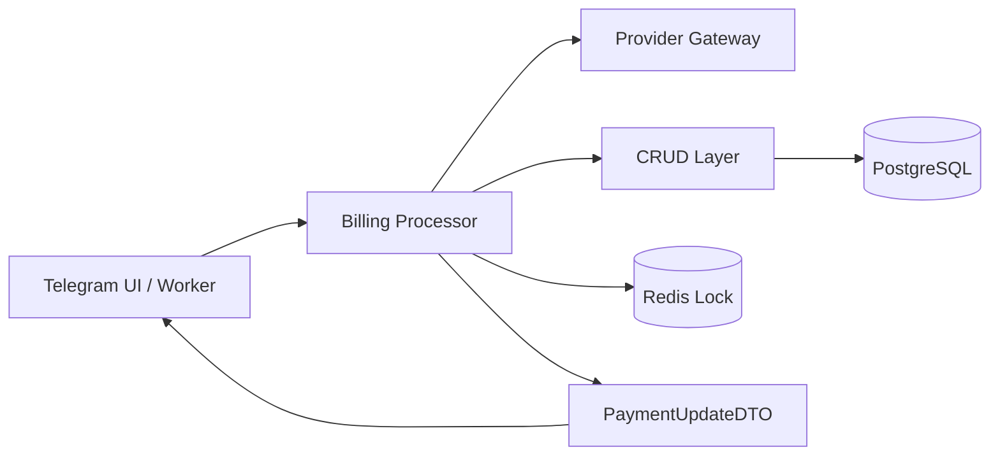
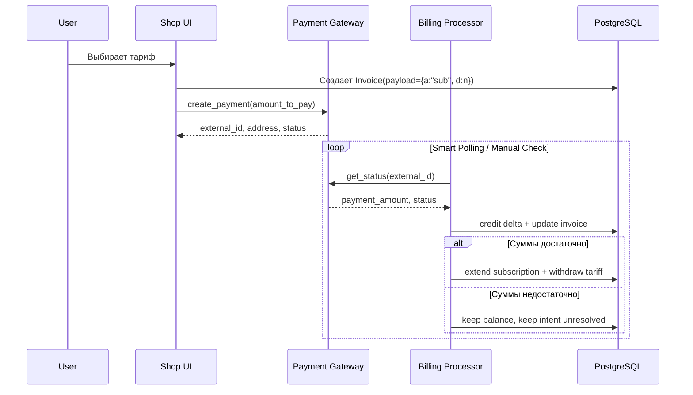

# FINANCE_SYSTEM

Текущий документ описывает фактическую архитектуру финансовой системы CSL по состоянию на кодовую базу в `src/`. Источником истины являются рабочие модули биллинга, а исторические документы используются только как контекст принятых решений.

## Scope

- Основные модули:
  - [models.py](file:///root/signal_bot_dev/src/database/models.py)
  - [billing_service.py](file:///root/signal_bot_dev/src/database/crud/billing_service.py)
  - [billing_processor.py](file:///root/signal_bot_dev/src/services/logic/billing_processor.py)
  - [cryptomus.py](file:///root/signal_bot_dev/src/services/cryptomus.py)
  - [cryptopay.py](file:///root/signal_bot_dev/src/services/cryptopay.py)
  - [cactus_client.py](file:///root/signal_bot/src/services/cactus_client.py) — Фиатный шлюз CactusPay (Карты РФ / СБП, RUB)
  - [payment_worker.py](file:///root/signal_bot_dev/src/services/payment_worker.py)
  - [shop.py](file:///root/signal_bot/src/bot/handlers/shop.py) — UI биллинга и Hosted Checkout
  - [billing_kb.py](file:///root/signal_bot/src/bot/keyboards/billing_kb.py) — Клавиатуры методов оплаты
  - [bouncer.py](file:///root/signal_bot/src/services/bouncer.py) — «Вышибала» (Bouncer): контроль истечения подписки, автопродление, атомарная деградация до FREE_NOISE пресета и развилка A/B сервисных уведомлений при истечении
  - [messenger_worker.py](file:///root/signal_bot/src/services/messenger_worker.py) — Доставщик алертов: рантайм-сегментация VIP/Free, Gatekeeper-проверка членства, отключение рендера графиков для Free
  - [redis_bus.py](file:///root/signal_bot/src/core/redis_bus.py) — Шина Redis + методы шлюза подписок set_gate_status/get_gate_status (ключ csl:gate:{user_id})
  - [commands.py](file:///root/signal_bot/src/bot/handlers/commands.py) + [main_kb.py](file:///root/signal_bot/src/bot/keyboards/main_kb.py) — Clean State Model: 4-состоятельный резолвер главного меню, монолитный футер и рендер Gate Screen подэкрана разблокировки
  - [settings.py](file:///root/signal_bot/src/bot/handlers/settings.py) + [settings_kb.py](file:///root/signal_bot/src/bot/keyboards/settings_kb.py) — Paywall защита настроек (11 точек Early Exit) + открытый master-тумблер is_signals_enabled для всех
  - [onboarding.py](file:///root/signal_bot/src/bot/handlers/onboarding.py) — 3-шаговый онбординг (язык → бонус сообщества → пресет) и формирование 3-дневного пробного VIP-периода
- Контекстные документы:
  - [IMPLEMENTATION_PLAN.md](file:///root/signal_bot_dev/IMPLEMENTATION_PLAN.md)
  - [new_finance_system_release.md](file:///root/signal_bot_dev/new_finance_system_release.md)
  - [new_finance_system_report.md](file:///root/signal_bot_dev/new_finance_system_report.md)
  - [MANUAL_BILLING.md](file:///root/signal_bot/docs/MANUAL_BILLING.md) — Ручное подтверждение крипто-оплат
  - [CACTUS_PAY_INTEGRATION.md](file:///root/signal_bot/docs/CACTUS_PAY_INTEGRATION.md) — Исчерпывающая документация по CactusPay (данный документ является справочным материалом для провайдера CACTUS)
  - [FREEMIUM_AND_GATEKEEPER.md](file:///root/signal_bot/docs/FREEMIUM_AND_GATEKEEPER.md) — Исчерпывающая документация по гибридной Freemium-воронке, 4-состоятельной UI-модели главного меню и шлюзу обязательных медиа-подписок (справочный материал для механик конверсии VIP/Free)
  - [SERVICES_ARCHITECTURE.md](file:///root/signal_bot/docs/SERVICES_ARCHITECTURE.md) — Доменная декомпозиция слоя src/services/ по философии «Улей»: карта пакетов (ingestion/logic/payments/workers/rendering/monitoring), направления импортов и инварианты сопровождения

---

## Explanation

### Финансовая подсистема в философии «Улей»

В общей архитектуре CSL финансы реализованы по тем же принципам, что и остальные подсистемы «Улья»: тяжелые решения и orchestration вынесены в специализированные модули, а слой хранения остается максимально простым и детерминированным.

Для финансового контура это означает следующее:

- `Gateway layer` взаимодействует с внешним провайдером платежей и формирует внешний снимок состояния платежа. Основной крипто-шлюз реализован в [cryptomus.py](file:///root/signal_bot_dev/src/services/cryptomus.py), остаточная совместимость с legacy-провайдером сохранена в [cryptopay.py](file:///root/signal_bot_dev/src/services/cryptopay.py). Фиатный рублёвый шлюз (Карты РФ / СБП / Hosted Checkout) реализован в [cactus_client.py](file:///root/signal_bot/src/services/cactus_client.py) и документирован отдельно в [CACTUS_PAY_INTEGRATION.md](file:///root/signal_bot/docs/CACTUS_PAY_INTEGRATION.md).
- `CRUD layer` инкапсулирует только атомарные операции над БД: создание инвойса, выборка сущностей, изменение баланса, обновление записи инвойса, продление подписки. Этот слой реализован в [billing_service.py](file:///root/signal_bot_dev/src/database/crud/billing_service.py).
- `Processor layer` является "мозгом" биллинга: выполняет синхронизацию с провайдером, захватывает lock, рассчитывает дельту, исполняет intent и возвращает DTO. Этот слой реализован в [billing_processor.py](file:///root/signal_bot_dev/src/services/logic/billing_processor.py).
- `Delivery layer` использует результат процессора для фона и UI: [payment_worker.py](file:///root/signal_bot_dev/src/services/payment_worker.py) (фоновый polling+уведомления) и [shop.py](file:///root/signal_bot/src/bot/handlers/shop.py) (экран выбора тарифа/метода, Hosted Checkout CactusPay, ручной триггер проверки).
- `Freemium/Audience-Building layer` является надстройкой над биллингом и управляет сегментацией VIP/Free, шлюзом медиа-подписок (Gatekeeper) и жизненным циклом пробного периода. Деградация тарифа при экспирации, контроль членства в каналах и сегментация доставки алертов реализованы в [bouncer.py](file:///root/signal_bot/src/services/bouncer.py) и [messenger_worker.py](file:///root/signal_bot/src/services/messenger_worker.py). Полная спецификация Freemium-воронки и 4-состоятельной UI-модели приведена в отдельном документе [FREEMIUM_AND_GATEKEEPER.md](file:///root/signal_bot/docs/FREEMIUM_AND_GATEKEEPER.md).



Ключевой принцип: внешняя платежная реальность, внутренняя транзакционная логика и пользовательский интерфейс разнесены по отдельным слоям. Это упрощает сопровождение, исключает скрытые побочные эффекты и позволяет стабильно выполнять обработку в фоне.

### Delta-Accounting

#### Почему система отказалась от бинарной модели

Бинарная модель `оплачен / не оплачен` плохо работает в реальных платежных сценариях:

- она не умеет корректно учитывать частичные переводы;
- она теряет семантику поэтапной доплаты;
- она плохо совместима с переплатами;
- она не защищает от повторного учета одной и той же суммы при повторных проверках воркером и пользователем.

По этой причине текущая система считает не факт "оплаченности", а прирост подтвержденной суммы.

#### Как дельта считается фактически

Processor:

1. получает от провайдера текущее подтвержденное значение оплаты;
2. вычисляет `effective_paid_amount`;
3. отдельно вычисляет, сколько уже было реально зачислено в систему по данному инвойсу, суммируя `DEPOSIT`-транзакции пользователя с описанием, привязанным к `Invoice.external_id`;
4. рассчитывает:

```text
delta = effective_paid_amount - already_credited_total
```

См. реализацию:

- [_get_invoice_credited_total()](signal_bot_dev/src/services/logic/billing_processor.py#L95-L107)
- [_resolve_effective_paid_amount()](signal_bot_dev/src/services/logic/billing_processor.py#L125-L130)
- [process_payment_update()](src/services/logic/billing_processor.py#L235-L265)

#### Что это дает

- Частичная оплата не теряется: если пришло `10` из `25`, `delta = 10`, баланс пополняется на `10`, статус становится `PARTIAL`.
- Доплата не дублируется: если затем пришло `25`, а уже было зачислено `10`, новая `delta = 15`.
- Переплата сохраняется: если пришло `30` при `amount_expected = 25`, баланс получает всю дельту, а после исполнения intent остаток остается у пользователя.
- Повторные опросы воркера идемпотентны: если новых денег нет, `delta = 0`, и повторное зачисление не происходит.

Таким образом, Delta-Accounting решает проблему одновременно в трех осях: частичная оплата, переплата и повторная верификация.

### Target-Action Flow и Intent System

#### Концепция

Система отделяет:

- `факт оплаты` — сколько денег реально подтверждено провайдером;
- `намерение пользователя` — что нужно сделать после того, как деньги подтверждены.

Намерение хранится в `Invoice.payload` и интерпретируется процессором. Для подписки текущий UI генерирует payload через [_build_subscription_payload()](file:///root/signal_bot_dev/src/bot/handlers/shop.py#L40-L46).

Текущее поведение:

- пользователь не делает абстрактный депозит;
- пользователь инициирует конкретную покупку;
- если баланса не хватает, система создает инвойс на разницу;
- после получения достаточной суммы processor автоматически завершает исходное намерение.

#### Почему это важно

Такой подход убирает разрыв между платежом и конечным действием:

- пользователю не нужно самостоятельно возвращаться и выполнять вторую операцию;
- воркер может завершить цикл без участия человека;
- средства не "зависают" в неисполненном состоянии;
- при изменении тарифа система не теряет деньги: если текущего баланса после зачисления недостаточно, подписка не активируется, а средства остаются на балансе.

#### Payload как транспорт намерения

Фактический текущий payload-контракт:

```json
{"a": "sub", "d": 30}
```

Исторические документы содержат более ранний вариант со значением `p` (`price_at_create`), см. [new_finance_system_release.md](file:///root/signal_bot_dev/new_finance_system_release.md#L17-L26), но в текущем рабочем коде ключ `p` не используется и не генерируется. Источником истины является код:

- [shop.py](file:///root/signal_bot_dev/src/bot/handlers/shop.py#L40-L46)
- [billing_processor.py](file:///root/signal_bot_dev/src/services/logic/billing_processor.py#L35-L64)

Поддержка legacy payload сохранена через regex-разбор строкового формата `sub_30`, что важно для старых незавершенных инвойсов.



### Слой изоляции: Processor vs CRUD

#### Почему выделен BillingProcessor

Изначально логика биллинга смешивала:

- ORM-доступ;
- внешние сетевые запросы;
- управление транзакциями;
- парсинг payload;
- бизнес-решения по активации подписки;
- уведомления и интерпретацию состояния.

Это делало код трудно сопровождаемым и приводило к нестабильности в фоне.

Текущая архитектура разделяет обязанности так:

- [billing_service.py](file:///root/signal_bot_dev/src/database/crud/billing_service.py) отвечает только за атомарные операции над данными;
- [billing_processor.py](file:///root/signal_bot_dev/src/services/logic/billing_processor.py) отвечает за orchestration и бизнес-решения.

#### Почему отказ от ORM relationships оказался принципиальным

Фоновая обработка столкнулась с ошибками `MissingGreenlet` и `greenlet_spawn`, когда SQLAlchemy пыталась лениво подтягивать связанные данные или повторно читать ORM-атрибуты после `commit()` / `rollback()`.

Система стабилизирована тремя решениями:

1. Processor и worker перестали опираться на `invoice.user` и другие relationship-access pattern.
2. Инвойс и пользователь загружаются отдельными запросами с блокировкой в [get_billing_entities()](file:///root/signal_bot_dev/src/database/crud/billing_service.py#L94-L107).
3. Наружу возвращается только `PaymentUpdateDTO`, а не ORM-модель.

Это означает:

- фоновые сервисы не зависят от состояния SQLAlchemy identity map;
- UI и воркер получают только примитивные значения;
- сетевой вызов вынесен за пределы DB-транзакции, см. [process_payment_update()](file:///root/signal_bot_dev/src/services/logic/billing_processor.py#L133-L171).

#### Результат изоляции

- обработка стала идемпотентной;
- воркер перестал падать на lazy loading;
- логика оплаты одинаково работает в manual-check и background polling;
- тестовый mock-flow и production-flow сведены к одному вычислительному ядру.

---

## Reference

### PaymentUpdateDTO

Источник: [dto.py](file:///root/signal_bot_dev/src/core/dto.py#L59-L72)

| Поле | Тип | Назначение |
| :--- | :--- | :--- |
| `is_paid` | `bool` | Финальный результат обработки: считается ли инвойс полностью оплаченным после текущего цикла. |
| `delta_credited` | `float` | Сумма нового зачисления на баланс в рамках текущей итерации обработки. |
| `sub_activated` | `bool` | Признак того, что intent подписки был успешно исполнен. |
| `new_balance` | `float` | Баланс пользователя после применения всех изменений текущего цикла. |
| `new_end_date` | `datetime \| None` | Новая дата окончания подписки после успешной активации. |
| `error` | `str \| None` | Код доменной ошибки или промежуточного состояния обработки. |
| `amount_actual` | `float` | Подтвержденная провайдером сумма на момент текущей проверки. |
| `amount_expected` | `float` | Ожидаемая сумма инвойса. |
| `invoice_status` | `str` | Результирующий статус инвойса в доменной модели: `PENDING`, `PARTIAL`, `PAID`, `EXPIRED`. |
| `needed_amount` | `float` | Недостающая сумма либо до полного покрытия инвойса, либо до выполнения подписочного intent. |
| `intent_action` | `str \| None` | Действие, извлеченное из payload. |
| `intent_days` | `int \| None` | Параметр подписочного intent: число дней тарифа. |

#### Набор фактически используемых кодов `error`

Источник: [billing_processor.py](file:///root/signal_bot_dev/src/services/logic/billing_processor.py#L138-L201), [billing_processor.py](file:///root/signal_bot_dev/src/services/logic/billing_processor.py#L288-L327)

- `invoice_not_found`
- `user_not_found`
- `provider_error`
- `lock_error`
- `payment_processing`
- `subscription_price_not_found`
- `insufficient_balance_for_intent`
- `invoice_expired`
- `partial_payment`
- `payment_pending`
- `unexpected_error`

### InvoiceIntentPayload schema

#### Текущий фактический контракт

Источник генерации: [shop.py](file:///root/signal_bot_dev/src/bot/handlers/shop.py#L40-L46)  
Источник чтения: [billing_processor.py](file:///root/signal_bot_dev/src/services/logic/billing_processor.py#L35-L64)

```json
{
  "a": "sub",
  "d": 30
}
```

#### Поля

| Ключ | Тип | Обязательность | Смысл |
| :--- | :--- | :--- | :--- |
| `a` | `str` | Да | Код действия. В текущем биллинге фактически используется `sub`. |
| `d` | `int` | Да для `sub` | Количество дней подписки. |

#### Поведение парсера

Парсер:

- сначала пытается разобрать payload как JSON;
- при неуспехе применяет legacy fallback `sub_(\d+)`;
- возвращает кортеж `(intent_action, intent_days)`.

Это реализовано в [_parse_invoice_intent()](file:///root/signal_bot_dev/src/services/logic/billing_processor.py#L35-L64).

#### Историческое замечание

Документ [new_finance_system_release.md](file:///root/signal_bot_dev/new_finance_system_release.md#L17-L26) описывает старую схему `{"a": str, "d": int, "p": float}`. В текущем рабочем коде ключ `p` отсутствует и не должен считаться частью активного контракта.

### Модель данных Invoice

Источник: [models.py](file:///root/signal_bot_dev/src/database/models.py#L103-L121)

| Колонка | Тип | Роль в жизненном цикле |
| :--- | :--- | :--- |
| `id` | `int` | Внутренний PK инвойса. |
| `user_id` | `BigInteger` | Владелец инвойса; используется для лока, баланса и подписки. |
| `amount_actual` | `Float` | Подтвержденная провайдером сумма, синхронизированная в БД. |
| `amount_expected` | `Float` | Целевая сумма инвойса, с которой сравнивается текущая оплата. |
| `payload` | `String \| None` | Сериализованное намерение пользователя. |
| `status` | `String` | Доменный статус: `PENDING`, `PARTIAL`, `PAID`, `EXPIRED`. |
| `is_reminder_sent` | `Boolean` | Технический флаг, предотвращающий повторную отправку reminder-уведомления. |
| `created_at` | `DateTime` | Время создания; используется воркером для Smart Polling и auto-expire. |
| `external_id` | `String(100)` | Универсальный внешний идентификатор инвойса у провайдера. |
| `provider` | `String(20)` | Код платежного провайдера. Текущий default: `CRYPTOMUS`. |
| `address` | `String \| None` | Платежный адрес, выданный провайдером. |
| `network` | `String \| None` | Платежная сеть. |

#### Ключевые инварианты

- `external_id` — обязательный, уникальный, индексируемый внешний ключ платежной корреляции.
- `amount_expected` — сумма бизнес-цели инвойса.
- `amount_actual` — последняя синхронизированная сумма, увиденная у провайдера.
- Источником истины для уже зачисленной суммы в Delta-Accounting является не `amount_actual`, а сумма фактически созданных `DEPOSIT`-транзакций по инвойсу.

### Провайдерный слой

#### Cryptomus

Источник: [cryptomus.py](file:///root/signal_bot_dev/src/services/cryptomus.py)

Ключевые методы:

- `create_payment()` — создает инвойс у провайдера или mock-инвойс в `DEV_MODE`, см. [cryptomus.py](file:///root/signal_bot_dev/src/services/cryptomus.py#L254-L310)
- `get_status()` — получает текущее состояние платежа, см. [cryptomus.py](file:///root/signal_bot_dev/src/services/cryptomus.py#L312-L346)
- `_mock_get_status()` — в `DEV_MODE` читает состояние инвойса из БД и возвращает `pending`, `partially_paid` или `paid`, см. [cryptomus.py](file:///root/signal_bot_dev/src/services/cryptomus.py#L140-L199)

#### CryptoPay

Источник: [cryptopay.py](file:///root/signal_bot_dev/src/services/cryptopay.py)

CryptoPay остается в системе как legacy/compatibility provider:

- `create_payment_invoice()` создает инвойс в CryptoBot;
- `check_invoice_status()` получает внешний статус;
- в processor логика `CRYPTOPAY` поддерживается в [_get_provider_payment_snapshot()](file:///root/signal_bot_dev/src/services/logic/billing_processor.py#L78-L92).

### Матрица переходов состояний

Ниже приведена фактическая доменная матрица на основе [_resolve_invoice_status()](file:///root/signal_bot_dev/src/services/logic/billing_processor.py#L67-L75), [_resolve_effective_paid_amount()](file:///root/signal_bot_dev/src/services/logic/billing_processor.py#L125-L130) и основной ветки [process_payment_update()](file:///root/signal_bot_dev/src/services/logic/billing_processor.py#L227-L330).

| Сумма от API / effective_paid_amount | Текущий статус в БД | Provider status | Итоговый статус | Выполняемое действие |
| :--- | :--- | :--- | :--- | :--- |
| `0` | `PENDING` / `PARTIAL` | не expired | `PENDING` | Без зачисления, intent не исполняется. |
| `> 0` и `< amount_expected` | `PENDING` | любой не-expired | `PARTIAL` | Зачисляется только новая дельта, инвойс сохраняется для доплаты. |
| `> 0` и `< amount_expected` | `PARTIAL` | любой не-expired | `PARTIAL` | Зачисляется только новая дельта; intent остается неисполненным. |
| `>= amount_expected` | `PENDING` / `PARTIAL` | любой | `PAID` | Зачисляется новая дельта, затем проверяется payload и возможна автоактивация. |
| `< amount_expected`, но shortfall `<= PAYMENT_TOLERANCE_USD` | `PENDING` / `PARTIAL` | любой | `PAID` | Платеж считается достаточным, применяется business-tolerance, затем выполняется intent. |
| `0` | `PENDING` / `PARTIAL` | `expired/cancel/fail/...` | `EXPIRED` | Зачисления нет, intent не исполняется. |
| `>= amount_expected` и `payload.a == "sub"` и `balance >= tariff` | `PENDING` / `PARTIAL` | любой | `PAID` | Продлевается подписка, создается `WITHDRAW`, остаток остается на балансе. |
| `>= amount_expected` и `payload.a == "sub"` и `balance < tariff` | `PENDING` / `PARTIAL` | любой | `PAID` | Деньги остаются на балансе, intent не исполняется, возвращается `insufficient_balance_for_intent`. |

#### Отдельно: правила действий при полном платеже

После перехода в `PAID` processor действует так:

1. проверяет, есть ли подписочный intent;
2. проверяет, не был ли уже выполнен `WITHDRAW` по этому инвойсу;
3. если списание уже было, повторная активация не выполняется;
4. если intent подписочный и денег хватает, выполняет:
   - [extend_user_subscription()](file:///root/signal_bot_dev/src/database/crud/billing_service.py#L154-L168)
   - [adjust_user_balance(..., tx_type="WITHDRAW")](file:///root/signal_bot_dev/src/database/crud/billing_service.py#L126-L152)
5. если денег не хватает, средства остаются на балансе.

### Транзакционная модель и защита от гонок

Источник: [billing_processor.py](file:///root/signal_bot_dev/src/services/logic/billing_processor.py#L133-L357)

Процесс обработки платежа устроен в следующем порядке:

1. вне транзакции читается provider snapshot;
2. выполняется `session.rollback()` для очистки промежуточного состояния сессии после внешнего вызова;
3. захватывается Redis-lock по `user_id`;
4. открывается `async with session.begin()`;
5. внутри транзакции выполняются:
   - повторная блокирующая загрузка `Invoice` и `User`;
   - Delta-Accounting;
   - синхронизация `Invoice`;
   - исполнение intent;
6. после выхода из транзакции выполняется invalidation пользовательского кеша;
7. lock освобождается в `finally`.

Это обеспечивает:

- идемпотентность;
- защиту от race condition между воркером и ручной кнопкой проверки;
- отсутствие сетевых вызовов внутри DB-транзакции;
- воспроизводимое поведение для фоновой и ручной обработки.

### Worker contract

Источник: [payment_worker.py](file:///root/signal_bot_dev/src/services/payment_worker.py)

Worker:

- выбирает только `PENDING` и `PARTIAL` инвойсы, см. [payment_worker.py](file:///root/signal_bot_dev/src/services/payment_worker.py#L165-L178);
- использует адаптивный polling: `30s` для новых, `180s` для старых, см. [payment_worker.py](file:///root/signal_bot_dev/src/services/payment_worker.py#L18-L24), [payment_worker.py](file:///root/signal_bot_dev/src/services/payment_worker.py#L40-L41);
- автоматически переводит инвойс в `EXPIRED` после `120` минут, см. [payment_worker.py](file:///root/signal_bot_dev/src/services/payment_worker.py#L63-L68);
- использует только `PaymentUpdateDTO` и `user.language_code`, не работая через ORM relationships;
- отправляет разные уведомления для:
  - reminder;
  - зачисления;
  - частичной оплаты;
  - автоактивации подписки;
  - случая, когда платеж принят, но auto-activation не выполнена.

### Фактические различия между историческим дизайном и текущей реализацией

Для сопровождения важно не смешивать проектные документы и реальный действующий код.

На текущий момент есть два принципиальных расхождения:

1. Историческая release-спецификация описывает payload с ключом `p`, но рабочий код использует только `a` и `d`.
2. Историческая логика Delta-Accounting опиралась на `Invoice.amount_actual`, но финальная рабочая реализация использует сумму уже созданных `DEPOSIT`-транзакций по инвойсу как базу сравнения.

Для любых дальнейших изменений источником истины должны считаться:

- [billing_processor.py](file:///root/signal_bot_dev/src/services/logic/billing_processor.py)
- [billing_service.py](file:///root/signal_bot_dev/src/database/crud/billing_service.py)
- [models.py](file:///root/signal_bot_dev/src/database/models.py)
- [payment_worker.py](file:///root/signal_bot_dev/src/services/payment_worker.py)

---

## Maintenance Notes

Наиболее чувствительные точки сопровождения:

- Нельзя возвращать ORM-модели из process-layer наружу. Внешний контракт должен оставаться DTO-only.
- Нельзя смешивать provider network I/O с DB-транзакцией.
- Нельзя повторно вводить логику через relationship-access (`invoice.user`) в фоне.
- Любые новые intent-action должны добавляться одновременно в:
  - генерацию payload;
  - парсер payload;
  - execution branch в processor;
  - пользовательские тексты и воркерные уведомления.
- Любое изменение правил признания платежа должно согласованно обновлять:
  - `_resolve_effective_paid_amount()`;
  - `_resolve_invoice_status()`;
  - тексты UI/worker;
  - acceptance-сценарии mock и real payment flow.
