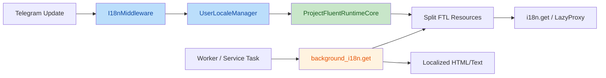
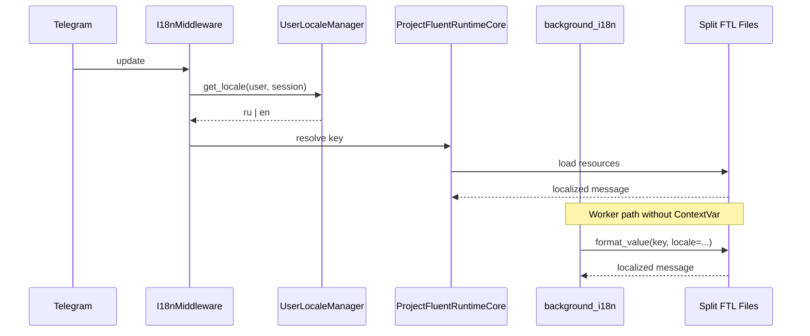

# LOCALIZATION_SYSTEM

Документ описывает фактическую архитектуру локализации CSL по состоянию на текущий код в `src/`. Источником истины являются рабочие модули локализации и реальные вызовы `i18n`/`background_i18n`; исторические отчеты используются только как контекст миграции.

## Scope

- Инфраструктурные модули:
  - [i18n_runtime.py](../src/core/i18n_runtime.py)
  - [localization.py](../src/core/localization.py)
  - [i18n.py](../src/bot/i18n.py)
- Основные runtime-потребители:
  - [profile.py](../src/bot/handlers/profile.py)
  - [billing_kb.py](../src/bot/keyboards/billing_kb.py)
  - [payment_worker.py](../src/services/payment_worker.py)
  - [bouncer.py](../src/services/bouncer.py)
  - [admin_payments.py](../src/bot/handlers/admin_payments.py)
  - [user_service.py](../src/database/crud/user_service.py)
- Контекстные документы:
  - [BACKGROUND_LOCALIZATION.md](../docs/BACKGROUND_LOCALIZATION.md)
  - [review_and_rework_localization_system_report.md](../review_and_rework_localization_system_report.md)

---

## Explanation

### Локализация как инфраструктурный слой «Улья»

Текущая локализация встроена в систему по тем же принципам, что и другие зрелые подсистемы CSL:

- `bot-layer` получает locale через middleware и профиль пользователя;
- `background-layer` не использует контекстные объекты aiogram и работает через явный runtime API;
- файловая структура локалей повторяет смысловую структуру экранов и модулей;
- фактический набор ключей подчинен коду, а не историческим `.ftl`.

Иными словами, локализация больше не является пассивным набором переводов. Это полноценный инфраструктурный контур с двумя режимами доступа:

- `Context-aware path` для handler-flow;
- `Context-free path` для workers, cron-процессов и административных фоновых сценариев.



### Почему split-структура стала обязательной

Историческая модель с единым `messages.ftl` перестала масштабироваться по нескольким причинам:

- один файл собирал UI-кнопки, фоновые уведомления и админские сообщения в одном пространстве;
- синхронизация `ru` и `en` постепенно деградировала;
- ревизия живых ключей требовала ручного обхода большого монолита;
- merge-конфликты и accidental edits становились все вероятнее по мере роста billing и admin-flow.

Новая структура вводит инвариант:

> один экран или один смысловой поток = один `.ftl`-модуль.

Фактическая структура локалей сейчас одинакова для `ru` и `en`:

- `common.ftl`
- `main.ftl`
- `settings.ftl`
- `profile.ftl`
- `partner.ftl`
- `wallet.ftl`
- `shop.ftl`
- `worker.ftl`
- `admin/admin.ftl`
- `admin/admin_bi.ftl`
- `admin/admin_broadcast.ftl`
- `admin/admin_payments.ftl`

Это не только улучшает навигацию, но и делает локализацию естественным продолжением структуры `handlers`, `keyboards` и `services`.

### Почему код является единственным источником истины

В текущем контуре именно код определяет, какие ключи являются легитимными:

- `i18n.get(...)` и `LazyProxy(...)` фиксируют потребности UI;
- `background_i18n.get(...)` фиксирует потребности фоновых задач;
- selector-ключи и динамические ветки задают допустимые runtime-параметры;
- новые экраны и callback-chain автоматически формируют требования к `.ftl`.

Следствие:

- документация описывает только то, что реально существует в коде;
- локали синхронизируются от `src`, а не наоборот;
- удаление ключей допустимо только после подтверждения отсутствия runtime-использования.

### Двухконтурная модель: bot-layer и background-layer

Основной архитектурный выбор сохранен и после рефакторинга split-локалей:

- в `bot-layer` локаль вычисляется через `I18nMiddleware` и `UserLocaleManager`;
- в `background-layer` локаль передается явно и не зависит от `ContextVar`.

Это решение принципиально важно для production-стабильности:

- worker-задачи выполняются вне update lifecycle;
- фоновые уведомления не могут безопасно полагаться на aiogram-контекст;
- прямой runtime вызов делает поведение детерминированным и тестируемым.



### Как локаль выбирается и живет в системе

Жизненный цикл locale сейчас выглядит так:

1. При первом создании пользователя `resolve_initial_locale()` отображает Telegram language hint в один из двух поддерживаемых кодов.
2. Значение сохраняется в `User.language_code`.
3. `UserLocaleManager.get_locale()` читает сохраненное значение из БД и нормализует его.
4. При ручной смене языка профиль пользователя обновляется, транзакция коммитится, пользовательский кэш инвалидируется.
5. Фоновые сервисы при каждом уведомлении нормализуют `User.language_code` и передают locale явно.

Это делает язык:

- устойчивым к перезапускам;
- единым для UI и фоновых уведомлений;
- независимым от эфемерного состояния update-context.

### Расхождения между кодом и контекстным отчетом

Контекстный отчет [review_and_rework_localization_system_report.md](../review_and_rework_localization_system_report.md) в целом соответствует текущему коду. Существенных расхождений не выявлено.

Фактически важная деталь:

- текущий код уже прошел финальную зачистку и **не содержит** fallback на legacy `messages.ftl` ни для `ru`, ни для `en`;
- загрузка выполняется только из текущих split `.ftl` ресурсов.

Это означает, что report уже нужно читать как отчет о миграции, а не как описание переходного состояния.

---

## Reference

### `src/core/localization.py`

Источник: [localization.py](../src/core/localization.py)

#### Константы

| Константа | Значение | Назначение |
| :--- | :--- | :--- |
| `DEFAULT_LOCALE` | `"ru"` | Базовая локаль проекта и fallback для неподдерживаемых значений. |
| `FALLBACK_LOCALE` | `"en"` | Локаль для non-Cyrillic initial mapping. |
| `SUPPORTED_LOCALES` | `{"ru", "en"}` | Явно поддерживаемый набор языков. |
| `CYRILLIC_TG_LANGUAGE_PREFIXES` | `("ru", "be", "uk", "kk")` | Префиксы Telegram language code, считающиеся `ru`-ориентированными. |
| `LOCALES_DIR` | `assets/locales` | Корневая директория ресурсов Fluent. |

#### Функции

| Функция | Сигнатура | Назначение |
| :--- | :--- | :--- |
| `resolve_initial_locale` | `(raw_locale: str \| None) -> str` | Преобразует Telegram language hint в стартовую локаль нового пользователя. |
| `normalize_locale_code` | `(locale: str \| None) -> str` | Нормализует сохраненный locale до безопасного 2-letter кода из `SUPPORTED_LOCALES`. |

Ключевой фрагмент:

```python
DEFAULT_LOCALE = "ru"
FALLBACK_LOCALE = "en"
SUPPORTED_LOCALES = frozenset({"ru", "en"})

def resolve_initial_locale(raw_locale: str | None) -> str:
    normalized = (raw_locale or "").strip().lower()
    if normalized.startswith(CYRILLIC_TG_LANGUAGE_PREFIXES):
        return DEFAULT_LOCALE
    return FALLBACK_LOCALE
```

Комментарий:

- начальная маршрутизация привязана не к точному `ru`, а к группе кириллических языков;
- все неподдерживаемые или шумные значения в конечном счете приводятся к допустимому набору `ru/en`.

### `src/core/i18n_runtime.py`

Источник: [i18n_runtime.py](../src/core/i18n_runtime.py)

#### Основные элементы

| Элемент | Назначение |
| :--- | :--- |
| `_get_locale_resource_paths(locale)` | Находит все `.ftl` ресурсы локали рекурсивно и сортирует их по относительному пути. |
| `_get_locale_resource_ids(locale)` | Преобразует пути ресурсов в `resource_id`, совместимые с `FluentLocalization`. |
| `ProjectFluentRuntimeCore` | Кастомный runtime core для middleware, загружающий split-структуру локалей. |
| `build_app_i18n_core()` | Возвращает singleton-compatible core для `I18nMiddleware`. |
| `BackgroundI18n` | Runtime-обертка для worker/service слоя без `ContextVar`. |
| `app_i18n_core` | Глобальный core для handler-flow. |
| `background_i18n` | Глобальный runtime API для worker-flow. |

#### Поведение загрузчика

Загрузчик работает по следующему фактическому контракту:

1. Берет директорию локали из `LOCALES_DIR / locale`.
2. Рекурсивно находит все `.ftl`.
3. Сортирует найденные файлы по относительному пути.
4. Для `ProjectFluentRuntimeCore` читает содержимое каждого файла и добавляет ресурс в `FluentBundle`.
5. Для `BackgroundI18n` передает те же `resource_id` в `FluentLocalization`.

Ключевой фрагмент:

```python
def _get_locale_resource_paths(locale: str) -> list[Path]:
    locale_dir = LOCALES_DIR / locale
    resource_paths = sorted(
        (path for path in locale_dir.rglob("*.ftl") if path.is_file()),
        key=lambda path: path.relative_to(locale_dir).as_posix(),
    )
    if resource_paths:
        return resource_paths
    raise FileNotFoundError(...)
```

Комментарий:

- загрузка больше не зависит от `messages.ftl`;
- сортировка по относительному пути делает порядок загрузки стабильным и воспроизводимым;
- одинаковая файловая база используется и middleware, и background runtime.

#### Класс `ProjectFluentRuntimeCore`

Фактическая роль класса:

- заменить стандартное предположение `FluentRuntimeCore` о файловой структуре локали;
- поддержать split `.ftl` без изменений в вызывающем коде handlers;
- сохранить интерфейс, совместимый с `aiogram_i18n`.

Ключевой фрагмент:

```python
class ProjectFluentRuntimeCore(FluentRuntimeCore):
    def find_locales(self) -> dict[str, FluentBundle]:
        translations: dict[str, FluentBundle] = {}
        locales = self._extract_locales(self.path)

        for locale in locales:
            translations[locale] = FluentBundle(...)
            for resource_path in _get_locale_resource_paths(locale):
                with resource_path.open("r", encoding="utf8") as fp:
                    translations[locale].add_resource(FluentResource(fp.read()))
```

#### Класс `BackgroundI18n`

Назначение:

- дать worker-слою прямой API `get(key, locale=..., **kwargs)`;
- исключить зависимость от `I18nContext` и `ContextVar`;
- использовать те же split-ресурсы, что и UI.

Ключевой фрагмент:

```python
class BackgroundI18n:
    def __init__(self) -> None:
        loader = FluentResourceLoader(f"{LOCALES_DIR}/{{locale}}")
        self._localizations = {
            locale: FluentLocalization([locale], _get_locale_resource_ids(locale), loader)
            for locale in SUPPORTED_LOCALES
        }

    def get(self, key: str, *, locale: str | None = None, **kwargs: object) -> str:
        normalized_locale = normalize_locale_code(locale)
        localization = self._localizations[normalized_locale]
        return str(localization.format_value(key, kwargs or None))
```

Практический инвариант:

- если код выполняется вне handler-flow, он должен использовать именно `background_i18n.get(...)`.

### `src/bot/i18n.py`

Источник: [i18n.py](../src/bot/i18n.py)

#### `UserLocaleManager`

| Метод | Назначение |
| :--- | :--- |
| `set_locale(...)` | Сохраняет выбранный язык в профиле пользователя и инвалидирует пользовательский кэш. |
| `get_locale(...)` | Читает locale из БД; при отсутствии профиля использует `resolve_initial_locale()`. |

Ключевой фрагмент:

```python
async def get_locale(
    self,
    event_from_user: TelegramUser | None = None,
    session: AsyncSession | None = None,
    **_: Any,
) -> str:
    if event_from_user is None:
        return DEFAULT_LOCALE

    if session is not None:
        user = await session.get(User, event_from_user.id)
        if user is not None:
            return normalize_locale_code(user.language_code)

    async with async_session() as fallback_session:
        user = await fallback_session.get(User, event_from_user.id)
        if user is not None:
            return normalize_locale_code(user.language_code)

    return resolve_initial_locale(event_from_user.language_code)
```

Комментарий:

- locale хранится как часть пользовательского профиля, а не как эфемерная настройка UI;
- fallback к `resolve_initial_locale()` используется только если профиль еще не существует;
- middleware и background-layer читают одну и ту же сущность `User.language_code`, что выравнивает поведение всей системы.

#### `build_i18n_middleware()`

Возвращает `I18nMiddleware`, сконфигурированный на:

- `core=app_i18n_core`;
- `manager=UserLocaleManager(default_locale=DEFAULT_LOCALE)`;
- `default_locale=DEFAULT_LOCALE`.

Это позволяет handler-коду продолжать использовать стандартный `I18nContext`, не зная о split-структуре ресурсов.

### Реальные точки изменения locale

#### Первичное создание пользователя

Источник: [user_service.py](../src/database/crud/user_service.py#L17-L48)

При создании нового `User` поле `language_code` заполняется так:

```python
new_user = User(
    id=user_id,
    username=username,
    referrer_id=valid_referrer_id,
    language_code=resolve_initial_locale(telegram_language_code),
)
```

#### Явная смена языка в профиле

Источник: [profile.py](../src/bot/handlers/profile.py#L126-L142)

Фактический flow:

1. хендлер читает пользователя из БД;
2. вычисляет новый язык переключением `ru <-> en`;
3. сохраняет его в `User.language_code`;
4. делает `commit`;
5. инвалидирует пользовательский кэш;
6. временно переключает `i18n.use_locale(new_locale)` для перерендера UI.

Ключевой фрагмент:

```python
current_locale = normalize_locale_code(user.language_code)
new_locale = FALLBACK_LOCALE if current_locale == DEFAULT_LOCALE else DEFAULT_LOCALE

user.language_code = new_locale
await session.commit()
await session.refresh(user)
await invalidate_user_cache(user.id)

with i18n.use_locale(new_locale):
    await _render_profile_home(callback, session, user, i18n)
```

### Реальные точки использования ключей в UI

#### Клавиатуры и `LazyProxy`

Источник: [billing_kb.py](../src/bot/keyboards/billing_kb.py#L54-L68)

Кнопка языка формируется через разные ключи для разных локалей:

```python
language_button = (
    LazyProxy("kb-wallet-language-ru")
    if language_code == "ru"
    else LazyProxy("kb-wallet-language-en")
)
```

Это означает:

- `ru` и `en` намеренно не являются побайтно идентичными по одному ключу языка;
- вместо общего selector-ключа применена явная двухключевая модель, упрощающая UI-текст кнопки.

### Реальные точки использования ключей в фоне

#### `payment_worker.py`

Источник: [payment_worker.py](../src/services/payment_worker.py#L38-L43)

Worker использует тонкий wrapper:

```python
def _get_i18n_text(locale: str | None, key: str, **kwargs: object) -> str:
    return background_i18n.get(
        key,
        locale=normalize_locale_code(locale),
        **kwargs,
    )
```

Практическая роль:

- стандартизация передачи locale;
- минимизация риска забыть `locale=...` в нескольких местах;
- единая точка для worker-side локализации.

#### `bouncer.py`

Источник: [bouncer.py](../src/services/bouncer.py#L77-L86), [bouncer.py](../src/services/bouncer.py#L130-L151)

`Bouncer` работает напрямую через `background_i18n.get(...)` и каждый раз берет язык из пользовательского профиля:

```python
user_locale = normalize_locale_code(user.language_code)
warning_text = background_i18n.get("bouncer-subscription-expiry-warning", locale=user_locale)
```

#### `admin_payments.py`

Источник: [admin_payments.py](../src/bot/handlers/admin_payments.py#L42-L43)

Для админской модерации платежей принят отдельный инвариант:

```python
def _get_admin_text(key: str, **kwargs: object) -> str:
    return background_i18n.get(key, locale=DEFAULT_LOCALE, **kwargs)
```

Комментарий:

- админский payment review intentionally закреплен за русским текстом;
- это не баг локализации, а проектное решение: админка переводится для однородности структуры, но фактически остается русскоязычной.

### Файловая структура локалей

#### `ru`

Источник: `assets/locales/ru`

- `common.ftl`
- `main.ftl`
- `settings.ftl`
- `profile.ftl`
- `partner.ftl`
- `wallet.ftl`
- `shop.ftl`
- `worker.ftl`
- `admin/admin.ftl`
- `admin/admin_bi.ftl`
- `admin/admin_broadcast.ftl`
- `admin/admin_payments.ftl`

#### `en`

Источник: `assets/locales/en`

- `common.ftl`
- `main.ftl`
- `settings.ftl`
- `profile.ftl`
- `partner.ftl`
- `wallet.ftl`
- `shop.ftl`
- `worker.ftl`
- `admin/admin.ftl`
- `admin/admin_bi.ftl`
- `admin/admin_broadcast.ftl`
- `admin/admin_payments.ftl`

### Production Invariants

Фактические инварианты, которые следует сохранять при любых дальнейших изменениях:

1. Любой новый UI-ключ должен иметь физическое покрытие в соответствующем `.ftl`-модуле обеих локалей.
2. Любой новый worker/service сценарий обязан использовать `background_i18n.get(..., locale=...)`.
3. Запрещено возвращать систему к `messages.ftl` или смешанному split+legacy режиму.
4. Новые `.ftl` файлы должны попадать в уже существующую директорию локали и автоматически подхватываться runtime.
5. `User.language_code` остается единственным persisted source of truth для выбранного языка.
6. Исключения по локали должны быть явными и архитектурно мотивированными, как в случае `admin_payments.py`.

### Review Checklist

Практический чек-лист для ревью локализации:

- есть ли новый ключ в коде и в обеих локалях;
- не попал ли worker-код на `I18nContext` вместо `background_i18n`;
- не появился ли скрытый legacy fallback;
- соответствует ли новый `.ftl` файл смысловому модулю, а не случайному месту;
- не нарушена ли синхронизация `ru/en` по переменным и набору ключей;
- не привязана ли логика выбора locale к update-context там, где нужен persisted профиль.
