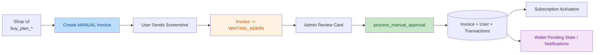
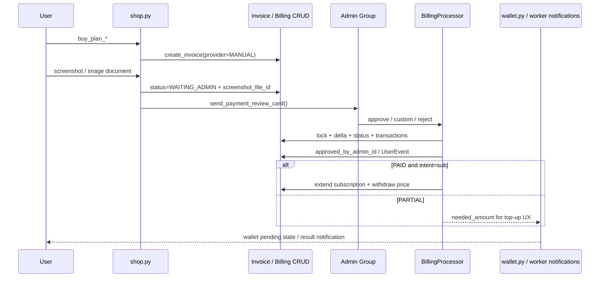

# MANUAL_BILLING

Документ фиксирует фактическую архитектуру модуля ручного подтверждения оплат (`MANUAL`) в проекте CSL.

Источником истины является рабочий код в `src/`. Исторические планы используются только как контекст миграции и для фиксации отклонений.

## Scope

- Основные модули:
  - [models.py](../src/database/models.py)
  - [config.py](../src/core/config.py)
  - [dto.py](../src/core/dto.py)
  - [billing_service.py](../src/database/crud/billing_service.py)
  - [billing_processor.py](../src/services/logic/billing_processor.py)
  - [shop.py](../src/bot/handlers/shop.py)
  - [admin_payments.py](../src/bot/handlers/admin_payments.py)
  - [payment_worker.py](../src/services/payment_worker.py)
  - [wallet.py](../src/bot/handlers/wallet.py)
  - [billing_kb.py](../src/bot/keyboards/billing_kb.py)
- Миграции:
  - [c4f7a9d2e6b1_add_manual_payment_fields_to_invoices.py](../alembic/versions/c4f7a9d2e6b1_add_manual_payment_fields_to_invoices.py)
- Локализация:
  - [shop.ftl](../assets/locales/ru/shop.ftl)
  - [wallet.ftl](../assets/locales/ru/wallet.ftl)
  - [worker.ftl](../assets/locales/ru/worker.ftl)
  - [admin_payments.ftl](../assets/locales/ru/admin/admin_payments.ftl)
- Контекстные документы:
  - [FINANCE_SYSTEM.md](../docs/FINANCE_SYSTEM.md)
  - [BACKGROUND_LOCALIZATION.md](../docs/BACKGROUND_LOCALIZATION.md)
  - [plan_of_manual_billing.md](../plan_of_manual_billing.md)

***

## Explanation

### Зачем `MANUAL` встроен как payment provider, а не как отдельный сервис

Ручная оплата в текущем коде не является “обходным путем” вокруг биллинга. Она встроена в тот же доменный контур, что и автоматические провайдеры:

- создается стандартный `Invoice`;
- используется тот же `payload` с намерением покупки;
- начисление денег идет через тот же `BillingProcessor`;
- автоактивация подписки использует тот же `Target-Action Flow`;
- наружу возвращается тот же `PaymentUpdateDTO`.

Ключевой архитектурный выбор:

> Администратор рассматривается не как отдельный бизнес-процесс, а как “человеческий внешний API”, который поставляет фактический `amount_actual` в тот же процессор, что и автоматический платежный провайдер.

Это дает два эффекта:

- доменная логика не дублируется между auto-payment и manual-payment;
- ручное подтверждение автоматически наследует `Delta-Accounting`, идемпотентность и исполнение intent.

### Роль manual billing в архитектуре «Улья»

В терминах “Улья” ручной биллинг разделен на независимые, но согласованные слои:

- `UI / Entry layer`: пользователь выбирает тариф и получает manual invoice с реквизитами;
- `Evidence layer`: пользователь отправляет доказательство оплаты в Telegram;
- `Admin review layer`: закрытая админ-группа подтверждает, отклоняет или задает кастомную сумму;
- `Processor layer`: `BillingProcessor` применяет delta, меняет статус инвойса, активирует intent;
- `Worker / State-awareness layer`: фоновый воркер и экран кошелька синхронизируют UX вокруг pending invoice.



### Почему ручная оплата не ломает инварианты биллинга

До рефакторинга ручной платеж легко мог превратиться в “особый случай”, который:

- начисляет деньги в обход общей логики;
- хранит отдельные статусы вне `Invoice`;
- теряет частичные оплаты и доплаты;
- повторно активирует уже оплаченный intent;
- зависит от ORM-relationships и ломается в async-контуре.

Текущий код явно защищается от этих проблем:

- `BillingProcessor` работает через отдельные CRUD-функции и не использует `invoice.user`;
- захватывается Redis-lock по `user_id` перед записью финансовых изменений;
- начисление строится по `delta`, а не по бинарному “оплачен / не оплачен”;
- исполнение intent идет только после синхронизации invoice-state;
- наружу возвращается только `PaymentUpdateDTO`, а не ORM-объекты.

### Delta-Accounting как главный механизм manual flow

Ручной биллинг в production-коде уже не мыслится как одноразовое подтверждение полной суммы.

Фактическая модель:

- администратор передает не “флаг успеха”, а фактическую сумму подтвержденной оплаты;
- процессор вычисляет, сколько по этому invoice уже было зачислено в транзакциях;
- на баланс добавляется только новая дельта;
- итоговый статус инвойса выводится из `effective_paid_amount` и `amount_expected`.

Это критично для двух сценариев:

- `partial payment`: пользователь перевел меньше нужного, получил уведомление и позже доплатил;
- `top-up on paid invoice`: по уже оплаченному инвойсу может прийти подтверждение большей суммы, и новая дельта не потеряется.

### Почему pending-state отражается и в кошельке

Manual billing включает не только сам путь оплаты, но и UX восстановления контекста.

После отправки чека пользователь может:

- закрыть бота;
- вернуться через несколько минут или часов;
- потерять контекст текущей заявки;
- создать дублирующий invoice.

Чтобы этого не происходило, экран кошелька теперь смотрит в БД на последний `MANUAL`-инвойс со статусом `WAITING_ADMIN` и отображает:

- явный notice о том, что заявка еще на проверке;
- измененный текст кнопки продления.

Тем самым `wallet.py` выступает как state-aware view поверх `Invoice`, а не как статичный экран.

### Почему worker почти не трогает `MANUAL`

У ручного провайдера нет внешнего API, который можно опрашивать так же, как `Cryptomus`.

Поэтому фактический контракт воркера другой:

- `MANUAL`-инвойсы исключены из provider-polling;
- если пользователь еще не прислал чек, воркер только отслеживает timeout;
- после отправки скриншота ответственность переходит в admin-review flow;
- уведомления о частичной оплате и успехе используют background i18n, но сами суммы формируются процессором.

Иными словами:

> для `MANUAL` воркер решает только задачу lifecycle timeout, а не задачу external status sync.

### Подотчетность админов как часть бизнес-контракта

В текущем коде админское действие больше не является “немым”.

Система фиксирует:

- кто нажал кнопку;
- кто обработал заявку;
- какая сумма была подтверждена;
- какой итоговый статус получился;
- по какой причине платеж был отклонен.

Это проявляется сразу в трех местах:

- в тексте карточки review (`processed by`, `processing`);
- в `Invoice.approved_by_admin_id` и `Invoice.rejection_reason`;
- в `UserEvent` с типом `manual_payment_review`.

Такой design делает админский review наблюдаемым и пригодным для ретроспективной диагностики.



### Отклонения фактического кода от плана

Ниже перечислены подтвержденные расхождения между [plan_of_manual_billing.md](../plan_of_manual_billing.md) и текущей реализацией:

1. В плане фигурирует префикс `csl_manual_...`, а фактический `external_id` строится как `manual_{user_id}_{uuid}` в [shop.py](../src/bot/handlers/shop.py#L58-L60).
2. План предлагает класс `ManualPaymentSG`, а в коде реализован `ManualPaymentStates` в [shop.py](../src/bot/handlers/shop.py#L34-L35).
3. Исходная фаза 3 требовала принимать только фото, но рабочий код также принимает `document(image/*)` в [shop.py](../src/bot/handlers/shop.py#L168-L176).
4. Исходная фаза 4 описывала reject как мгновенный сброс в `PENDING`, а фактический код использует FSM ввода причины отказа в [admin_payments.py](../src/bot/handlers/admin_payments.py#L444-L550).
5. `PaymentUpdateDTO` расширен полем `admin_name`, хотя в начальной фазе 2 этого не было; это соответствует позднему polishing-плану и реализовано в [dto.py](../src/core/dto.py#L59-L73).
6. Фактический UX шире плана: добавлены wallet pending-state, top-up flow, differentiate review-card для доплаты, `processed by` и `UserEvent`.
7. В исходном плане manual billing сосуществует с другими методами оплаты, а текущий UI-флоу магазина уже делает `MANUAL` единственным пользовательским методом: legacy callback `pay_cryptomus_*` просто перенаправляет в manual-flow в [shop.py](../src/bot/handlers/shop.py#L304-L317).

***

## Reference

### Модель `Invoice`

Источник: [models.py](../src/database/models.py#L103-L123)

| Поле | Тип | Назначение |
| :--- | :--- | :--- |
| `external_id` | `String(100)` | Внешний идентификатор инвойса, ключ маршрутизации всех user/admin callback-chain |
| `provider` | `String(20)` | Провайдер оплаты; для ручного сценария используется `MANUAL` |
| `amount_expected` | `Float` | Сколько нужно получить для исполнения invoice intent |
| `amount_actual` | `Float` | Последняя подтвержденная сумма по invoice |
| `status` | `String(20)` | Состояние жизненного цикла invoice |
| `payload` | `String(255) \| None` | JSON intent, например подписка на N дней |
| `address` | `String(128) \| None` | Кошелек для оплаты |
| `network` | `String(20) \| None` | Сеть manual payment |
| `screenshot_file_id` | `String(255) \| None` | Telegram `file_id` присланного чека |
| `approved_by_admin_id` | `BigInteger \| None` | Telegram ID админа, последним обработавшего invoice |
| `rejection_reason` | `String(255) \| None` | Причина отказа, видимая пользователю |

Практический смысл:

- `Invoice` остается единственным persisted state для ручной оплаты;
- отдельной manual-table или review-table в системе нет;
- manual metadata хранится в самом invoice и участвует в UX кошелька и review-flow.

Ключевой фрагмент:

```python
class Invoice(Base):
    user_id: Mapped[int]
    amount_actual: Mapped[float] = mapped_column(Float, default=0.0, nullable=False)
    amount_expected: Mapped[float] = mapped_column(Float, nullable=False)
    status: Mapped[str] = mapped_column(String(20), nullable=False)
    external_id: Mapped[str] = mapped_column(String(100), unique=True, index=True, nullable=False)
    provider: Mapped[str] = mapped_column(String(20), default="CRYPTOMUS", nullable=False)
    screenshot_file_id: Mapped[str | None] = mapped_column(String(255), nullable=True)
    approved_by_admin_id: Mapped[int | None] = mapped_column(BigInteger, nullable=True)
    rejection_reason: Mapped[str | None] = mapped_column(String(255), nullable=True)
```

Комментарий:

- default provider в модели остается `CRYPTOMUS`, но user-facing manual flow явно создает invoice с `provider="MANUAL"`;
- бизнес-инвариант определяется не default-ом ORM, а явным значением при создании invoice.

### Миграция manual review-полей

Источник: [c4f7a9d2e6b1_add_manual_payment_fields_to_invoices.py](../alembic/versions/c4f7a9d2e6b1_add_manual_payment_fields_to_invoices.py#L23-L50)

Фактически миграция:

- добавляет `screenshot_file_id`;
- добавляет `approved_by_admin_id`;
- добавляет `rejection_reason`;
- не трогает бизнес-данные старых invoice beyond schema extension.

### Конфигурация

Источник: [config.py](../src/core/config.py#L43-L68)

| Поле | Тип | Назначение |
| :--- | :--- | :--- |
| `PAYMENT_MANUAL_WALLET` | `str \| None` | Кошелек для ручной оплаты |
| `ADMIN_PAYMENT_CHAT_ID` | `int \| None` | Закрытая группа модерации ручных платежей |
| `TARIFFS` | `dict[int, float]` | Источник стоимости intent `sub` |

Комментарий:

- если `PAYMENT_MANUAL_WALLET` или `ADMIN_PAYMENT_CHAT_ID` не заданы, manual-flow в `shop.py` не стартует;
- эти две настройки образуют runtime feature-switch для manual billing.

### DTO: `PaymentUpdateDTO`

Источник: [dto.py](../src/core/dto.py#L59-L73)

| Поле | Тип | Назначение |
| :--- | :--- | :--- |
| `is_paid` | `bool` | Финальный статус оплаты после применения update |
| `delta_credited` | `float` | Сколько новых средств начислено именно на этом шаге |
| `sub_activated` | `bool` | Была ли подписка активирована автоматически |
| `new_balance` | `float` | Баланс пользователя после обработки |
| `new_end_date` | `datetime \| None` | Новый срок действия подписки |
| `error` | `str \| None` | Доменный код результата |
| `admin_name` | `str \| None` | Человекочитаемый идентификатор админа |
| `amount_actual` | `float` | Подтвержденная сумма invoice после update |
| `amount_expected` | `float` | Ожидаемая сумма invoice |
| `invoice_status` | `str` | Текущий статус invoice |
| `needed_amount` | `float` | Сколько еще не хватает до ожидаемой суммы или до intent execution |
| `intent_action` | `str \| None` | Тип intent, например `sub` |
| `intent_days` | `int \| None` | Параметр подписочного intent |

Комментарий:

- DTO является единственной границей между billing logic и UI/worker;
- ни `shop.py`, ни `admin_payments.py`, ни worker не должны строить вывод из ORM-связей.

### CRUD-слой `billing_service.py`

Источник: [billing_service.py](../src/database/crud/billing_service.py#L21-L178)

#### Ключевые функции

| Функция | Сигнатура | Назначение |
| :--- | :--- | :--- |
| `create_invoice` | `(session, user_id, external_id, amount_expected, payload, provider, address, network, amount_actual) -> Invoice \| None` | Создает invoice для manual flow |
| `get_invoice_by_external_id` | `(session, ext_id) -> Invoice \| None` | Ищет invoice по внешнему ID |
| `get_latest_pending_manual_invoice` | `(session, user_id) -> Invoice \| None` | Находит последний invoice в `WAITING_ADMIN` для экрана кошелька |
| `get_billing_entities` | `(session, ext_id) -> tuple[Invoice \| None, User \| None]` | Загружает invoice и user отдельными `get(..., with_for_update=True)` |
| `update_invoice_record` | `(session, invoice_id, amount_actual, status) -> Invoice \| None` | Меняет сумму и статус |
| `update_invoice_review_metadata` | `(session, invoice_id, approved_by_admin_id, screenshot_file_id, rejection_reason) -> Invoice \| None` | Меняет metadata ручной модерации |
| `reset_invoice_for_retry` | `(session, invoice_id) -> Invoice \| None` | Возвращает invoice в `PENDING` и очищает moderation-следы |

Ключевой фрагмент:

```python
async def get_billing_entities(session: AsyncSession, ext_id: str) -> tuple[Invoice | None, User | None]:
    invoice = await get_invoice_by_external_id(session, ext_id)
    if invoice is None:
        return None, None

    locked_invoice = await session.get(Invoice, invoice.id, with_for_update=True)
    locked_user = await session.get(User, locked_invoice.user_id, with_for_update=True)
    return locked_invoice, locked_user
```

Комментарий:

- billing-контур принципиально не использует `invoice.user`;
- это прямое следствие борьбы с `greenlet_spawn` и async lazy-loading.

### Пользовательский manual flow: `shop.py`

Источник: [shop.py](../src/bot/handlers/shop.py#L34-L445)

#### Основные элементы

| Элемент | Назначение |
| :--- | :--- |
| `ManualPaymentStates.waiting_for_screenshot` | FSM-состояние ожидания чека |
| `_build_subscription_payload(days)` | Создает JSON intent `{"a":"sub","d":days}` |
| `_start_manual_payment_flow(...)` | Создает manual invoice и показывает экран оплаты |
| `_resolve_manual_upload_error_key(...)` | Блокирует повторную загрузку в неподходящих статусах |
| `_extract_manual_screenshot_file_id(...)` | Принимает `photo` или `document(image/*)` |
| `callback_start_manual_upload(...)` | Запускает FSM загрузки чека |
| `process_manual_payment_screenshot(...)` | Переводит invoice в `WAITING_ADMIN` и создает admin task |

Ключевой фрагмент:

```python
invoice = await billing_service.create_invoice(
    session=session,
    user_id=user_id,
    external_id=external_id,
    amount_expected=amount_to_pay,
    provider=MANUAL_PAYMENT_PROVIDER,
    address=config.PAYMENT_MANUAL_WALLET,
    network=MANUAL_PAYMENT_NETWORK,
    payload=payload,
)
```

Комментарий:

- manual payment создается как обычный invoice, а не как побочная сущность;
- `payload` заранее фиксирует intent, поэтому администратор подтверждает не “абстрактный перевод”, а конкретный purchase flow.

#### Защита от повторной отправки скриншота

Фактическая логика допуска:

- `PENDING` — разрешено;
- `PARTIAL` — разрешено как доплата;
- `WAITING_ADMIN` — запрещено;
- `PAID` — запрещено;
- `EXPIRED` — запрещено.

Это означает, что screenshot-flow уже встроен в цикл частичной оплаты, а не ограничен одноразовой отправкой.

### Админский review-flow: `admin_payments.py`

Источник: [admin_payments.py](../src/bot/handlers/admin_payments.py#L33-L550)

#### Состояния

| State | Назначение |
| :--- | :--- |
| `waiting_for_custom_amount` | Админ вводит подтвержденную сумму вручную |
| `waiting_for_rejection_reason` | Админ вводит причину отказа |

#### Основные функции

| Функция | Назначение |
| :--- | :--- |
| `send_payment_review_card` | Отправляет photo-card в admin group |
| `_lock_review_card` | Мгновенно переводит карточку в режим “обработка” |
| `_notify_user_about_manual_result` | Уведомляет пользователя о результате review |
| `process_admin_payment_approve` | Подтверждает ожидаемую сумму |
| `process_admin_payment_custom_start` | Запускает FSM кастомной суммы |
| `process_admin_payment_custom_amount` | Применяет введенную сумму |
| `process_admin_payment_reject` | Запускает FSM причины отказа |
| `process_admin_payment_rejection_reason` | Возвращает invoice в retry-state и уведомляет пользователя |

#### Review-card как stateful UI

Карточка администратора сейчас различает:

- новую заявку;
- доплату по существующему invoice.

Ключевой фрагмент:

```python
already_paid_amount = max(round(float(invoice_amount_actual), 2), 0.0)
needed_amount = max(round(float(invoice_amount_expected) - already_paid_amount, 2), 0.0)
is_topup = already_paid_amount > 0
title_key = "admin-pay-review-card-title-topup" if is_topup else "admin-pay-review-card-title-new"
approve_amount = needed_amount if is_topup and needed_amount > 0 else float(invoice_amount_expected)
```

Комментарий:

- админ сразу видит, новый это платеж или доплата;
- основная approve-кнопка подсказывает сумму остатка, а не полную цену тарифа;
- это снижает вероятность неверной модерации top-up invoice.

### Логика `process_manual_approval`

Источник: [billing_processor.py](../src/services/logic/billing_processor.py#L134-L419)

Фактический порядок операций:

1. Валидирует `amount_actual`.
2. Снимает snapshot invoice по `ext_id`.
3. Захватывает Redis-lock по `user_id`.
4. Открывает `async with session.begin()`.
5. Загружает `(invoice, user)` через CRUD без relationships.
6. Проверяет, что `provider == MANUAL`.
7. Парсит intent из `payload`.
8. Вычисляет `credited_total` по уже созданным транзакциям.
9. Начисляет только новую `delta`.
10. Обновляет `amount_actual` и `status`.
11. Записывает `approved_by_admin_id` и moderation-metadata.
12. Добавляет `UserEvent` c admin attribution.
13. Если статус стал `PAID` и intent — подписка, активирует ее и списывает цену.
14. Возвращает `PaymentUpdateDTO`.

Ключевой фрагмент:

```python
credited_total = await _get_invoice_credited_total(
    session=session,
    user_id=user.id,
    external_id=invoice.external_id,
)
delta = _round_money(effective_paid_amount - credited_total)
target_status = _resolve_invoice_status("manual", effective_paid_amount, amount_expected)

if delta > 0:
    new_balance = await billing_service.adjust_user_balance(
        session=session,
        user_id=user.id,
        amount=delta,
        tx_type="DEPOSIT",
        description=(
            f"Пополнение через {MANUAL_PAYMENT_PROVIDER} "
            f"(Invoice #{invoice.external_id}, approved_by={admin_id})"
        ),
    )
```

Комментарий:

- manual approval не верит слепо текущему `invoice.amount_actual`;
- источником truth для delta служит сумма уже созданных `DEPOSIT`-транзакций по invoice;
- именно это делает повторные подтверждения и доплаты корректными.

### Статусы и переходы

#### Жизненный цикл `Invoice`

| Текущий статус | Событие | Итоговый статус | Кто инициирует |
| :--- | :--- | :--- | :--- |
| `PENDING` | invoice создан | `PENDING` | `shop.py` |
| `PENDING` | пользователь отправил чек | `WAITING_ADMIN` | `shop.py` |
| `WAITING_ADMIN` | админ подтвердил неполную сумму | `PARTIAL` | `admin_payments.py -> processor` |
| `WAITING_ADMIN` | админ подтвердил достаточную сумму | `PAID` | `admin_payments.py -> processor` |
| `PARTIAL` | пользователь прислал доплату | `WAITING_ADMIN` | `shop.py` |
| `WAITING_ADMIN` | админ отклонил чек | `PENDING` | `admin_payments.py` |
| `PENDING` без скриншота | прошло 24 часа | `EXPIRED` | `payment_worker.py` |

Комментарий:

- `WAITING_ADMIN` является чисто human-review статусом;
- `PARTIAL` означает, что деньги уже частично зачислены, но intent еще не завершен;
- `PAID` в этом модуле означает “суммы достаточно для закрытия invoice”, а не обязательно “подписка уже активирована”.

### Worker и уведомления

Источник: [payment_worker.py](../src/services/payment_worker.py#L50-L219)

#### Поведение для `MANUAL`

- если invoice `PENDING` и скриншот еще не прислан, воркер просто отслеживает timeout;
- если скриншот уже есть или invoice не `PENDING`, manual invoice исключается из polling-path;
- `MANUAL`-инвойс истекает через `1440` минут без чека;
- уведомления о частичной оплате содержат тот же адрес и сеть, что и initial manual invoice screen.

Ключевой фрагмент:

```python
if invoice_provider.upper() == MANUAL_PAYMENT_PROVIDER:
    if inv.status != "PENDING" or invoice_screenshot_file_id:
        PaymentManager.next_poll_at.pop(invoice_external_id, None)
        return

    if age_minutes >= MANUAL_INVOICE_EXPIRE_MINUTES:
        inv.status = "EXPIRED"
        await session.commit()
```

Комментарий:

- worker не опрашивает несуществующий внешний API для manual provider;
- его роль ограничена housekeeping, а не payment resolution.

### Wallet awareness

Источник: [wallet.py](../src/bot/handlers/wallet.py#L28-L69)

Экран кошелька:

- ищет последний `MANUAL`-invoice в `WAITING_ADMIN`;
- добавляет status-block в текст;
- меняет ключ кнопки продления на pending-aware вариант.

Ключевой фрагмент:

```python
pending_manual_invoice = await billing_service.get_latest_pending_manual_invoice(session, user.id)
renew_button_key = "kb-wallet-renew-pending-review" if pending_manual_invoice else "kb-wallet-renew"
```

Практический смысл:

- manual billing становится видимым не только в момент оплаты, но и при повторном входе пользователя в bot UI;
- это уменьшает вероятность дублирующих заявок и снижает нагрузку на поддержку.

### Локализационные модули

Фактически manual billing размазан по нескольким `.ftl`-модулям, а не по одному монолитному `messages.ftl`:

- [shop.ftl](../assets/locales/ru/shop.ftl) — экран оплаты, подсказки по чеку, accept/retry user flow;
- [admin_payments.ftl](../assets/locales/ru/admin/admin_payments.ftl) — карточки админов, approve/reject texts;
- [worker.ftl](../assets/locales/ru/worker.ftl) — фоновые уведомления о success / partial / reject;
- [wallet.ftl](../assets/locales/ru/wallet.ftl) — pending-state в кошельке.

Это соответствует текущей split-архитектуре локализации и повторяет фактическую структуру runtime-потребителей.

***

## Итоговые инварианты модуля

1. `MANUAL` реализован как полноценный payment provider внутри общего billing-контура.
2. Единственным источником persisted state является `Invoice` плюс финансовые `Transaction`.
3. Ручное подтверждение всегда проходит через `BillingProcessor`, а не через ad-hoc DB updates.
4. Delta вычисляется по уже зачисленным транзакциям, а не по бинарному invoice-state.
5. В billing logic запрещено полагаться на ORM-relationships.
6. Любое админское действие оставляет след в metadata, UI и `UserEvent`.
7. Wallet и worker знают о lifecycle manual invoice и подстраивают UX под реальное состояние заявки.
