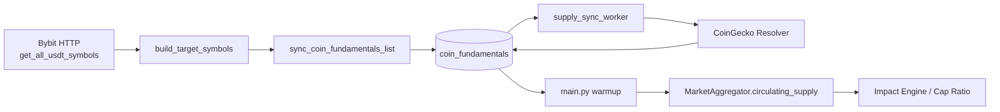
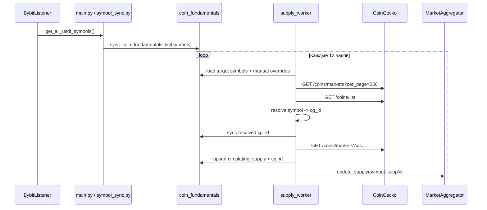

# MCAP\_HEALING

Документ фиксирует фактическую архитектуру контура авто-обнаружения, seeding и разрешения `Market Cap` / `circulating_supply` в проекте CSL.

Источником истины является рабочий код в `src/`.&#x20;

## Scope

- Основные модули:
  - [main.py](../src/main.py)
  - [fundamentals\_service.py](../src/database/crud/fundamentals_service.py)
  - [symbol\_sync.py](../src/services/symbol_sync.py)
  - [supply\_worker.py](../src/services/supply_worker.py)
  - [bybit\_ws.py](../src/services/bybit_ws.py)
  - [market\_aggregator.py](../src/services/aggregators/market_aggregator.py)
  - [models.py](../src/database/models.py)

***

## Explanation

### Проблема в архитектуре «Улья»

Контур аналитики ликвидаций опирается на `Market Cap` и производные метрики (`Cap Ratio`, фильтрация мусорных событий). Для их вычисления `Impact Engine` должен знать:

- базовый символ инструмента;
- `circulating_supply`;
- корректный `cg_id` CoinGecko;
- актуальную цену из рыночного snapshot.

До рефакторинга система имела три системные точки отказа:

- `Ticker collisions`: публичный `coins/list` CoinGecko содержит множество коллизий по `symbol`, а логика “бери первое совпадение” приводила к ложным `cg_id`.
- `Cold start`: если символ еще не попал в runtime-снимки агрегатора, воркер эмиссии вообще не знал о его существовании.
- `Static mapping`: ручные исправления жили в коде и требовали деплоя для каждой новой коллизии или листинга.

В результате система устойчиво обновляла только уже “прогретую” часть universe, а новые или коллидирующие инструменты выпадали из расчета MCAP.

### Архитектурное решение

Фактическая реализация разбила задачу на четыре слоя:

- `Discovery layer`: [BybitListener.get\_all\_usdt\_symbols()](../src/services/bybit_ws.py#L34-L52) отдает полный список доступных `USDT`-пар Bybit.
- `Seeding layer`: [sync\_coin\_fundamentals\_list()](../src/database/crud/fundamentals_service.py#L13-L46) гарантирует, что каждая обнаруженная пара представлена в `coin_fundamentals`.
- `Resolver layer`: [supply\_sync\_worker()](../src/services/supply_worker.py#L222-L362) разрешает `symbol -> cg_id`, получает `circulating_supply`, синхронизирует БД и runtime-кэш.
- `Consumption layer`: [MarketAggregator.update\_supply()](../src/services/aggregators/market_aggregator.py#L366-L374) и дальнейший расчет impact-метрик используют уже очищенный базовый символ.

Ключевой архитектурный инвариант:

> Источником истины для universe монет является `coin_fundamentals`, а не оперативная память воркеров.

### Почему БД стала контрактом между воркерами

Вместо того чтобы каждый раз заново строить universe внутри `supply_worker`, система использует БД как интеграционный контракт между двумя независимыми жизненными циклами:

- `startup / symbol discovery` отвечает за то, чтобы нужная строка существовала в БД;
- `resolver / supply sync` отвечает за обогащение этой строки `cg_id` и `circulating_supply`.

Это дает три эффекта:

- новый листинг сначала “регистрируется” как сущность домена;
- разрешение MCAP становится идемпотентной фоновой задачей поверх стабильного набора строк;
- `Impact Engine` не зависит от того, видел ли WebSocket уже сделки по конкретной монете.



### Нормализация как доменный слой

Контур MCAP работает не с “сырой” биржевой парой, а с базовым активом. Это выражено в [normalize\_bybit\_symbol()](../src/utils.py#L12-L22):

- суффикс `USDT` удаляется;
- числовой префикс удаляется (`1000PEPE -> PEPE`);
- итоговый символ нормализуется до нижнего регистра, после чего в большинстве слоев приводится к upper-case ключу.

Это важно, потому что:

- таблица `coin_fundamentals` хранит базовый актив, а не полную Bybit-пару;
- `MarketAggregator` тоже адресует supply по очищенному символу;
- для мультипликаторных тикеров (`1000PEPE`) multiplier учитывается отдельно при расчете impact-метрик, а не через отдельную запись в `coin_fundamentals`.

### Иерархия разрешения `cg_id`

Resolver в [supply\_worker.py](../src/services/supply_worker.py#L117-L153) использует трехуровневую иерархию:

1. `CoinMapping` из БД как явный override.
2. `Top-250 markets` CoinGecko как более качественный авто-слой при коллизиях.
3. `coins/list` как общий fallback.

Это означает, что ручная настройка не просто помогает runtime-резолву, а становится persisted truth: после построения `resolved_by_symbol` воркер вызывает [\_sync\_resolved\_cg\_ids()](../src/services/supply_worker.py#L174-L208) и синхронизирует выбранный `cg_id` обратно в `coin_fundamentals`, даже если в текущем цикле еще не удалось получить `circulating_supply`.



### Как решен cold start фактически

Исторический план предполагал, что `supply_worker` сам будет обращаться к Bybit HTTP API и на каждом цикле строить полный список активов. В рабочем коде выбран другой путь:

- на старте [main.py](../src/main.py#L136-L157) выполняет первичный seeding всех `target_symbols`;
- в фоне [symbol\_sync\_worker()](../src/services/symbol_sync.py#L24-L54) каждые 10 минут проверяет новые листинги и досеивает их в БД;
- сам `supply_worker` остается строго `DB-driven`.

Это более чистое разделение ответственности:

- discovery не смешивается с resolver;
- universe пополняется мгновенно при появлении листинга;
- `supply_worker` не зависит от Bybit API как от второго внешнего источника истинности.

### Обработка rate limits и наблюдаемость

`CoinGecko` теперь обрабатывается как нестабильный внешний провайдер:

- [\_fetch\_json()](../src/services/supply_worker.py#L54-L96) поддерживает экспоненциальный backoff на `429`;
- счетчик попыток ведется отдельно по имени запроса (`top-250`, `coins/list`, `supply chunk N`);
- после успешного ответа backoff для конкретного запроса сбрасывается;
- в конце цикла [\_log\_unresolved\_symbols()](../src/services/supply_worker.py#L211-L219) выводит список символов без найденного `cg_id`.

Это превращает логи в операционный интерфейс для ручного пополнения `coin_mappings`.

### Отклонения фактического кода от плана

Ниже перечислены расхождения между [plan\_MCAP\_healing.md](../plan_MCAP_healing.md) и текущей реализацией:

1. `Cold start` решен не через HTTP-вызов Bybit из `supply_worker`, а через `startup seeding + real-time seeding`.
2. В плане фигурирует `seed_coin_fundamentals(...)`, в коде реализована функция [sync\_coin\_fundamentals\_list(...)](../src/database/crud/fundamentals_service.py#L13-L46). Семантически это тот же seeding, но имя отражает идемпотентную синхронизацию списка.
3. План “Phase 6” говорит о приоритизации строк с `circulating_supply IS NULL or 0`; в текущем коде [\_load\_target\_symbols()](../src/services/supply_worker.py#L35-L41) просто выбирает `DISTINCT symbol ORDER BY symbol`. Приоритизация пустышек пока не реализована.
4. В плане пример лога звучит как “Внимание! Не найден маппинг...”; в коде реализован фактический формат `[MCAP] Не найден маппинг для: ...`.
5. Текст warning-лога предлагает добавить записи в `coin_mapping`, тогда как фактическая таблица в БД называется `coin_mappings`.
6. Seeding выполняется с `circulating_supply = 0.0`, а не `NULL`, потому что поле `CoinFundamental.circulating_supply` объявлено `nullable=False` в [models.py](../src/database/models.py#L134-L144).

***

## Reference

### Модели БД

#### `CoinMapping`

Источник: [models.py](../src/database/models.py#L126-L131)

| Поле      | Тип                   | Назначение                                      |
| :-------- | :-------------------- | :---------------------------------------------- |
| `symbol`  | `String(20)`          | Базовый тикер Bybit, primary key                |
| `cg_id`   | `String(100)`         | Явный CoinGecko ID, высший приоритет в resolver |
| `comment` | `String(255) \| None` | Административная заметка по override            |

Миграция: [6d2f4b8a1c33\_add\_coin\_mappings\_table.py](../alembic/versions/6d2f4b8a1c33_add_coin_mappings_table.py#L1-L51)

Стартовый seed ручных overrides:

```python
SEED_MAPPINGS = [
    {"symbol": "BIT", "cg_id": "bitdao", "comment": "Migrated from legacy utils.MANUAL_MAPPING"},
    {"symbol": "WLD", "cg_id": "worldcoin-org", "comment": "Migrated from legacy utils.MANUAL_MAPPING"},
    {"symbol": "PEPE", "cg_id": "pepe", "comment": "Migrated from legacy utils.MANUAL_MAPPING"},
    {"symbol": "SHIB", "cg_id": "shiba-inu", "comment": "Migrated from legacy utils.MANUAL_MAPPING"},
]
```

#### `CoinFundamental`

Источник: [models.py](../src/database/models.py#L134-L144)

| Поле                 | Тип                   | Назначение                             |
| :------------------- | :-------------------- | :------------------------------------- |
| `symbol`             | `String(20)`          | Базовый актив, primary key             |
| `circulating_supply` | `Float`               | Текущее предложение, обязательное поле |
| `cg_id`              | `String(100) \| None` | Разрешенный CoinGecko ID               |
| `last_updated`       | `DateTime`            | Время последнего апдейта строки        |

Практический смысл:

- строка в `coin_fundamentals` означает “система знает о существовании этого актива”;
- `cg_id is NULL` означает, что resolver еще не подобрал CoinGecko identity;
- `circulating_supply = 0.0` после seeding означает “актив зарегистрирован, но supply пока не получен”.

### CRUD: `sync_coin_fundamentals_list`

Источник: [fundamentals\_service.py](../src/database/crud/fundamentals_service.py#L13-L46)

Сигнатура:

```python
async def sync_coin_fundamentals_list(session: AsyncSession, symbols: list[str]) -> int:
```

Контракт функции:

- принимает список сырых Bybit-символов;
- нормализует каждый символ через `normalize_bybit_symbol`;
- собирает deduplicated payload;
- вставляет недостающие строки через `ON CONFLICT (symbol) DO NOTHING`;
- возвращает число реально добавленных записей.

Ключевой фрагмент:

```python
payload = [
    {
        "symbol": symbol,
        "circulating_supply": 0.0,
        "cg_id": None,
        "last_updated": get_utc_now(),
    }
    for symbol in normalized_symbols
]

stmt = insert(CoinFundamental).values(payload)
stmt = stmt.on_conflict_do_nothing(index_elements=["symbol"])
```

Комментарий:

- функция не модифицирует существующие записи;
- seeding не трогает уже вычисленный `cg_id` и не сбрасывает `circulating_supply`;
- это чистая idempotent registration step.

### Startup integration: `main.py`

Источник: [main.py](../src/main.py#L136-L180)

Фактический порядок операций:

1. `BybitListener` получает все активные `USDT`-пары через [get\_all\_usdt\_symbols()](../src/services/bybit_ws.py#L34-L52).
2. `build_target_symbols()` применяет `IGNORED_SYMBOLS` и `DEV_MODE`.
3. Внутри стартовой DB-сессии вызывается [sync\_coin\_fundamentals\_list()](../src/database/crud/fundamentals_service.py#L13-L46).
4. После этого из БД загружается весь `CoinFundamental` и его `circulating_supply` прогревает `MarketAggregator`.
5. Только затем запускаются `symbol_sync_worker` и `supply_sync_worker`.

Критический инвариант:

> `supply_sync_worker` стартует только после того, как universe активов уже зарегистрирован в `coin_fundamentals`.

### Real-time discovery: `symbol_sync_worker`

Источник: [symbol\_sync.py](../src/services/symbol_sync.py#L24-L54)

Сигнатура:

```python
async def symbol_sync_worker(listener: BybitListener, market_aggregator: MarketAggregator) -> None:
```

Ответственность воркера:

- каждые `600` секунд опрашивает Bybit по списку символов;
- сравнивает новый список с `listener.target_symbols`;
- выделяет `new_symbols`;
- досеивает их в `coin_fundamentals`;
- прогревает market/ohlc-контур;
- добавляет символы в WebSocket hot-swap.

Ключевой фрагмент:

```python
if new_symbols:
    async with async_session() as session_db:
        seeded_count = await sync_coin_fundamentals_list(session_db, new_symbols)

    await warmup_system(market_aggregator, new_symbols)
    await warmup_ohlc(market_aggregator, new_symbols)

    for symbol in new_symbols:
        await listener.add_new_symbol(symbol)
```

Комментарий:

- сначала БД, потом warmup/runtime;
- это гарантирует, что новый актив виден resolver-контурy до следующего прохода `supply_worker`;
- `symbol_sync_worker` не занимается `cg_id` и supply напрямую, только discovery и registration.

### Resolver: `supply_worker`

Источник: [supply\_worker.py](../src/services/supply_worker.py#L35-L362)

#### Внутренние функции

| Функция                     | Назначение                                                        |
| :-------------------------- | :---------------------------------------------------------------- |
| `_load_target_symbols()`    | Читает universe символов из `coin_fundamentals`                   |
| `_load_manual_overrides()`  | Загружает `CoinMapping` в `symbol -> cg_id` map                   |
| `_fetch_json()`             | Выполняет HTTP-запрос к CoinGecko и применяет backoff на `429`    |
| `_build_symbol_id_map()`    | Строит map по ответу CoinGecko, сохраняя первый приоритетный `id` |
| `_resolve_symbol_ids()`     | Применяет иерархию `manual -> top_market -> coins/list`           |
| `_sync_resolved_cg_ids()`   | Persist'ит итоговый `cg_id` в `coin_fundamentals`                 |
| `_upsert_fundamentals()`    | Bulk upsert `circulating_supply`, `cg_id`, `last_updated`         |
| `_log_unresolved_symbols()` | Логирует список символов без найденного `cg_id`                   |

#### Иерархия `symbol -> cg_id`

Источник: [\_resolve\_symbol\_ids()](../src/services/supply_worker.py#L117-L153)

```python
cg_id = manual_overrides.get(symbol)
if not cg_id:
    cg_id = top_market_map.get(symbol)
if not cg_id:
    cg_id = fallback_map.get(symbol)
```

Комментарий:

- ручной override всегда доминирует;
- `top_market_map` предназначен для collision-sensitive auto-match;
- `fallback_map` нужен только для покрытия редких активов вне top-250.

#### Обновление persisted state

Источник: [\_sync\_resolved\_cg\_ids()](../src/services/supply_worker.py#L174-L208), [\_upsert\_fundamentals()](../src/services/supply_worker.py#L156-L171)

`supply_worker` выполняет два отдельных DB-шага:

1. сразу после резолва синхронизирует `cg_id` в `coin_fundamentals`;
2. после получения `circulating_supply` делает `ON CONFLICT DO UPDATE`.

Это важно, потому что `cg_id` может быть уже известен, даже если CoinGecko временно не отдал `circulating_supply`.

#### Backoff на `429`

Источник: [\_fetch\_json()](../src/services/supply_worker.py#L54-L96)

Формула:

```python
retry_delay = min(
    RATE_LIMIT_BACKOFF_BASE_SECONDS * (2 ** (attempt - 1)),
    RATE_LIMIT_BACKOFF_MAX_SECONDS,
)
```

Параметры:

- `RATE_LIMIT_BACKOFF_BASE_SECONDS = 30`
- `RATE_LIMIT_BACKOFF_MAX_SECONDS = 15 * 60`

Поведение:

- backoff учитывается отдельно по `request_name`;
- на `200 OK` счетчик сбрасывается;
- на non-429 ошибки используется фиксированная `RETRY_ON_ERROR_SECONDS = 300`.

#### Reporting по unresolved symbols

Источник: [\_log\_unresolved\_symbols()](../src/services/supply_worker.py#L211-L219)

Фактический лог:

```python
logger.warning(
    "[MCAP] Не найден маппинг для: %s. Добавьте их в таблицу coin_mapping.",
    ", ".join(sorted(set(unresolved_symbols))),
)
```

Смысл лога:

- это не список “без supply”;
- это именно список символов, для которых resolver не смог подобрать `cg_id`;
- список предназначен для ручного пополнения `coin_mappings`.

### `BybitListener.get_all_usdt_symbols`

Источник: [bybit\_ws.py](../src/services/bybit_ws.py#L34-L52)

Сигнатура:

```python
def get_all_usdt_symbols(self) -> list[str]:
```

Семантика:

- использует `self.http.get_instruments_info(category="linear", limit=1000)`;
- берет только пары, оканчивающиеся на `USDT`;
- допускает статусы `Trading` и `PreLaunch`.

Это важный источник truth для seeding, потому что universe определяется на уровне биржи, а не на уровне runtime trade-flow.

### `MarketAggregator` и потребление supply

Источник: [market\_aggregator.py](../src/services/aggregators/market_aggregator.py#L366-L374)

Сигнатуры:

```python
def update_supply(self, symbol: str, supply: float) -> None
def get_supply(self, symbol: str) -> float | None
```

Поведение:

- ключ всегда нормализуется через `normalize_bybit_symbol(symbol).upper()`;
- runtime-кэш использует ту же базовую идентичность, что и `coin_fundamentals`;
- это гарантирует, что seeded symbol, resolved `cg_id` и impact-calculation говорят об одной и той же сущности.

### В этом модуле нет DTO-слоя

В отличие от финансового контура, MCAP Healing не вводит отдельные DTO. Фактический контракт выражен через:

- ORM-модели `CoinFundamental` и `CoinMapping`;
- внутренние словари `dict[str, str]`, `dict[str, list[str]]`, `list[dict[str, object]]`;
- runtime-кэш `MarketAggregator.circulating_supply`.

Это означает, что граница модуля проходит не по DTO, а по shared storage + in-memory cache.
