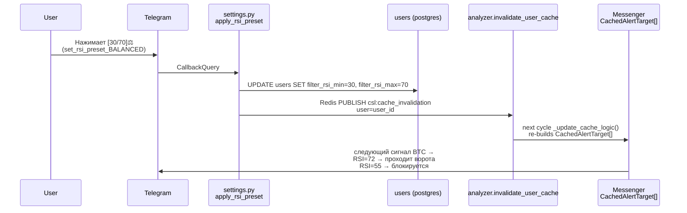

# RSI\_GATE

Документ фиксирует фактическую архитектуру пользовательского RSI-фильтра (RSI-Gate) в CSL. Описывается логика «ворот»: сигнал к пользователю доходит **только если** `RSI ≤ rsi_min` ИЛИ `RSI ≥ rsi_max`. Источником истины является рабочий код в `src/` и текущие `.ftl`-ресурсы.

## Scope

- **Инфраструктура:**
  - [models.py](../src/database/models.py#L52-L56) — колонки `filter_rsi_min/max` в `User`
  - [dto.py](../src/core/dto.py#L72-L73) — `SettingPresetDTO.rsi_min/max`
  - [config.py](../src/core/config.py#L71-L137) — `SETTING_PRESETS` с RSI-зонами
  - [d4e5f6a7b8c9\_add\_rsi\_filter\_thresholds.py](../alembic/versions/d4e5f6a7b8c9_add_rsi_filter_thresholds.py) — Alembic-миграция
- **The Brain + Per-User Pass:**
  - [trigger_engine.py](../src/services/logic/trigger_engine.py#L18-L74) — ядро RSI-ворот: `evaluate_trigger_logic`
  - [analyzer.py](../src/services/analyzer.py#L24-L45) — системный проход (`CachedAlertTarget` + принудительный `100/0`)
  - [messenger_worker.py](../src/services/messenger_worker.py#L33-L54) — per-user проход (`CachedAlertTarget` + пользовательские границы)
- **Сервисный слой:**
  - [user_service.py](../src/database/crud/user_service.py#L330-L383) — `apply_user_setting_preset` (атомарная запись RSI + инвалидация)
- **UI/UX:**
  - [settings_kb.py](../src/bot/keyboards/settings_kb.py#L114-L123) — entry-кнопка в Filter Triggers
  - [settings_kb.py](../src/bot/keyboards/settings_kb.py#L225-L267) — подменю RSI + `_format_rsi()`
  - [settings.py](../src/bot/handlers/settings.py#L29-L37) — FSM `SettingsStates.waiting_for_rsi_thresholds`
  - [settings.py](../src/bot/handlers/settings.py#L586-L687) — 5 RSI-хендлеров + `_RSI_PRESET_BAND_MAP`
- **Локализация:**
  - [settings.ftl (ru)](../assets/locales/ru/settings.ftl)
  - [settings.ftl (en)](../assets/locales/en/settings.ftl)
- **Исторический контекст:**
  - [IMPLEMENTATION_PLAN.md](../IMPLEMENTATION_PLAN.md) — исходный план и отклонения DEV-001..DEV-003

***

## Explanation

### Что такое RSI-Gate в архитектуре «Улья»

RSI-Gate — это самый первый (early-return) фильтр в `evaluate_trigger_logic`. В отличие от остальных триггеров (CASCADE / OI_PUMP / SQUEEZE / VOLUME) он работает как **«ворота в начале коридора»**: сигнал не доходит даже до расчёта объёмов/ОИ, если RSI активного актива не в экстремальной зоне пользователя.

Ключевая архитектурная особенность: RSI-Gate работает **только в per-user контексте** (`messenger_worker.py`). В системном проходе `analyzer.py` он **принудительно выключен** (пара `100.0 / 0.0`). Это гарантия того, что индивидуальные настройки пользователя могут «протащить» сигнал, который для другого пользователя был бы заблокирован. См. DEV-002 ниже.

### Четыре инварианта RSI-Gate

Инвариант | Значение
---------|----------
1.**Сигнатура «выключено»** | `rsi_min == 100.0 && rsi_max == 0.0` — инвертированная пара, при которой `rsi_filter_active = False`. Не `0/100`: тогда guard-условие заблокировало бы любой RSI `1..99`.
2.**No-Data Safety** | Если фильтр активен (не `100/0`), а `current_rsi is None` — сигнал **блокируется**. Пользователь не получает спам «на неопределённости» в первые 15 минут разогрева свечей. Если фильтр выключен (`100/0`), None-RSI не мешает.
3.**Atomic Preset Application** | При `apply_user_setting_preset` все числовые пороги (USD/%/OI/RSI) записываются **одним UPDATE** + один `invalidate_user_cache`. В системе не может быть промежуточного состояния «пресет применился наполовину».
4.**Performance: O(1) до цикла** | Три RSI-ветки стоят **перед** `has_cascade/has_volume/has_squeeze/has_oi_pump`. Порядок важен: при активном фильтре и пустом RSI мы экономим ~6 сравнений, а при центральном RSI — и больше.

```mermaid
flowchart TD
    LIQ[Liquidation Item<br>from WS stream] --> B[Brain: analyzer.py<br>process_liquidation_item]
    B -->|"rsi_min=100 rsi_max=0<br>RSI FORCED OFF"| ET1[evaluate_trigger_logic<br>(DEV-002: no RSI gate here)]
    ET1 -->|"alert_type IN {CASCADE/OI/VOL/SQZ}"| STREAM[(Redis Stream<br>csl:signals:ready)]
    STREAM --> MW[Messenger Worker<br>_check_triggers_from_dto<br>per each active user]
    MW -->|"target.filter_rsi_min<br>target.filter_rsi_max"| ET2[evaluate_trigger_logic<br>with PER-USER RSI params]
    ET2 -->|"✅ RSI <= min OR RSI >= max"| RENDER[Render + Send Telegram]
    ET2 -->|"❌ RSI None + filter_active"| DROP1[Drop silently]
    ET2 -->|"❌ RSI внутри зоны"| DROP2[Drop silently]
    ET2 -->|"✅ 100/0 disabled: always pass"| RENDER

    style B fill:#bbdefb,color:#0d47a1
    style ET1 fill:#e3f2fd,color:#000
    style MW fill:#fff3e0,color:#e65100
    style ET2 fill:#ffe0b2,color:#bf360c
    style DROP1 fill:#ffcdd2,color:#b71c1c
    style DROP2 fill:#ffcdd2,color:#b71c1c
```

### Жизненный цикл настроек пользователя (RSI preset)



### Отклонения от IMPLEMENTATION_PLAN.md (фактическая реализация)

| Код | Пункт плана | Фактическое поведение | Причина |
|-----|-------------|-----------------------|---------|
| DEV-001 | Ф2.1 Новые параметры в `evaluate_trigger_logic` | Параметры `current_rsi`, `rsi_min`, `rsi_max` добавлены **с дефолтами** (`None, 100.0, 0.0`), не как required | Legacy-вызовы в других модулях не переписывались; дефолт эквивалентен «фильтр выключен» |
| DEV-002 | Ф2.2 RSI в `analyzer.process_liquidation_item` | **Принудительно `rsi_min=100.0, rsi_max=0.0`** в системном проходе. RSI применяется только в `messenger_worker._check_triggers_from_dto`. | RSI — per-user фильтр. Если отсеять его в brain-проходе, пользователи с узкими зонами не получат то, что могут пройти у других |
| DEV-003 | Ф3.1 `apply_user_setting_preset` | Реализован **в Фазе 1+2**, не в Фазе 3 | Atomic Preset Constraint: без RSI-строк применение пресета было бы неатомарным |
| DEV-004 | Ф1.1 RSI в `ChannelSettings` | **Полностью отменено**, legacy-таблица вообще не трогалась | Пользовательский отказ: `ChannelSettings` — устаревший слой, вскоре удаляется |
| UX-001 | Ф4 `Меню → FSM сразу при ручном вводе` | Премиум пресеты **применяются одним нажатием без FSM**; отдельная кнопка `✏️ Ввести вручную` переводит в FSM-режим | Скорость UX: установить 20/80🐋 → один tap, а не ввод текста |
| UX-002 | Ф4 «Назад» в RSI-меню | Callback → `settings_filters` (уровень выше), не `back_to_settings` | Navigation Rule: каждый submenu возвращает строго на предыдущий уровень |

***

## Reference

### 1. Хранилище (Модель БД)

Добавлены две колонки в `users`. `server_default` задаёт **disabled-состояние** (`100/0`), поэтому онбординг-skip не создаёт «зомби-пользователей» с внезапно жёстким RSI-фильтром.

Колонка в `User` | Тип | SQLAlchemy default | Alembic server_default | Назначение
-------------------|------|--------------------|------------------------|-----------
`filter_rsi_min` | `Float` | `100.0` | `'100.0'` | Нижняя граница (пропускает `RSI ≤ значение`)
`filter_rsi_max` | `Float` | `0.0` | `'0.0'` | Верхняя граница (пропускает `RSI ≥ значение`)

Миграция (чистый upgrade без channel_settings — см. DEV-004):

```python
# alembic/versions/d4e5f6a7b8c9_add_rsi_filter_thresholds.py
def upgrade() -> None:
    op.add_column("users", sa.Column("filter_rsi_min", sa.Float(),
                  nullable=False, server_default="100.0"))
    op.add_column("users", sa.Column("filter_rsi_max", sa.Float(),
                  nullable=False, server_default="0.0"))
```

Ссылка на ORM: [models.py L52–L56](../src/database/models.py#L52-L56).

### 2. DTO + Контракты

#### SettingPresetDTO (frozen dataclass)

Порядок полей: **сначала все пороги thresholds, потом RSI-гейты, потом toggle-блоки**. Добавлено на строках 72–73 между `threshold_cascade_mcap_usd_min` и `alert_cascade`.

```python
# src/core/dto.py L72–L73
@dataclass(slots=True, frozen=True)
class SettingPresetDTO:
    # ... все threshold-поля USD/OI/% ...
    rsi_min: float
    rsi_max: float
    # ... все toggle-поля (alert_cascade, alert_volume, …) …
```

#### SETTING_PRESETS — три архетипа + неявный Disabled

Источник: [config.py L71–L137](../src/core/config.py#L71-L137).

| Preset ID  | rsi_min | rsi_max | Торговый смысл |
|------------|---------|---------|----------------|
| SCALPER ⚡️| 35.0    | 65.0    | Узкая полоса: любые острые пики волатильности |
| BALANCED ⚖️| 30.0    | 70.0    | Классика: умеренная экстремальность |
| CONSERVATIVE 🐋| 20.0 | 80.0 | Жёсткая зона: только реальные перекупленность/перепроданность |
| DISABLED 🔓| 100.0  | 0.0     | Sentinel: ворота всегда открыты |

### 3. Runtime TypedDicts (CachedAlertTarget)

Оба консьюмера сигналов хранят RSI-границы в своих `CachedAlertTarget`-срезах с **fallback** на `100.0/0.0` (`getattr(source, ..., 100.0)`) — защита от «полусовместимых» legacy-юзеров в миграционном окне.

| Модуль | Добавленные ключи в TypedDict | Fallback в `_build_cached_target` |
|--------|-------------------------------|------------------------------------|
| [analyzer.py](../src/services/analyzer.py#L42-L45) | `filter_rsi_min: float`, `filter_rsi_max: float` | `100.0` / `0.0` |
| [messenger_worker.py](../src/services/messenger_worker.py#L51-L54) | тоже | `100.0` / `0.0` |

### 4. Триггер-ядро: `evaluate_trigger_logic`

Источник: [trigger_engine.py L18–L47](../src/services/logic/trigger_engine.py#L18-L47).

```python
def evaluate_trigger_logic(
    *,
    # ... volume / cascade / oi / squeeze параметры ...
    current_rsi: float | None = None,     # DEV-001: default = None
    rsi_min: float = 100.0,               # DEV-001: default = DISABLED (100/0)
    rsi_max: float = 0.0,
) -> SignalAlertType | None:
    # 1) Проверка: фильтр ВКЛ (не sentinel 100/0)?
    rsi_filter_active = not (rsi_min == 100.0 and rsi_max == 0.0)
    if rsi_filter_active:
        # 2) No-Data Safety: RSI ещё посчитался?
        if current_rsi is None:
            return None                                   # Early-return 1
        # 3) Условие «ворот»: РАЗРЕШАЕМ только экстремумы
        if not (current_rsi <= rsi_min or current_rsi >= rsi_max):
            return None                                   # Early-return 2
    # ... после трёх RSI-веток следуют: has_cascade / has_volume / has_squeeze / has_oi_pump
```

#### Точка-вызов 1: Системный проход (Brain) — RSI ПРИНУДИТЕЛЬНО ВЫКЛЮЧЕН

Источник: [analyzer.py L281–L299](../src/services/analyzer.py#L281-L299).

```python
alert_type = evaluate_trigger_logic(
    # ... volume/cascade/oi thresholds ...
    current_rsi=rsi_val,
    rsi_min=100.0,   # DEV-002 hardcoded: RSI gate OFF на уровне Brain
    rsi_max=0.0,
)
```

#### Точка-вызов 2: Per-User (Messenger) — здесь РАБОТАЕТ RSI-Gate

Источник: [messenger_worker.py L173–L194](../src/services/messenger_worker.py#L173-L194).

```python
alert_type = evaluate_trigger_logic(
    # ... enable_cascade/enable_oi/enable_squeeze/enable_volume per-user ...
    current_rsi=market_data.get("rsi"),          # текущий RSI из DTO
    rsi_min=target["filter_rsi_min"],            # per-user минимальная граница
    rsi_max=target["filter_rsi_max"],            # per-user максимальная граница
)
```

### 5. Сервисный слой: атомарное применение пресета

Источник: [user_service.py L341–L382](../src/database/crud/user_service.py#L341-L382).

```python
update_values = {
    # ... threshold-поля (USD / OI / %) ...
    "filter_rsi_min": float(preset.rsi_min),   # DEV-003: RSI в том же UPDATE
    "filter_rsi_max": float(preset.rsi_max),
    # ... toggle-поля ...
    "threshold_mode": str(preset.threshold_mode).upper(),   # LAST: контракт порядка
}

await session.execute(update(User).where(User.id == user_id).values(**update_values))
await session.commit()

from src.services.analyzer import invalidate_user_cache
await invalidate_user_cache(user.id)   # один инвалидационный Redis PUBLISH
```

### 6. UI: Клавиатуры + RSM-меню

#### Entry-кнопка в меню «Фильтры триггеров»

Расположена **перед** `back_to_settings`, сразу после OI-порогов. Динамический LazyProxy-плейсхолдер: `⚙️ Границы RSI: 30 / 70`.

Источник: [settings_kb.py L114–L123](../src/bot/keyboards/settings_kb.py#L114-L123).

```python
InlineKeyboardButton(
    text=LazyProxy("kb-settings-rsi-thresholds",
                   rsi_min=str(_format_rsi(user.filter_rsi_min)),
                   rsi_max=str(_format_rsi(user.filter_rsi_max))),
    callback_data="menu_rsi_thresholds",
)
```

`_format_rsi()` округляет float-границы до целых (`int(round(...))`) для компактного UI — [settings_kb.py L225–L230](../src/bot/keyboards/settings_kb.py#L225-L230).

#### Подменю RSI: `get_settings_rsi_kb()`

Источник: [settings_kb.py L233–L267](../src/bot/keyboards/settings_kb.py#L233-L267).

| Строка | Контент | callback_data |
|--------|---------|---------------|
| 1 | `[20/80]🐋  [30/70]⚖️  [35/65]⚡️` | `set_rsi_preset_CONSERVATIVE/BALANCED/SCALPER` |
| 2 | `[🔓 Выключить (100/0)]  [✏️ Ввести вручную]` | `set_rsi_preset_DISABLED`, `set_rsi_manual_start` |
| 3 | `[⬅️ Назад к фильтрам]` | `settings_filters` (UX-002: на уровень выше) |

Экспорт: [\_\_init\_\_.py L2–L10](../src/bot/keyboards/__init__.py#L2-L10) и [\_\_all\_\_](../src/bot/keyboards/__init__.py#L21-L30).

### 7. UI: FSM + 5 RSI-хендлеров

FSM-состояние: [settings.py L29–L37](../src/bot/handlers/settings.py#L29-L37).
```python
class SettingsStates(StatesGroup):
    # ... другие FSM-состояния ...
    waiting_for_rsi_thresholds = State()
```

`_RSI_PRESET_BAND_MAP` (константа UI-уровня, независима от config.SETTING_PRESETS — [settings.py L586–L591](../src/bot/handlers/settings.py#L586-L591)):
```python
_RSI_PRESET_BAND_MAP = {
    "CONSERVATIVE": (20.0, 80.0),
    "BALANCED":     (30.0, 70.0),
    "SCALPER":      (35.0, 65.0),
    "DISABLED":     (100.0, 0.0),   # sentinel-disabled
}
```

Сводка хендлеров:

| Handler | Trigger | Действие |
|---------|---------|----------|
| `start_rsi_menu` | `menu_rsi_thresholds` | Рендерит RSI-подменю с `settings-rsi-thresholds-prompt` |
| `apply_rsi_preset` | `set_rsi_preset_<ID>` | Достаёт пару из `_RSI_PRESET_BAND_MAP` → `update_user_settings(rsi_min/max)` → `invalidate_user_cache` → toast |
| `start_rsi_manual_input` | `set_rsi_manual_start` | Ставит FSM `waiting_for_rsi_thresholds` |
| `process_rsi_thresholds` | `waiting_for_rsi_thresholds` message | Парсит `30/70`, `30,70`, `30 70` → валидация `0 ≤ x ≤ 100` → `update_user_settings` → explain-профиль |
| `_explain_rsi_profile(rsi_min, rsi_max)` | helper | Детектирует CONSERVATIVE/BALANCED/SCALPER/DISABLED или custom — отдаёт ключ `settings-rsi-gate-explain-*` |

Ручной ввод поддерживает три разделителя (пробел, `,`, `/`) — см. [settings.py L646–L651](../src/bot/handlers/settings.py#L646-L651):
```python
parts = message.text.replace(",", " ").replace("/", " ").split()
```

### 8. Caption builders: RSI во все summary-экраны

Во все билдеры, перечисленные ниже, добавлены `rsi_min/rsi_max` аргументы. Все числа проходят через `_format_rsi()` → строки-целые.

| Builder | Место | Ключ FTL |
|---------|-------|----------|
| `_build_settings_summary_caption` | [settings.py L263–L277](../src/bot/handlers/settings.py#L263-L277) | `settings-title` |
| `_build_settings_filters_caption` | [settings.py L280–L294](../src/bot/handlers/settings.py#L280-L294) | `settings-filters-screen` |
| `_build_presets_catalog_caption` | [settings.py L44–L72](../src/bot/handlers/settings.py#L44-L72) | `settings-preset-catalog-screen` — отдельные `*_rsi_min/max` для каждого профиля |
| `_build_preset_confirmation_caption` | [settings.py L74–L93](../src/bot/handlers/settings.py#L74-L93) | `settings-preset-confirm-screen` |
| `_build_settings_rsi_caption` | [settings.py L297–L299](../src/bot/handlers/settings.py#L297-L299) | `settings-rsi-thresholds-prompt` |

### 9. Локализация (RU / EN)

Все ключи присутствуют **симметрично** в `ru/settings.ftl` и `en/settings.ftl`. Включены в smoke-проверку.

**Новые тексты FSM (11 штук):**
- `settings-rsi-thresholds-prompt` — FSM-подсказка формата
- `settings-rsi-thresholds-updated` — toast после успешного ручного ввода
- `settings-rsi-thresholds-disabled` — toast после 🔓
- `settings-rsi-gate-explain-{disabled,conservative,balanced,scalper,custom}` — 5 интерпретаций профиля
- `settings-rsi-thresholds-invalid` — ошибка валидации (не 2 числа / не 0–100)

**Кнопочные ключи (8 штук):**
- `kb-settings-rsi-thresholds`
- `kb-settings-rsi-menu`
- `kb-settings-rsi-preset-{conservative,balanced,scalper}`
- `kb-settings-rsi-disable`, `kb-settings-rsi-manual`, `kb-settings-rsi-back`

**Обновлённые существующие блоки:**
- `settings-title`, `settings-filters-screen` — строка `RSI-гейт: { $rsi_min } / { $rsi_max }`
- `settings-preset-catalog-screen` — RSI для каждого профиля + вступление «RSI-гейт»
- `settings-preset-confirm-screen` — RSI на экране подтверждения
- `help-analytics` — отдельный параграф **🚦 RSI-гейт** с объяснением disabled=100/0, 30/70 стандарт, 20/80 жесткий, принцип No-Data Safety
