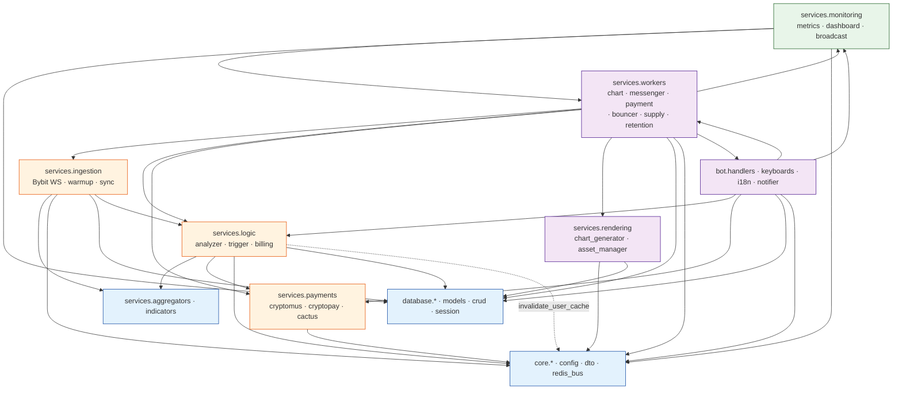

# Services Architecture — Доменная декомпозиция слоя `src/services/` по философии «Улей»

---

## 1. Архитектурный обзор (Explanation)

### 1.1 Проблема «God Folder» и почему старое устройство не масштабируется

До рефакторинга `src/services/` представлял собой **смесь доменных областей в плоском списке**: WebSocket-обработчики биржи, клиенты платёжных шлюзов, генератор графиков, фоновые демоны доставки, вышибала подписок, ядро аналитики и панель метрик — всё находилось в одном каталоге.

Это порождало 4 класса проблем:

| Проблема | Симптомы в CSL |
|---|---|
| **Когнитивная перегрузка онбординга** | Новый инженер, открывающий `src/services/`, не мог понять срез системы «data-in → decision → data-out» без изучения 20+ README-less модулей. |
| **Скрытые циклические зависимости** | `analyzer.py` ↔ `trigger_engine.py` ↔ `billing_processor.py` ↔ `bouncer.py` — плоское пространство имён маскировало направление зависимостей. |
| **Нечёткие ownership boundaries** | При смене провайдера платежей, переезде на новый DEX или переписывании движка аналитики инженеры не имели явных границ «какие модули я могу ломать». |
| **Невозможность горизонтального масштабирования** | В докер-среде каждый worker выносится в отдельный контейнер с `python -m src.services.X`. При плоской структуре не было гарантий, что запуск `messenger_worker` не потянет за собой тяжелый `chart_generator` (ошибки импорта в production). |

### 1.2 Философия «Улей» (The Hive) — как работает доменная декомпозиция

Микросервисная философия в монолите Python означает **не развёртывание отдельных подов**, а **строгую сегрегацию пакетов по направлению потока данных и характеру ответственности**:

```
┌──────────────────────────────────────────────────────────────────────┐
│                 ПОТОК ДАННЫХ В «УЛЬЕ» CSL                            │
│                                                                      │
│  ingestion/                 logic/                   workers/        │
│  ┌──────────┐  DTO-массив  ┌──────────────┐  signal  ┌────────────┐  │
│  │bybit_ws  │─────────────▶│  analyzer.py │─────────▶│messenger_w │  │
│  │worker.py │   события    │trigger_engin │  Stream  │chart_worke │  │
│  │warmup.py │─────────────▶│billing_proc │─────────▶│payment_wor │  │
│  │symbol_syn│              │              │          │bouncer/ret │  │
│  └──────────┘              └──────┬───────┘          └─────┬──────┘  │
│                                  │  invalidate_cache()     │ send    │
│                                  ▼                        ▼         │
│                              payments/               rendering/      │
│                              ┌──────────┐           ┌────────────┐   │
│                              │cryptomus │           │chart_gener │   │
│                              │cryptopay │           │asset_manage│   │
│                              │cactus_cli│           └────────────┘   │
│                              └──────────┘                            │
│                                                                      │
│                          monitoring/ (внешняя диагноcтика)           │
│                          ┌──────────────────────────────────┐       │
│                          │ metrics/dashboard/broadcast      │       │
│                          └──────────────────────────────────┘       │
│                                                                      │
│                 aggregators/ · indicators/ (фундамент)               │
│                 ┌────────────────────────────┐                       │
│                 │ market_aggregator / rsi …  │                       │
│                 └────────────────────────────┘                       │
└──────────────────────────────────────────────────────────────────────┘
```

Каждый пакет решает **ровно одну задачу из потока**: собрать → обогатить → решить → доставить. Это зеркальная архитектура микросервисов, но в рамках одного Python-пакета с дешёвыми межпроцессными вызовами через Redis Streams.

### 1.3 Как принять решение, в какой пакет поместить новый модуль

Правило единственного вопроса в порядке приоритета:

| Вопрос | Ответ → Пакет |
|---|---|
| 1. Модуль **получает данные из внешнего мира** (WebSocket биржи, REST синхронизация листингов, прогрев БД/кэшей)? | → `ingestion/` |
| 2. Модуль **принимает бизнес-решения на основе агрегированных данных** (сигналы, триггеры, биллинг, расчёт Delta-Accounting)? | → `logic/` |
| 3. Модуль **заставляет других что-то делать** (фоновый цикл, консьюмер Redis Stream, таймер, отправка уведомлений)? | → `workers/` |
| 4. Модуль — **тонкий клиент внешнего API** (платёжные шлюзы, крипто-провайдеры, почта)? | → `payments/` (расширяемый паттерн: `integrations/`) |
| 5. Модуль **генерирует медиа/графику/рендер**? | → `rendering/` |
| 6. Модуль — **диагностическая надстройка над всеми** (метрики, BI-дашборд, рассылки админам)? | → `monitoring/` |
| 7. Модуль — **чистое вычисление без побочных эффектов** (скользящие средние, RSI, агрегация стаканов)? | → `indicators/` или `aggregators/` |

Если модуль подходит под 2+ вопроса — это сигнал **к разделению**: например, в старом `dashboard.py` рендер PNG-дашборда (rendering) был смешан с бизнес-статистикой (monitoring). В новом устройстве `dashboard.py` лежит в `monitoring/`, а делегирует работу с Telegram-медиа в `rendering.asset_manager`.

---

## 2. Справочник пакетов (Reference)

Каждый пакет ниже описан по шаблону: **Назначение / Инварианты импорта / Состав / Основные точки входа**.

### 2.1 `src/services/ingestion/` — Сбор и первичная обработка

**Назначение:** Первый контур системы. Принимает события из внешнего мира (Bybit V5 WebSocket), прогревает память процесса из БД/REST, синхронизирует листинги монет.

**Инварианты импорта:**  
✅ Может импортировать из: `src.core.*`, `src.database.crud.*`, `src.services.aggregators.*`, `src.services.indicators.*`, **`src.services.logic.analyzer`** (обработка ликвидаций).  
❌ НЕ МОЖЕТ импортировать из: `payments`, `rendering`, `workers`, `monitoring`, `bot.*` (нет обратных UI-зависимостей).

**Состав пакета:**

| Модуль | Ответственность | Ключевые символы |
|---|---|---|
| [bybit_ws.py](file:///root/signal_bot/src/services/ingestion/bybit_ws.py) | Bybit V5 WS-клиент с Connection Pool (`ws_map`), heartbeat, Hot Swap новых монет | `BybitListener`, `get_all_usdt_symbols`, `add_new_symbol`, `last_message_time` |
| [worker.py](file:///root/signal_bot/src/services/ingestion/worker.py) | Consumer очереди `asyncio.Queue`: разбор `liquidation/ticker/trade`, семафор `Semaphore(100)` для защиты OOM | `DataWorker.run(queue)`, `process_liquidation_item` (делегация в analyzer) |
| [warmup.py](file:///root/signal_bot/src/services/ingestion/warmup.py) | Прогрев агрегаторов данными из Bybit REST (OI, RSI 15m, минутные OHLC) | `warmup_system()`, `warmup_ohlc()` |
| [symbol_sync.py](file:///root/signal_bot/src/services/ingestion/symbol_sync.py) | Фоновый воркер **каждые 10 минут**: сравнение `listener.target_symbols` с Bybit REST + Hot Swap | `symbol_sync_worker()`, `build_target_symbols()` (фильтр `IGNORED_SYMBOLS` + `DEV_SYMBOL_LIMIT`) |

### 2.2 `src/services/logic/` — Ядро принятия решений

**Назначение:** Чистая бизнес-логика без побочных эффектов ввода-вывода «наверх»: идентификация сигналов, расчёт Delta-Accounting биллинга, триггеры алертов.

**Инварианты импорта:**  
✅ Может импортировать из: `core.*`, `database.*`, `services.payments.*` (клиенты шлюзов для проверки статуса), `services.aggregators.*`, `services.indicators.*`.  
✅ Может вызывать `redis_bus.invalidate_user_cache` после транзакций.  
❌ НЕ МОЖЕТ импортировать из: `workers.*`, `monitoring.*`, `bot.*` (движок не должен знать о Telegram UI или о том, **кто** будет исполнять его решения).

**Состав пакета:**

| Модуль | Ответственность | Ключевые символы |
|---|---|---|
| [analyzer.py](file:///root/signal_bot/src/services/logic/analyzer.py) | Engine аналитики: `_cached_users` L1-кэш, пользовательские фильтры, `min_system_threshold`, инвалидация Pub/Sub | `process_liquidation_item()`, `invalidate_user_cache()`, `user_cache_refresher_task()` |
| [trigger_engine.py](file:///root/signal_bot/src/services/logic/trigger_engine.py) | Матчинг сигналов по пользовательским пресетам: CASCADE, SQUEEZE, VOLUME, L/S Spam Filter | `evaluate_trigger_logic()`, `is_signal_spammy()`, `build_alert_title()` |
| [billing_processor.py](file:///root/signal_bot/src/services/logic/billing_processor.py) | Orchestrator биллинга: Delta-Accounting, Redis-lock + `with_for_update`, intent resolution `payload.a=sub` | `process_payment_update()`, `process_manual_approval()`, `PaymentUpdateDTO` |

> **Важная связь:** `analyzer.py` и `trigger_engine.py` — это **разделённый монолит**: `analyzer` отвечает за «выбрать цели и проверки», а `trigger_engine` — за «как конкретно считается порог для одной цели». Они намеренно **не вынесены в разные процессы**: слишком горячий цикл.

### 2.3 `src/services/workers/` — Фоновые демоны и консьюмеры очередей

**Назначение:** Long-running процессы с бесконечным циклом. Все они запускаются либо как `asyncio.create_task` внутри `brain`, либо как отдельный Docker-контейнер (`artist`, `messenger`).

**Инварианты импорта:**  
✅ Может импортировать ИЗ ВСЕХ пакетов: `ingestion`, `logic`, `payments`, `rendering`, `monitoring`, `bot.*`, `core.*`, `database.*`. Worker — самый «верхний» слой склейки, он orchestrator, а не вычислитель.  
❌ Никакой другой пакет **не может импортировать из workers** (кроме `monitoring.metrics_service`, который читает heartbeat-синглтоны `BouncerManager.last_run` и `PaymentManager.last_run` — это **read-only** рефы без цикла).

**Состав пакета:**

| Модуль | Запуск | Ответственность | Ключевые символы |
|---|---|---|---|
| [chart_worker.py](file:///root/signal_bot/src/services/workers/chart_worker.py) | Отдельный контейнер **artist**: `python -m src.services.workers.chart_worker` | Consumer Group `ARTIST_GROUP` стрима `raw_signals`: рендер 15m OHLC PNG, Harvest message_id в LOG_CHANNEL, кэш `chart:{symbol}` | `ChartWorker`, Token Bucket `CHART_BUCKET_CAPACITY` |
| [messenger_worker.py](file:///root/signal_bot/src/services/workers/messenger_worker.py) | Отдельный контейнер **messenger**: `python -m src.services.workers.messenger_worker` | Consumer Group `MESSENGER_GROUP` стрима `ready_signals`: Gatekeeper-проверка VIP/Free, Telegram send_photo с placeholders из `AssetManager` | `AlertPipeline`, `_cached_users`, `check_user_channel_membership()` |
| [payment_worker.py](file:///root/signal_bot/src/services/workers/payment_worker.py) | Внутри brain как `payment_checker_worker(bot)` | Smart Polling: адаптивные интервалы 30s→180s, инвалидация статусов PENDING/PARTIAL, уведомления. Синглтон `PaymentManager.last_run` | `payment_checker_worker(bot, interval_minutes)`, `process_payment_update()` вызов |
| [bouncer.py](file:///root/signal_bot/src/services/workers/bouncer.py) | Внутри brain: `bouncer_worker(bot, interval=15m)` | «Вышибала»: 25ч-окно предупреждения автопродления, деградация `degrade_user_to_free_tier`, Fork A/B уведомлений (в каналах vs отписан) | `BouncerManager.last_run`, `_handle_subscription_expiry()` |
| [supply_worker.py](file:///root/signal_bot/src/services/workers/supply_worker.py) | Внутри brain: `supply_sync_worker(market_aggregator, interval=4h)` | Синхронизация `CoinFundamental.circulating_supply` из Bybit REST / CoinGecko | `supply_sync_worker()` |
| [retention.py](file:///root/signal_bot/src/services/workers/retention.py) | Внутри brain: `retention_policy_worker(hours=4)` | Очистка старых `UserEvent`, `Liquidation` и устаревших данных | `retention_policy_worker()` |

### 2.4 `src/services/payments/` — Клиенты платёжных шлюзов

**Назначение:** Тонкие клиенты внешних интеграций. **Никакой бизнес-логики**: только HTTP-request → DTO, сериализация/десериализация, обработка error-codes провайдера.

**Инварианты импорты:**  
✅ Только из: `core.*`, `core.config`.  
❌ НИКОГДА не импортируют `database.*`, `logic.*`, `bot.*`, `redis_bus.*` (провайдер должен быть независим от того, как мы храним деньги).

**Состав пакета:**

| Модуль | Провайдер | Роль | Ключевые символы |
|---|---|---|---|
| [cryptomus.py](file:///root/signal_bot/src/services/payments/cryptomus.py) | Cryptomus (USDT TRC20/ERC20, основа) | Крипто-шлюз №1 | `cryptomus_client`, `create_payment()`, `get_status()` |
| [cryptopay.py](file:///root/signal_bot/src/services/payments/cryptopay.py) | CryptoPay (legacy / совместимость) | Крипто-шлюз №2 fallback | `cryptopay`, `create_payment_invoice()` |
| [cactus_client.py](file:///root/signal_bot/src/services/payments/cactus_client.py) | CactusPay (RUB, Карты РФ, СБП) | Фиатный шлюз, Hosted Checkout режим | `cactus_client`, `CactusCreatePaymentResponse`, `CACTUS_MIN_AMOUNT_RUB` |

> **Шаблон расширения:** При подключении нового провайдера (например, PayPal или CloudPayments) — просто добавь файл в `payments/`, импорт `config`, возврат DTO. `logic/billing_processor` через `provider`-ветку подхватит автоматически.

### 2.5 `src/services/rendering/` — Графика и Telegram-медиа

**Назначение:** Всё, что генерирует байты для отправки через `bot.send_photo` / `bot.send_document`: PNG-графики matplotlib, placeholders, Telegram file_id management.

**Инварианты импорта:**  
✅ `core.*` (конфиг, Redis bus), `database.session` (для записи `file_id` в `assets` таблицу).  
❌ Не импортирует из: `logic.*`, `payments.*`, `bot.*` — рендер должен быть без понятия «зачем этот график рисуют».

**Состав пакета:**

| Модуль | Ответственность | Ключевые символы |
|---|---|---|
| [chart_generator.py](file:///root/signal_bot/src/services/rendering/chart_generator.py) | Matplotlib 15m OHLC свечи, Volume barchart, RSI subplot, strip_emoji title → PNG bytes | `render_chart(symbol, ohlc, title)`, `_render_sync()` |
| [asset_manager.py](file:///root/signal_bot/src/services/rendering/asset_manager.py) | Singleton Telegram file_id кэш: placeholder изображений, LOG_CHANNEL harvest, dedupe через `assets` таблицу | `AssetManager.ensure_placeholder()`, `PLACEHOLDER_MSG_ID_REDIS_KEY` |

### 2.6 `src/services/monitoring/` — Метрики, BI и админ-рассылки

**Назначение:** Диагностическая надстройка над всеми слоями. **НЕ ВЛИЯЕТ** на поток сигналов/платежей: даже если метрики упали — доставка и биллинг продолжают работать.

**Инварианты импорты:**  
✅ Может читать **из всего**: `workers.*` heartbeat, `database.crud.stats_service`, `core.*` (psutil, time).  
❌ НИКОГДА не пишет в production-таблицы User/Invoice/Transaction (только read stats/aggregations).

**Состав пакета:**

| Модуль | Ответственность | Ключевые символы |
|---|---|---|
| [metrics_service.py](file:///root/signal_bot/src/services/monitoring/metrics_service.py) | Singleton-сборщик технических и бизнес-метрик: CPU, RAM, WS Pool size, Aggregator Cache Size, Latency LCP, Bouncer/Payment Heartbeat | `MetricsService.get_system_stats()`, `get_admin_bi_data()` |
| [dashboard.py](file:///root/signal_bot/src/services/monitoring/dashboard.py) | Фоновый дашборд в LOG_CHANNEL: форматтер `DashboardFormatter`, L2-кэш `combined_data` TTL 55с, `recreate_dashboard_logic()` | `dashboard_worker(bot, liq, market)`, `DASHBOARD_CACHE_TTL_SEC` |
| [broadcast_service.py](file:///root/signal_bot/src/services/monitoring/broadcast_service.py) | Массовая рассылка админам по сегментам (All / VIP / Free) с семафором Telegram API rate-limit | `run_broadcast(bot, segment, content, interval=0.05)` |

### 2.7 `src/services/aggregators/` и `src/services/indicators/` — Фундамент (без изменений)

Эти два пакета остались **нетронутыми** по правилу: «раз не нарушают границы — не перераспределяй».

- **[aggregators/](file:///root/signal_bot/src/services/aggregators/)**: In-memory sliding-window агрегаторы. `MarketAggregator` (ticker+OI), `LiquidationAggregator` (лилки по 5м), `TradeAggregator` (сделки). Pure function-like state machines.
- **[indicators/](file:///root/signal_bot/src/services/indicators/)**: `RSIIndicator` — индикаторы без side-effect, вызываются из `warmup` и `analyzer`.

### 2.8 Диаграмма направлений импортов (Mermaid)



---

## 3. `__init__.py` Hygiene — Почему мы запретили barrel exports

### 3.1 Проблема «жадного реэкспорта»

Классический антипаттерн в Python:
```python
# ПЛОХО: src/services/__init__.py
from .analyzer import *
from .bybit_ws import BybitListener
from .billing_processor import process_payment_update
```

Когда разработчик пишет `from src.services import BybitListener`, Python **исполняет всё** внутри `__init__.py`, включая `analyzer`, который импортирует `trigger_engine`, который импортирует `billing_processor`… и в какой-то момент цикл замыкается → `ImportError: cannot import name 'X' from partially initialized module 'Y'`.

### 3.2 Правило Zero Re-exports

**Инвариант сопровождения (ненарушимый):**  
> Все `__init__.py` в `src/services/**/` **пустые**. Ни одного `from .` — ни явного, ни звёздочного.  
> Все импорты — **абсолютные, полные пути**: `from src.services.logic.analyzer import invalidate_user_cache`.

Это 100% гарантия, что циклические импорты не появятся при добавлении нового cross-module вызова.

### 3.3 Exception: Read-only heartbeat в metrics_service

Единственное «оправданное» read-импорт из `workers` лежит в `monitoring/metrics_service:7-8`:
```python
from src.services.workers.bouncer import BouncerManager
from src.services.workers.payment_worker import PaymentManager
```
Этот импорта безопасен **только потому**, что `metrics_service` читает **атрибуты-классы** `last_run: datetime | None`, не вызывает методы и не инстанцирует Worker. Любой новый импорт workers → logic → metrics — запрещён.

---

## 4. Журнал архитектурных решений и отклонений (Decisions Log)

| # | Решение | Почему так, а не иначе |
|---|---|---|
| 1 | `analyzer.py` отправлен в `logic/`, а не в отдельный `engine/` | `analyzer` + `trigger_engine` + `billing_processor` — это **три слоя одного ядра**: выборка целей → вычисление триггера → биллинг. Разделение на engine/logic создало бы ложное впечатление, что billing «не настоящая логика». |
| 2 | Отдельный пакет `payments/`, а не `integrations/` | В текущем CSL 100% внешних интеграций — это платёжные провайдеры. Название `payments/` семантически точнее. При появлении SMTP/Telegram Bot API webhook можно создать `integrations/` как параллельный пакет. |
| 3 | `workers/` единый для `brain.create_task` и для standalone Docker | Мы намеренно **не разделяем** «внутренние воркеры brain» и «standalone worker»: один и тот же `bouncer.py` удобно запускать и как `asyncio.create_task`, и как отдельный контейнер без изменений кода. Единственное правило: если воркер имеет бесконечный цикл и sleep — он в `workers/`. |
| 4 | `dashboard.py` в `monitoring/`, а не в `rendering/` | 90% кода `dashboard.py` — это сбор статистики из `stats_service` и `aggregators`. Рендер PNG он делегирует `AssetManager` в rendering. Поэтому «главное» у дашборда — мониторинг. |
| 5 | `messenger_worker` не импортирует `services.ingestion.*` | Messenger работает по Redis Stream. Он **не должен знать** как сигналы попали в Stream (из Bybit? из mock-теста?). Это классическая «Streams Decoupling». |
| 6 | `billing_processor` находится в `logic/`, а не в `payments/` | `billing_processor` — это **оркестратор**, а не клиент API. Он использует `payments.*`, но сам не «платёжный клиент». Правило 1.3 вопрос 2 → logic (принимает решения: delta, intent, activate sub). |
| 7 | `supply_worker` и `retention` в `workers/`, а не в `ingestion/` | Supply — фоновая синхронизация **не является ingestion-потоком** (нет записи в общую очередь Queue). Retention — вообще чистый DB-cleanup без внешних вызовов. Оба — таймерные циклы с sleep. |
| 8 | Пустые `__init__.py` вместо TypedDict contracts | В проекте уже есть DTO в `src/core/dto.py` (SignalDTO, PaymentUpdateDTO…). Добавлять их же реэкспортом в services contracts — дублирование. Каждый модуль импортирует нужное DTO напрямую из `core.dto`. |

---

## 5. Руководство сопровождения (How-to)

### 5.1 Хочу добавить новый модуль — как это сделать правильно

Шаблон 5-шагового решения:

1. **Классифицируй по вопросам из §1.3.**  
   Пример: «новый CryptoPanic новостной RSS → влияет на trigger? — Нет; берёт данные снаружи? — Да → `ingestion/`.»
2. **Создай пустой файл в нужном пакете.**  
   Пример: `src/services/ingestion/news_rss.py`.
3. **Импортируй нужные пакеты только по разрешённому направлению из §2.x Инварианты.**  
   Если нужный импорт запрещён правилом — **это architectural smell**: подумай, не нужно ли разбить модуль.
4. **Проверь, что `services/__init__.py` и `<pkg>/__init__.py` остаются пустыми.**  
   Никаких `from .news_rss import *`.
5. **Добавь строку в текущий документ §2.x — Состав пакета.**  
   Имя файла → ответственность → ключевые символы.

### 5.2 Хочу запустить standalone worker из терминала

Команды по новым путям:

```bash
# Artist-контейнер (рендер графиков)
python -m src.services.workers.chart_worker

# Messenger-контейнер (доставка алертов)
python -m src.services.workers.messenger_worker

# Brain (весь основной контур + UI)
python -m src.main
```

Данные в docker-compose.yml уже синхронизированы: [docker-compose.yml](file:///root/signal_bot/docker-compose.yml#L64-L110).

### 5.3 Хочу рефакторить существующий модуль — чек-лист перед PR

- [ ] Модуль всё ещё соответствует вопросам классификации §1.3? Если ответы изменились → перемести.
- [ ] Проверь `python -m py_compile` для затронутых модулей и для main.py.
- [ ] Запусти кастомный детектор пропусков импортов (или grep по 19 pattern-ов).
- [ ] Убедись, что новые импорты абсолютные: `from src.services.<pkg>.<mod> import X`, а не `from .X` или `from ..logic import Y`.
- [ ] Ни один `__init__.py` внутри services не получил новых символов.

### 5.4 Откат «если всё сломалось»

Структура директорий — это чистый `git mv` без rename-файлов. При необходимости отката:
```bash
git log --oneline -5
git revert <sha>
```

---

## 6. Карта ссылок и быстрая навигация

| Направление поиска | Иди |
|---|---|
| Всё, что связано с оплатой и продлением подписки | [payments/](file:///root/signal_bot/src/services/payments/) + [logic/billing_processor.py](file:///root/signal_bot/src/services/logic/billing_processor.py) + [workers/payment_worker.py](file:///root/signal_bot/src/services/workers/payment_worker.py) → См. [FINANCE_SYSTEM.md](file:///root/signal_bot/docs/FINANCE_SYSTEM.md) |
| Freemium-воронка, деградация VIP→Free, Gatekeeper каналов | [workers/bouncer.py](file:///root/signal_bot/src/services/workers/bouncer.py) + [workers/messenger_worker.py](file:///root/signal_bot/src/services/workers/messenger_worker.py) + [logic/analyzer.py](file:///root/signal_bot/src/services/logic/analyzer.py) → См. [FREEMIUM_AND_GATEKEEPER.md](file:///root/signal_bot/docs/FREEMIUM_AND_GATEKEEPER.md) |
| Фиат RUB, Карты РФ, СБП, Hosted Checkout Cactus | [payments/cactus_client.py](file:///root/signal_bot/src/services/payments/cactus_client.py) → См. [CACTUS_PAY_INTEGRATION.md](file:///root/signal_bot/docs/CACTUS_PAY_INTEGRATION.md) |
| Поиск сигналов, триггеры CASCADE/SQUEEZE | [logic/analyzer.py](file:///root/signal_bot/src/services/logic/analyzer.py) + [logic/trigger_engine.py](file:///root/signal_bot/src/services/logic/trigger_engine.py) + [aggregators/](file:///root/signal_bot/src/services/aggregators/) + [indicators/](file:///root/signal_bot/src/services/indicators/) |
| Поступление данных Bybit, Hot Swap монет | [ingestion/bybit_ws.py](file:///root/signal_bot/src/services/ingestion/bybit_ws.py) + [ingestion/symbol_sync.py](file:///root/signal_bot/src/services/ingestion/symbol_sync.py) |
| PNG-графики, file_id, placeholders | [rendering/](file:///root/signal_bot/src/services/rendering/) |
| BI-дашборд, экспорт CSV, метрики админки | [monitoring/](file:///root/signal_bot/src/services/monitoring/) |

---

*Версия документа: 1.0 · Референс: рефакторинг `src/services/` от 2026-09-18.*
