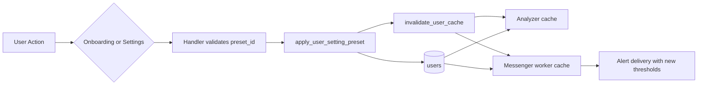
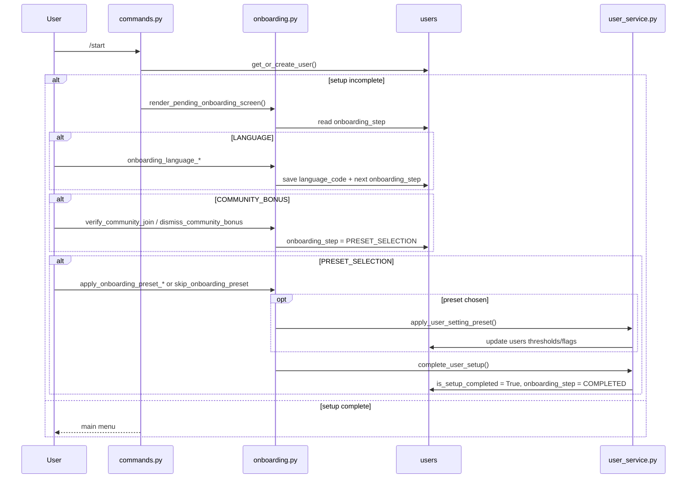

# STRATEGY_PROFILES_SYSTEM

Документ фиксирует фактическую архитектуру контура пресетов настроек и связанного мастера онбординга в CSL.

Источником истины является рабочий код в `src/`; [IMPLEMENTATION_PLAN.md](../IMPLEMENTATION_PLAN.md) используется только как исторический контекст и точка сравнения.

## Scope

- Базовые типы и конфигурация:
  - [dto.py](../src/core/dto.py)
  - [config.py](../src/core/config.py)
- Модель пользователя и миграции:
  - [models.py](../src/database/models.py)
  - [c91d4f7b2a10_add_user_onboarding_step.py](../alembic/versions/c91d4f7b2a10_add_user_onboarding_step.py)
- CRUD и применение настроек:
  - [user_service.py](../src/database/crud/user_service.py)
- UI и navigation flow:
  - [onboarding.py](../src/bot/handlers/onboarding.py)
  - [settings.py](../src/bot/handlers/settings.py)
  - [settings_kb.py](../src/bot/keyboards/settings_kb.py)
  - [commands.py](../src/bot/handlers/commands.py)
  - [profile.py](../src/bot/handlers/profile.py)
  - [wallet.py](../src/bot/handlers/wallet.py)
- Потребление настроек аналитикой и доставкой:
  - [analyzer.py](../src/services/analyzer.py)
  - [messenger_worker.py](../src/services/messenger_worker.py)
- Локализация экранов:
  - `assets/locales/ru/main.ftl`
  - `assets/locales/ru/settings.ftl`
  - `assets/locales/en/main.ftl`
  - `assets/locales/en/settings.ftl`

---

## Explanation

### Контур пресетов как слой ускоренного входа в «Улей»

Функционал пресетов решает две задачи одновременно:

- ускоряет первичную настройку для новых пользователей;
- дает безопасный способ вернуть систему к рабочему профилю без ручной перенастройки десятков полей.

В текущем коде пресет не является UI-ярлыком поверх двух-трех порогов. Это полноценный persisted configuration profile, который записывается в таблицу `users` как набор рабочих порогов и флагов аналитики.

Практически это означает:

- источник истины для пресета живет в `config.SETTING_PRESETS`;
- применение пресета меняет именно пользовательское persisted state, а не временный session-state;
- аналитическое ядро и messenger worker читают уже обновленные значения из cache/DB без дополнительной интерпретации UI.



### Почему пресет реализован как полный профиль, а не как частичный patch

Текущая реализация сознательно использует `SettingPresetDTO` как полный снимок конфигурации пользователя:

- USD-пороги;
- MCAP-пороги;
- OI-пороги;
- флаги триггеров;
- флаги отображения аналитических блоков.

Такой подход важен по двум причинам:

- переключение между `USD` и `% MCAP` не разрушает профиль, потому что обе группы порогов записаны заранее;
- аналитический слой не обязан “догадываться”, какие значения считать дефолтами для отсутствующих полей.

Это отличается от ранней идеи “USD-only profile” и фактически переводит пресет в роль готового domain template.

### Онбординг как persisted wizard, а не линейная цепочка callback'ов

Базовый план предполагал просто вставить выбор пресета в цепочку регистрации. Рабочий код пошел дальше и сделал мастер восстановления состояния через поле `users.onboarding_step`.

Это решение убирает два класса проблем:

- пользователь не теряет прогресс мастера после повторного `/start`;
- разные точки входа (`/start`, `back_to_main`, входы из wallet/profile`) могут корректно вернуть его на актуальный шаг.

Фактический lifecycle незавершенного пользователя:

1. создается `User` с дефолтными порогами из модели БД;
2. выбирается язык;
3. при наличии оффера показывается bonus-screen сообщества;
4. затем показывается экран выбора пресета;
5. пользователь либо применяет пресет, либо пропускает шаг;
6. `complete_user_setup()` завершает мастер и переводит `onboarding_step` в `COMPLETED`.



### Почему меню настроек разделено на корень, триггеры и вид сообщения

Фактический рефакторинг UI ушел дальше исходного плана фаз 3-4. Вместо единого “pilot cockpit” экран настроек сейчас разделен на:

- корневой экран со сводкой и тремя ветками;
- `Фильтры триггеров`;
- `Вид сообщений`.

Архитектурный смысл разделения:

- корень выступает как index screen, а не как поле ручного редактирования всех параметров;
- подменю триггеров содержит все, что реально влияет на вероятность появления алерта;
- подменю вида сообщений изолирует косметические переключатели содержимого.

Это делает навигацию совместимой с проектным правилом “назад на один уровень вверх”, а не в корень дерева.

### Где проходит фактическая граница между trigger-settings и display-settings

Желаемая модель UI звучит как:

- trigger settings влияют на появление алерта;
- display settings влияют только на текст сообщения.

Однако рабочий код содержит важный нюанс:

- `alert_rsi` и `alert_cvd` действительно используются как display-флаги при построении payload сообщения;
- `alert_oi` одновременно участвует и в trigger-логике, и в display-payload.

Это видно по `messenger_worker._check_triggers_from_dto()`:

- `enable_oi=target["alert_oi"]` передается в `evaluate_trigger_logic(...)`;
- затем `show_oi=target["alert_oi"]` попадает в `TriggerResult`.

Следствие:

> UI уже разделен концептуально, но `alert_oi` пока остается гибридным флагом и не соответствует полностью чистой модели `trigger_oi` vs `show_oi`.

Это не делает систему некорректной, но фиксирует архитектурный долг для будущего разделения.

### Как изменения доходят до аналитического ядра

Контур подхвата изменений остается единым для всех настроек:

- handler меняет `User`;
- CRUD делает `commit`;
- вызывается `invalidate_user_cache(...)`;
- кэш analyzer и messenger worker пересобирается из актуальных пользователей;
- Redis Pub/Sub рассылает событие инвалидации.

Важно, что `invalidate_user_cache(...)` внутри себя гасит исключения и только логирует ошибку.

Это означает:

- UI может показать пользователю успешное применение пресета;
- при сбое Redis/refresh логика eventually consistency все равно восстановится через периодическое обновление кэша;
- но моментальный strong guarantee для “The Brain уже точно увидел новый пресет” в текущем коде отсутствует.

### Фактические отклонения от плана

Ниже перечислены расхождения между [IMPLEMENTATION_PLAN.md](../IMPLEMENTATION_PLAN.md) и рабочим кодом:

1. `SettingPresetDTO` расширен четырьмя MCAP-полями и фактически описывает гибридный профиль, а не исходный USD-only шаблон.
2. `config.SETTING_PRESETS` хранится как поле `Settings`, а не только как модульная константа.
3. Для резюма мастера добавлено persisted поле `users.onboarding_step` и отдельная миграция.
4. Выбор пресета в онбординге больше не является обязательным: есть ветка `skip_onboarding_preset`, которая завершает setup с дефолтными настройками БД.
5. Меню настроек было дополнительно разделено на root / trigger filters / message display, хотя базовый план фаз 3-4 описывал только каталог пресетов и confirmation screen.
6. Плановая заметка “успех показывать только после подтвержденной Redis-инвалидации” не реализована: ошибка инвалидации логируется, но не отменяет успешный UI-flow.
7. Плановая future-proof идея “подставлять дефолты для неполного DTO” тоже не реализована: `apply_user_setting_preset()` ожидает полноценный DTO и не мержит отсутствующие поля.
8. Историческая рекомендация “пресеты должны принудительно выставлять USD” уже не соответствует рабочему коду: `SCALPER` и `BALANCED` стартуют в `PERCENT`, `CONSERVATIVE` в `USD`.

---

## Reference

### `src/core/dto.py`

Источник: [dto.py](../src/core/dto.py)

#### Type aliases

| Элемент | Тип | Назначение |
| :--- | :--- | :--- |
| `SettingPresetId` | `Literal["SCALPER", "BALANCED", "CONSERVATIVE"]` | Допустимые идентификаторы пресетов |
| `UserOnboardingStep` | `Literal["LANGUAGE", "COMMUNITY_BONUS", "PRESET_SELECTION", "COMPLETED"]` | Persisted state мастера онбординга |

#### `SettingPresetDTO`

Сигнатура:

```python
@dataclass(slots=True, frozen=True)
class SettingPresetDTO:
    threshold: float
    threshold_cascade: float
    threshold_mode: Literal["USD", "PERCENT"]
    threshold_oi_percent: float
    threshold_oi_value: float
    threshold_mcap_pct: float
    threshold_mcap_usd_min: float
    threshold_cascade_mcap_pct: float
    threshold_cascade_mcap_usd_min: float
    alert_cascade: bool
    alert_volume: bool
    alert_squeeze: bool
    alert_longs: bool
    alert_shorts: bool
    alert_oi: bool
    alert_rsi: bool
    alert_cvd: bool
```

Комментарий:

- `frozen=True` делает пресет immutable domain template;
- DTO сразу кодирует и trigger-пороги, и display-флаги;
- MCAP-поля присутствуют на том же уровне значимости, что и USD-поля.

### `src/core/config.py`

Источник: [config.py](../src/core/config.py#L71-L131)

#### `Settings.SETTING_PRESETS`

Тип:

```python
SETTING_PRESETS: dict[str, SettingPresetDTO]
```

Реализованные профили:

| Preset | `threshold_mode` | USD volume | USD cascade | MCAP volume | MCAP cascade | OI |
| :--- | :--- | ---: | ---: | ---: | ---: | ---: |
| `SCALPER` | `PERCENT` | `8000` | `5000` | `0.005` + floor `1000` | `0.008` + floor `1000` | `5% / 100000` |
| `BALANCED` | `PERCENT` | `20000` | `15000` | `0.01` + floor `5000` | `0.015` + floor `5000` | `15% / 300000` |
| `CONSERVATIVE` | `USD` | `100000` | `80000` | `0.05` + floor `20000` | `0.1` + floor `20000` | `20% / 500000` |

Ключевой фрагмент:

```python
SETTING_PRESETS: dict[str, SettingPresetDTO] = Field(
    default_factory=lambda: {
        "SCALPER": SettingPresetDTO(
            threshold=8000.0,
            threshold_cascade=5000.0,
            threshold_mode="PERCENT",
            ...
        ),
        ...
    }
)
```

Комментарий:

- пресеты являются частью общего settings-контракта приложения;
- поле доступно как `config.SETTING_PRESETS`, что важно для handler/CRUD слоев;
- булевы alert-флаги сейчас у всех трех профилей включены.

### `src/database/models.py`

Источник: [models.py](../src/database/models.py#L9-L54)

#### Поля `User`, связанные с пресетами и мастером

| Поле | Тип | Назначение |
| :--- | :--- | :--- |
| `is_setup_completed` | `bool` | Флаг завершения мастера |
| `onboarding_step` | `str` | Persisted state текущего шага онбординга |
| `threshold` | `float` | USD-порог volume alert |
| `threshold_cascade` | `float` | USD-порог cascade alert |
| `threshold_mode` | `str` | Активный режим применения порогов |
| `threshold_mcap_pct` | `float` | Порог volume alert в доле от MCAP |
| `threshold_mcap_usd_min` | `float` | Нижний USD floor для MCAP-mode |
| `threshold_cascade_mcap_pct` | `float` | Порог cascade в доле от MCAP |
| `threshold_cascade_mcap_usd_min` | `float` | Нижний USD floor для cascade в MCAP-mode |
| `alert_cascade` / `alert_volume` / `alert_squeeze` | `bool` | Trigger-флаги типов ликвидационных событий |
| `alert_longs` / `alert_shorts` | `bool` | Trigger-флаги направления |
| `alert_oi` | `bool` | Гибридный флаг: и trigger, и display |
| `threshold_oi_percent` / `threshold_oi_value` | `float` | Пороги OI trigger |
| `alert_cvd` / `alert_rsi` | `bool` | Display-флаги блоков аналитики |

#### Дефолты БД

Практически важные дефолты для ветки “пропустить пресет”:

```python
threshold = 15000.0
threshold_cascade = 25000.0
threshold_mode = "USD"
threshold_mcap_pct = 0.01
threshold_mcap_usd_min = 10000.0
threshold_cascade_mcap_pct = 0.015
threshold_cascade_mcap_usd_min = 20000.0
threshold_oi_percent = 6.0
threshold_oi_value = 500000.0
```

Комментарий:

- именно эти значения получает пользователь, если завершает онбординг через `skip_onboarding_preset`;
- пресеты не обязательны для завершения регистрации.

### `src/database/crud/user_service.py`

Источник: [user_service.py](../src/database/crud/user_service.py)

#### `complete_user_setup`

Сигнатура:

```python
async def complete_user_setup(session: AsyncSession, user_id: int) -> User | None:
```

Поведение:

- читает пользователя по `id`;
- выставляет `is_setup_completed = True`;
- выставляет `onboarding_step = "COMPLETED"`;
- коммитит и делает `refresh`.

Ключевой фрагмент:

```python
user.is_setup_completed = True
user.onboarding_step = "COMPLETED"
await session.commit()
await session.refresh(user)
```

#### `update_user_settings`

Сигнатура:

```python
async def update_user_settings(session: AsyncSession, user_id: int, **kwargs) -> User | None:
```

Назначение:

- универсальный partial-update любых полей `User`;
- используется ручными настройками в `settings.py`.

#### `apply_user_setting_preset`

Сигнатура:

```python
async def apply_user_setting_preset(session: AsyncSession, user_id: int, preset_id: str) -> User | None:
```

Контракт:

- нормализует `preset_id`;
- берет `SettingPresetDTO` из `config.SETTING_PRESETS`;
- формирует единый `update_values`;
- делает bulk `update(User)...values(**update_values)`;
- коммитит транзакцию;
- перечитывает пользователя;
- вызывает `invalidate_user_cache(user.id)`.

Ключевой фрагмент:

```python
update_values = {
    "threshold": float(preset.threshold),
    "threshold_cascade": float(preset.threshold_cascade),
    "threshold_oi_percent": float(preset.threshold_oi_percent),
    "threshold_oi_value": float(preset.threshold_oi_value),
    "threshold_mcap_pct": float(preset.threshold_mcap_pct),
    "threshold_mcap_usd_min": float(preset.threshold_mcap_usd_min),
    "threshold_cascade_mcap_pct": float(preset.threshold_cascade_mcap_pct),
    "threshold_cascade_mcap_usd_min": float(preset.threshold_cascade_mcap_usd_min),
    "alert_cascade": bool(preset.alert_cascade),
    "alert_volume": bool(preset.alert_volume),
    "alert_squeeze": bool(preset.alert_squeeze),
    "alert_longs": bool(preset.alert_longs),
    "alert_shorts": bool(preset.alert_shorts),
    "alert_oi": bool(preset.alert_oi),
    "alert_rsi": bool(preset.alert_rsi),
    "alert_cvd": bool(preset.alert_cvd),
    "threshold_mode": str(preset.threshold_mode).upper(),
}
```

Комментарий:

- числовые значения MCAP сохраняются без `round()`, чтобы не терять точность вроде `0.005`;
- `threshold_mode` добавляется последним на уровне формирования payload;
- защитного merge с дефолтами для неполного DTO нет.

### `src/bot/handlers/onboarding.py`

Источник: [onboarding.py](../src/bot/handlers/onboarding.py)

#### Экран выбора пресета

Сигнатуры:

```python
def get_presets_selection_kb(i18n: I18nContext) -> InlineKeyboardMarkup
async def render_presets_selection_screen(event, i18n) -> None
```

Факты реализации:

- экран рендерится баннером `ImagePaths.SETTINGS`;
- работает и для `Message`, и для `CallbackQuery`;
- содержит три preset-кнопки и кнопку `Пропустить`.

Ключевой фрагмент:

```python
builder.row(
    InlineKeyboardButton(
        text=i18n.get("onboarding-preset-button-skip"),
        callback_data="skip_onboarding_preset",
    )
)
```

#### Резюмирование мастера

Сигнатуры:

```python
def _resolve_onboarding_step(user: User) -> str
async def render_pending_onboarding_screen(event, user, i18n) -> None
```

Поведение:

- `COMMUNITY_BONUS` автоматически деградирует в `PRESET_SELECTION`, если бонус уже использован или недоступен;
- неизвестный `onboarding_step` откатывается в `LANGUAGE`;
- `/start` и другие точки входа используют именно эту функцию для восстановления текущего шага.

#### Callback chain мастера

| Callback | Роль |
| :--- | :--- |
| `onboarding_language_*` | Сохраняет язык и переводит на следующий шаг |
| `dismiss_community_bonus` | Ставит `PRESET_SELECTION` и показывает выбор пресета |
| `verify_community_join` | Начисляет bonus, затем ведет на выбор пресета |
| `apply_onboarding_preset_*` | Применяет preset, завершает setup, открывает главное меню |
| `skip_onboarding_preset` | Завершает setup без применения preset |

Ключевой фрагмент ветки skip:

```python
@router.callback_query(F.data == "skip_onboarding_preset")
async def process_skip_onboarding_preset(...):
    completed_user = await complete_user_setup(session, callback.from_user.id)
    ...
    await render_main_menu(callback, completed_user, callback.from_user.full_name, i18n)
```

Комментарий:

- “быстрый старт через пресет” в рабочем коде необязателен;
- фактическая семантика skip: оставить defaults БД и завершить setup.

### `src/bot/handlers/commands.py`

Источник: [commands.py](../src/bot/handlers/commands.py#L114-L157)

#### `/start` и `back_to_main`

Ключевой фрагмент:

```python
if not user.is_setup_completed:
    await render_pending_onboarding_screen(message, user, i18n)
    return
```

Комментарий:

- главное меню больше не является unconditional target для незавершенного пользователя;
- он всегда возвращается в текущий шаг persisted wizard.

### `src/bot/handlers/settings.py`

Источник: [settings.py](../src/bot/handlers/settings.py)

#### Структура экранов

| Функция | Назначение |
| :--- | :--- |
| `render_settings_menu(...)` | Корневой экран со сводкой |
| `render_settings_filters_menu(...)` | Подменю trigger filters |
| `render_settings_display_menu(...)` | Подменю message display |
| `render_setting_presets_catalog(...)` | Каталог пресетов |
| `render_setting_preset_confirmation(...)` | Экран подтверждения |

#### Ручные настройки

FSM-состояния:

```python
class SettingsStates(StatesGroup):
    waiting_for_threshold = State()
    waiting_for_cascade_threshold = State()
    waiting_for_oi_thresholds = State()
    waiting_for_mcap_pct = State()
    waiting_for_mcap_min_usd = State()
    waiting_for_mcap_cas_pct = State()
    waiting_for_mcap_cas_min_usd = State()
```

#### Применение пресета из settings

Ключевой фрагмент:

```python
@router.callback_query(F.data.startswith("apply_setting_preset_"))
async def process_apply_setting_preset(...):
    user = await apply_user_setting_preset(session, callback.from_user.id, preset_id)
    ...
    await render_settings_menu(callback, user, i18n)
```

Комментарий:

- в отличие от онбординга, здесь есть отдельный confirmation step;
- после применения пользователь возвращается в корень настроек, а не в каталог пресетов.

#### Контекстный возврат из help-экранов

Ключевой фрагмент:

```python
await _render_settings_screen(callback, text, get_back_to_settings_kb("settings_filters"))
...
await _render_settings_screen(callback, text, get_back_to_settings_kb("settings_display"))
```

Практический смысл:

- кнопка `Назад` из справки знает, в какое подменю вернуть пользователя;
- навигация соблюдает проектный принцип строгой вложенности.

### `src/bot/keyboards/settings_kb.py`

Источник: [settings_kb.py](../src/bot/keyboards/settings_kb.py)

#### Основные клавиатуры

| Функция | Назначение |
| :--- | :--- |
| `get_settings_kb(user)` | Корневой экран: profile / filters / display / back |
| `get_settings_filters_kb(user)` | Переключение режима, порогов и trigger-флагов |
| `get_settings_display_kb(user)` | Переключение display-флагов |
| `get_presets_selection_kb()` | Каталог пресетов из настроек |
| `get_preset_confirmation_kb(preset_id)` | Подтверждение применения |
| `get_back_to_settings_kb(back_callback_data)` | Контекстный возврат из help |

Комментарий:

- root keyboard специально минималистична и больше не смешивает все controls на одном экране;
- разделение на три ветки реализовано именно на уровне клавиатур, а не только текстов.

### `src/services/analyzer.py`

Источник: [analyzer.py](../src/services/analyzer.py#L24-L137)

#### Кэш целевых настроек

`CachedAlertTarget` содержит все поля, необходимые для быстрого принятия решения:

- режим порогов;
- USD и MCAP thresholds;
- OI thresholds;
- alert-флаги.

Ключевой фрагмент:

```python
class CachedAlertTarget(TypedDict):
    id: int
    language_code: str
    threshold: float
    threshold_cascade: float
    threshold_mode: str
    threshold_mcap_pct: float
    threshold_mcap_usd_min: float
    threshold_cascade_mcap_pct: float
    threshold_cascade_mcap_usd_min: float
    threshold_oi_percent: float
    threshold_oi_value: float
    alert_cascade: bool
    alert_oi: bool
    alert_squeeze: bool
    alert_volume: bool
    alert_longs: bool
    alert_shorts: bool
    alert_rsi: bool
    alert_cvd: bool
```

#### `invalidate_user_cache`

Сигнатура:

```python
async def invalidate_user_cache(user_id: int | None = None) -> None:
```

Фактическое поведение:

- сразу вызывает `_update_cache_logic()`;
- публикует событие через `redis_bus.publish_cache_invalidation(...)`;
- логирует ошибку, но не бросает исключение наружу.

### `src/services/messenger_worker.py`

Источник: [messenger_worker.py](../src/services/messenger_worker.py#L60-L223)

#### Trigger evaluation и message payload

Сигнатура:

```python
async def _check_triggers_from_dto(target: CachedAlertTarget, dto: SignalDTO) -> TriggerResult | None:
```

Факты реализации:

- `effective_mode` переключается на `USD`, если `impact["is_fallback"]` true;
- при `PERCENT` режиме threshold проверяется вместе с USD floor;
- `evaluate_trigger_logic(...)` получает enable-флаги напрямую из пользовательского профиля.

Ключевой фрагмент:

```python
alert_type = evaluate_trigger_logic(
    ...
    oi_threshold_pct=target["threshold_oi_percent"],
    oi_threshold_value=target["threshold_oi_value"],
    ...
    enable_cascade=target["alert_cascade"],
    enable_oi=target["alert_oi"],
    enable_squeeze=target["alert_squeeze"],
    enable_volume=target["alert_volume"],
)
```

Возвращаемый `TriggerResult`:

```python
return {
    "alert_title": alert_title,
    "alert_type": alert_type,
    "threshold_cascade": target["threshold_cascade"],
    "show_oi": target["alert_oi"],
    "show_cvd": target["alert_cvd"],
    "show_rsi": target["alert_rsi"],
    "used_mcap": used_mcap,
}
```

Комментарий:

- `alert_oi` одновременно участвует и в gating алерта, и в формировании message payload;
- `alert_rsi` и `alert_cvd` выступают как display-only flags;
- переключение режима `USD/PERCENT` имеет прямой runtime-эффект в worker-слое и не ограничивается UI.

### Localization Coverage

Фактические ключевые группы локализации:

- `main.ftl`
  - onboarding language screen
  - onboarding preset screen
  - onboarding preset buttons / applied / skipped
  - community bonus screen
- `settings.ftl`
  - root summary
  - trigger filters screen
  - message display screen
  - help texts
  - preset catalog / confirmation / applied toast
  - keyboard labels

Практический инвариант:

- все новые preset- и settings-screen'ы имеют физическое покрытие и в `ru`, и в `en`.

### Production Invariants

Фактические инварианты этого модуля:

1. Источник истины для пресета — `config.SETTING_PRESETS`, а не локализация и не callback payload.
2. Применение пресета всегда должно идти через `apply_user_setting_preset(...)`, а не через ручной набор `update_user_settings(...)`.
3. Незавершенный онбординг обязан резюмироваться через `users.onboarding_step`.
4. Подхват новых настроек аналитическим слоем зависит от `invalidate_user_cache(...)` и периодического refresh кэша.
5. Skip-ветка онбординга должна сохранять дефолтные значения БД, а не создавать скрытый “пустой пресет”.
6. Пока не введены отдельные `show_oi` и `trigger_oi`, UI-разделение display/trigger нельзя считать полностью строгим.

### Review Checklist

- совпадает ли `SettingPresetDTO` с фактическими полями `User`;
- покрывает ли новый пресет и USD, и MCAP thresholds;
- используется ли для применения именно `apply_user_setting_preset(...)`;
- не сломан ли `onboarding_step` при новых входных точках;
- не нарушена ли навигация `Назад` между root / filters / display / help;
- добавлены ли локализационные ключи в обе локали;
- не создано ли новое расхождение между display-описанием и реальным trigger-поведением `alert_oi`.
