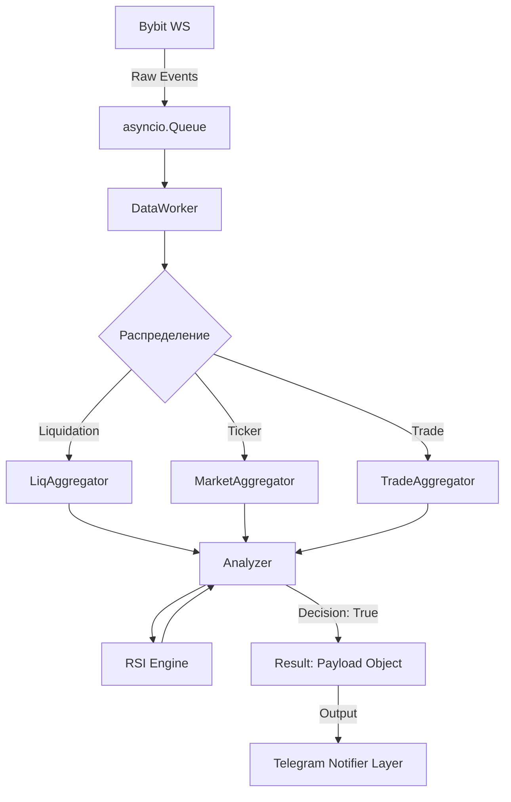

# Data Core & Analytics (Ядро данных и аналитика)

Этот слой является «двигателем» системы. Он отвечает за жизненный цикл данных: от приема из WebSocket до принятия решения о сигнале. Здесь сосредоточена вся математика и логика фильтрации.

### Структура сервисов слоя
```text
src/services/
├── aggregators/         # In-Memory хранилища (L1 Cache)
│   ├── liq_aggregator.py
│   ├── market_aggregator.py
│   └── trade_aggregator.py
├── indicators/          # Технический анализ
│   └── rsi.py
├── worker.py            # Потребитель очереди (Consumer)
├── analyzer.py          # Логика принятия решений (Brain)
├── symbol_sync.py       # Синхронизация торговых пар
├── warmup.py            # Первичный прогрев данных
├── retention.py         # Очистка долгосрочного хранилища (DB)
└── metrics_service.py   # Сбор технических метрик системы
```

---

## 1. Reference (Технический справочник)

### Схема движения данных (Data Pipeline)


### Основные компоненты
*   **DataWorker (`worker.py`)**: 
    - Оркестрирует потоки. Предотвращает перегрузку системы через `worker_semaphore` (лимит 100 одновременных задач).
*   **Analyzer (`analyzer.py`)**: 
    - Вычисляет типы сигналов: `CASCADE`, `SQUEEZE`, `OI_PUMP`, `VOLUME`.
    - Содержит логику **Smart Threshold** (защита от спама на основе волатильности).
*   **Aggregators**: 
    - Используют `collections.deque` с фиксированным `maxlen` для обеспечения константной скорости доступа O(1) и автоматического контроля памяти.
*   **MetricsService**: 
    - Собирает данные о CPU, RAM, размере очереди и задержках (Latency) для мониторинга здоровья «ядра».

---

## 2. Explanation (Архитектурная логика)

### Изоляция от интерфейсов (Headless Architecture)
Логика в `analyzer.py` спроектирована так, чтобы не знать о существовании Telegram. Она оперирует объектами `user_id`, `settings` и `thresholds`. Это позволяет запускать тесты аналитики без поднятия бота и готовит почву для системы «Улей».

### Почему мы используем Deque вместо SQL для аналитики?
Для расчета RSI или CVD нам нужны данные за последние 60 минут по 400+ монетам. 
- **SQL:** Потребовал бы 400+ запросов `SELECT` в минуту, что создало бы нагрузку на диск и IO-задержки.
- **Deque (In-Memory):** Все данные уже лежат в RAM в готовом для итерации виде. Доступ к ним быстрее в ~1000 раз.

### Механика Smart Threshold (Анти-спам 1.2x)
Чтобы трейдер не получал 10 уведомлений в секунду при обвале рынка, внедрена логика «прогрессии»:
Если по монете `BTC` уже был алерт, следующий отправится только если:
1. Прошел кулдаун (60 сек).
2. **ИЛИ** объем ликвидаций вырос на 20% и более. Это сигнализирует об ускорении движения, а не просто о его продолжении.

---

## 3. How-to Guides (Прикладные инструкции)

### Как добавить новый аналитический индикатор?
1. Создайте файл в `src/services/indicators/` (например, `ema.py`).
2. Реализуйте расчет, принимающий `list[float]` (цены).
3. В `market_aggregator.py` добавьте сбор необходимых данных в новую очередь `deque`.
4. Вызовите расчет в `analyzer.py` перед формированием пейлоада.

### Как изменить глубину памяти агрегаторов?
Если вам нужно считать RSI не по 50 барам, а по 200:
1. В `market_aggregator.py` найдите инициализацию `self.rsi_prices`.
2. Измените `maxlen=50` на `maxlen=200`.
3. Убедитесь, что `warmup.py` также запрашивает 200 свечей через параметр `limit`.