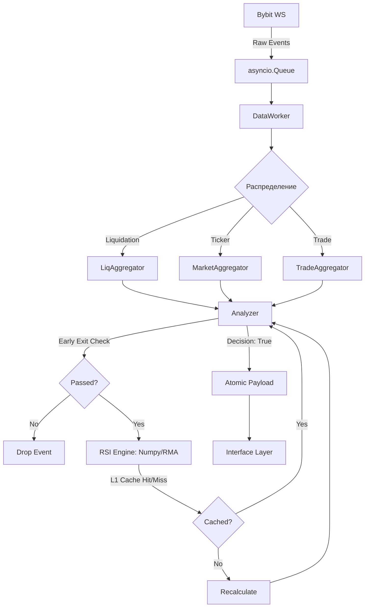

# Data Engine (Движок данных и аналитика)

Этот слой является «сердцем» системы, отвечающим за полный цикл обработки рыночных данных: от приема сырых событий из WebSocket до генерации сигналов. Слой оптимизирован для работы в режиме реального времени с минимальными задержками.

### Структура сервисов

```text
src/services/
├── aggregators/               # In-Memory хранилища (L1 Cache)
│   ├── base.py                # Абстрактный интерфейс
│   ├── liq_aggregator.py      # Ликвидации (O(1) доступ)
│   ├── market_aggregator.py   # Price/OI + RSI L1 Cache
│   └── trade_aggregator.py    # CVD (Минутные бакеты)
├── indicators/                # Технический анализ
│   └── rsi.py                 # Numpy RSI
├── worker.py                  # Потребитель очереди (Consumer)
├── analyzer.py                # Логика принятия решений (Brain)
└── warmup.py                  # Синхронный прогрев (Bootstrap)
```

***

## 1. Reference (Технический справочник)

### Обновленная схема движения данных



### Ключевые оптимизации

- **Numpy RSI (RMA)**: Математический модуль переведен на `numpy` с использованием алгоритма RMA (Running Moving Average), что устранило накладные расходы `pandas` и снизило время расчета в 10 раз.
- **O(1) Access**: Все агрегаторы используют `collections.deque` с фиксированным `maxlen`. Доступ к данным и их очистка выполняются за константное время.
- **Vicinity Search (±45с)**: При поиске исторической точки (например, 5 минут назад) используется алгоритм обхода соседей, позволяющий найти достоверную точку отсчета даже при микро-дрифте таймстампов.
- **User Cache (DTO)**: Данные пользователей кэшируются в памяти как легковесные `TypedDict` объекты, обновляемые раз в 60 секунд, что исключает тысячи запросов к БД при рассылке.

***

## 2. Explanation (Архитектурная логика)

### Стратегия "Early Exit" (Раннее отсечение)

Для поддержания высокой производительности при шторме ликвидаций, `analyzer.py` применяет двухэтапную фильтрацию:

1. **System Level**: Глобальное отсечение шума (`MIN_LIQ_VALUE_FILTER`).
2. **User Level**: Если событие не проходит ни по одному из персональных порогов пользователя (Volume, Cascade, OI), выполнение для этого пользователя прекращается до вызова тяжелых функций (RSI, CVD).

### L1 Analytics Cache

Расчет RSI — самая дорогая операция. Мы внедрили систему инвалидации кэша:

- Кэш RSI (`_rsi_cache`) привязан к паре `(last_price, bars_count)`.
- Если цена не изменилась и новый бар не закрылся — возвращается значение из памяти.

### Эффективность ТОП-списков

Для формирования рейтингов (OI UP/DOWN) в дэшборде используется `heapq.nlargest`. Это эффективнее полной сортировки `sorted()`, так как алгоритм поддерживает кучу (heap) только для N элементов, что дает сложность O(T log N) вместо O(T log T).

***

## 3. How-to Guides (Прикладные инструкции)

### Как изменить "пол" чувствительности системы?

Если бот обрабатывает слишком много мелких событий, нагружая CPU:

1. В `config `измените `MIN_LIQ_VALUE_FILTER` (например, на `500.0`).
2. Это отсечет все ликвидации ниже этой суммы на самом раннем этапе (в `DataWorker`).

