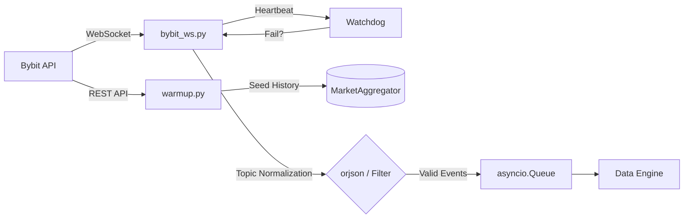

# Ingestion Layer (Слой приема данных)

Этот слой отвечает за стабильное поддержание соединений с Bybit V5 API, нормализацию входящего потока и мониторинг здоровья сокетов.

### Структура сервисов слоя
```text
src/services/
├── bybit_ws.py      # Ядро WebSocket (Pusher) + Watchdog
├── warmup.py        # REST-инициализатор (Bootstrap)
└── symbol_sync.py   # Монитор листингов (Hot Swap)
```

---

## 1. Reference (Технический справочник)

### Схема потока данных


### Описание модулей
*   **`bybit_ws.py`**:
    - **Назначение**: Поддержание пула соединений.
    - **Топики**: `liquidation`, `tickers`, `publicTrade`.
    - **Параметры**: `WS_CHUNK_SIZE = 25` (монет на один сокет).
*   **`warmup.py`**:
    - **Назначение**: Устранение «эффекта холодного старта».
    - **Действие**: Загружает последние 50 свечей и текущий OI/Price через HTTP-запросы до активации анализатора.
*   **`symbol_sync.py`**:
    - **Интервал**: 4 часа.
    - **Логика**: При обнаружении новой пары в `category: linear` вызывает цепочку `warmup` -> `listener.restart`.
### Ключевые механизмы
*   **Hot Swap (`add_new_symbol`)**: Система поддерживает динамическое добавление новых торговых пар без перезагрузки всего пула сокетов. При листинге новая пара прогревается через REST и подписывается на существующий или новый WS-чанк.
*   **Watchdog (Heartbeat)**: Каждый сокет мониторится на предмет "зависания". Если данные по топику не поступали более 60 секунд (при условии наличия активности на рынке), Watchdog инициирует переподключение конкретного чанка.
*   **Topic Normalization**: Исправлена проблема разного регистра в топиках (Bybit может присылать `BTCUSDT` и `btcusdt`). Все входящие символы принудительно приводятся к `UPPERCASE` на этапе входа.
*   **Limit 1000**: При синхронизации инструментов используется `limit=1000` для получения полного списка пар `linear` за один запрос.

---

## 2. Explanation (Архитектурная логика)

### Почему мы используем Chunking (разбиение по 25 монет)?
Bybit ограничивает количество подписок на один WebSocket-инстанс. Разбивка на чанки по 25 монет позволяет мониторить весь рынок (423+ пары), распределяя нагрузку между ~17 параллельными соединениями. Это также изолирует сбои: падение одного сокета прерывает поток только по 5% рынка.

### Роль Pre-filtering (Stage 1)
Для минимизации нагрузки на Event Loop, фильтрация происходит максимально близко к «входу»:
- **CVD Filter**: Сделки объемом меньше `$200` (параметр `MIN_TRADE_VALUE_FOR_CVD`) отсекаются внутри коллбэка сокета.
- **Thread Safety**: Использование `loop.call_soon_threadsafe` гарантирует, что данные из потоков библиотеки `pybit` безопасно попадают в асинхронную очередь без блокировки выполнения других задач.

---

## 3. How-to Guides (Прикладные инструкции)

### Как добавить новую монету в игнор-лист?
Все настройки фильтрации символов управляются через `.env`:
1. Откройте `.env`.
2. Добавьте тикер в переменную `IGNORED_SYMBOLS` (например, `IGNORED_SYMBOLS=USDCUSDT,EURUSDT`).
3. Перезапустите контейнеры: `./update.sh`.
