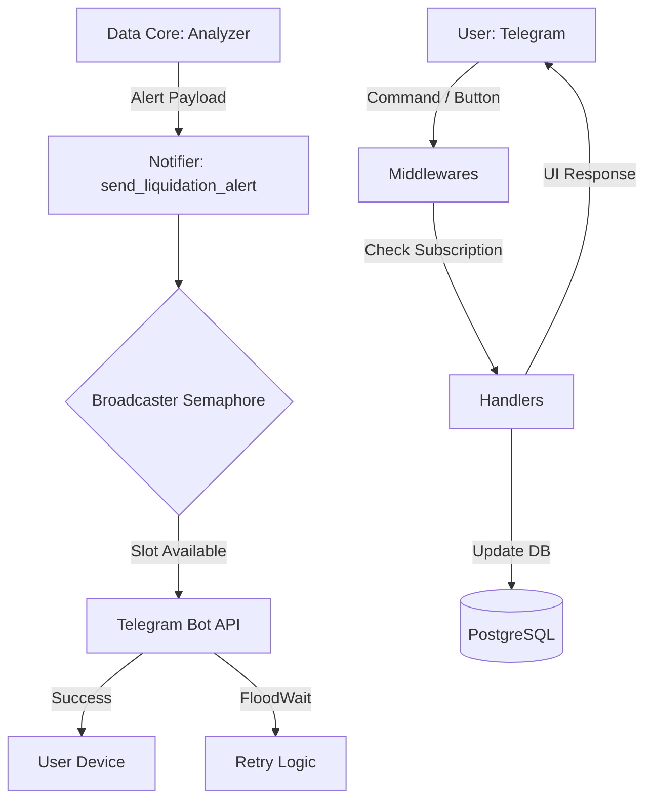

# Telegram Interface Layer (Интерфейс и доставка)

Этот слой переводит аналитические данные на язык интерфейса Telegram. Он управляет командами пользователя, формирует визуальные отчеты (кейборды) и обеспечивает доставку алертов с соблюдением лимитов Telegram API.

### Структура сервисов слоя

```text
src/bot/
├── handlers/           # Обработчики команд (commands, settings, shop)
├── keyboards/          # Интерактивные меню (Inline/Reply)
├── middlewares/        # Фильтры доступа (Block check)
├── utils/              # Форматтеры текста (Dashboard, Alerts)
└── notifier.py         # Ядро рассылки алертов (Throttling)

src/services/
├── dashboard.py        # Обновление VIP-дэшборда в канале
├── broadcast_service.py # Массовые рассылки админа
└── bouncer.py          # Сервис исключения (Gatekeeper)
```

***

## 1. Reference (Технический справочник)

### Схема доставки уведомлений (Delivery Path)



### Основные компоненты

- **Notifier (`notifier.py`)**:
  - Контролирует лимиты отправки. Использует `broadcaster_semaphore` для ограничения скорости до **25 сообщений в секунду** (безопасный порог Telegram).
- **Handlers (`handlers/`)**:
  - Модульная структура `aiogram 3.x`. Каждая фича (кошелек, настройки, админка) вынесена в отдельный роутер.
- **Middlewares**:
  - `BlockMiddleware` — проверяет статус пользователя в `SecurityManager` (кэш в памяти) до того, как запрос дойдет до обработчика.
- **Dashboard Worker**:
  - Раз в минуту редактирует закрепленное сообщение в канале. Использует `DashboardFormatter` для генерации сообщения дэшбоарда.

***

## 2. Explanation (Архитектурная логика)

### Broadcaster Throttling (25 msg/sec)

Telegram ограничивает рассылку (30 сообщений в секунду). Чтобы избежать `FloodWait`, который может парализовать бота на несколько минут, мы установили жесткий семафор на уровне 25 сообщений. Это гарантирует стабильную доставку даже во время «ликвидационного шторма», когда сотни юзеров должны получить сигнал одновременно.

### Разделение логики и оформления (Formatters)

Текст сообщений никогда не формируется внутри `analyzer.py`. Анализатор отдает только «сухие» цифры. Формирование текста (эмодзи, жирный шрифт, ссылки) происходит в `src/bot/utils/`. Это позволяет менять дизайн уведомлений без риска сломать логику расчетов.

### Почему используется `edit_message` для Дэшборда?

Вместо того чтобы спамить новыми сообщениями в VIP-канале, мы используем одно закрепленное сообщение. Это создает эффект «живого терминала», где данные (Топ ликвидаций, OI, RSI) обновляются в реальном времени, не засоряя историю чата.

***

## 3. How-to Guides (Прикладные инструкции)

### Как заблокировать пользователя?

Административная блокировка работает мгновенно через `SecurityManager`:

1. Используйте команду `/admin` -> Список юзеров -> Бан.
2. Система добавит ID в `blocked_users` (Python `set`), и `BlockMiddleware` начнет сбрасывать все запросы этого ID без обращения к БД.

