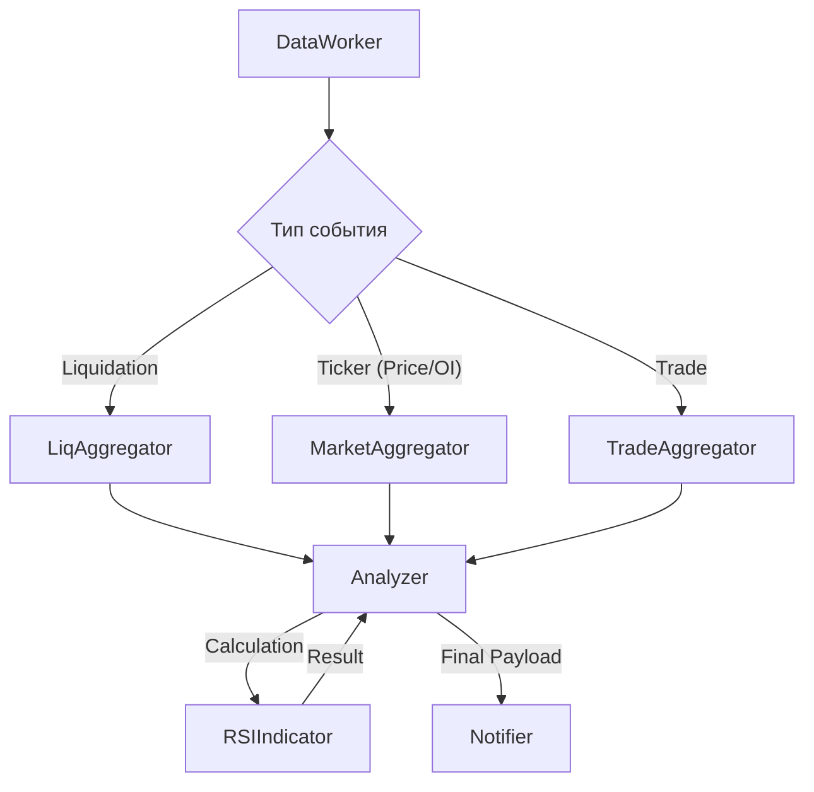

# Processing Layer (Агрегаторы и Индикаторы)

Этот слой отвечает за накопление данных в оперативной памяти (In-Memory), расчет скользящих средних, дельты объемов (CVD) и технических индикаторов (RSI).

### Структура сервисов слоя
```text
src/services/
├── aggregators/
│   ├── base.py              # Абстрактный интерфейс агрегаторов
│   ├── liq_aggregator.py    # Накопление и подсчет сумм ликвидаций
│   ├── market_aggregator.py # Снапшоты Price/OI и формирование RSI-баров
│   └── trade_aggregator.py  # Минутные бакеты для расчета CVD
└── indicators/
    └── rsi.py               # Математический модуль индекса относительной силы
```

---

## 1. Reference (Технический справочник)

### Схема трансформации данных (Processing Path)


### Описание модулей
*   **`liq_aggregator.py`**:
    - **Хранилище**: `dict[symbol, deque]` (глубина — 1 час).
    - **Метрики**: Суммы за 5 мин, 1 час, объем и количество в каскаде.
*   **`market_aggregator.py`**:
    - **Хранилище**: Снапшоты текущих значений и `deque` для минутной истории (60 мин).
    - **RSI-бары**: Формирует часовые точки (цены закрытия) для передачи в индикатор.
*   **`trade_aggregator.py`**:
    - **Логика**: Группирует сделки в минутные бакеты (Buy Volume vs Sell Volume).
    - **Метрики**: CVD (Cumulative Volume Delta) за произвольное количество минут.
*   **`rsi.py`**:
    - **Алгоритм**: Стандартный RSI (Wilder's Smoothing).
    - **Оптимизация**: (В процессе) Переход с `pandas` на `numpy` для устранения микро-задержек.

---

## 2. Explanation (Архитектурная логика)

### Почему In-Memory вместо БД для расчетов?
Для высокочастотного мониторинга (400+ монет) чтение из PostgreSQL при каждой ликвидации создало бы недопустимую задержку (latency). Использование `collections.deque` позволяет:
1.  **O(1) сложность**: Добавление новых данных и удаление старых происходит мгновенно.
2.  **Авто-очистка**: Параметр `maxlen` или метод `popleft()` в `cleanup_task` автоматически ограничивает потребление RAM, не давая процессу упасть по OOM (Out of Memory).

### Проблема «Холодного старта»
Агрегаторы начинают работать с пустыми очередями. Именно поэтому в системе существует `warmup.py`, который принудительно «заливает» исторические данные в `market_aggregator` и `liq_aggregator`, чтобы аналитика была доступна с первой секунды запуска, а не через час накопления.

---

## 3. How-to Guides (Прикладные инструкции)

### Как изменить окно расчета каскада?
Если каскадом считается слишком длинный промежуток времени:
1.  В `.env` или `config.py` найдите параметр `WINDOW_CASCADE`.
2.  Уменьшите значение (например, с 60 секунд до 30).
3.  Это сделает алерты типа `CASCADE` более строгими.

### Как изменить период RSI?
По умолчанию используется 14-периодный RSI на часовых барах:
1.  Для изменения периода: Переменная `RSI_PERIOD` в конфиге.
2.  Для изменения таймфрейма: Логика `now_bar = int(now // 3600)` в `market_aggregator.py`. (Замена `3600` на `300` переключит расчет на 5-минутные бары).