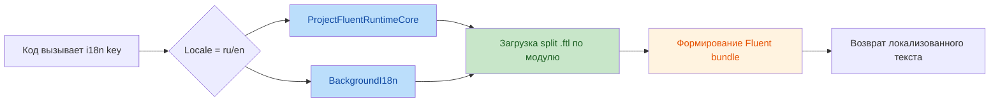
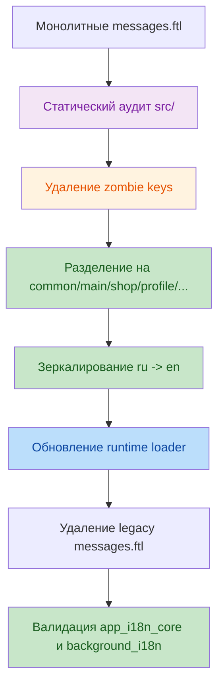

# Review And Rework Localization System Report

## 1. Executive Summary

В рамках ревью и доработки подсистемы локализации была выполнена полная миграция от монолитных файлов `messages.ftl` к модульной split-структуре локалей `ru` и `en`, синхронизированной с фактическим использованием ключей в `src/`.

Ключевые результаты:

- проведен статический аудит всех вызовов локализации в коде;
- удалены неиспользуемые и устаревшие legacy-ключи;
- русская локаль разбита на модульные `.ftl`-файлы по смысловым экранам и потокам;
- английская локаль приведена к зеркальной структуре и составу ключей;
- runtime и worker-layer переведены на загрузку всех `.ftl` из директории локали;
- полностью удалена legacy-зависимость от `messages.ftl` для поддерживаемых локалей;
- подтверждено отсутствие `Key not found` для живых вызовов локализации в `ru` и `en`.

На момент завершения работ критических production-блокеров в подсистеме локализации не выявлено.

## 2. Scope Of Work

Проверка и доработка затронули следующие области:

- аудит вызовов `i18n.get(...)`, `i18n.core.get(...)`, `LazyProxy(...)`, `background_i18n.get(...)`;
- проверка динамических ключей и selector-веток Fluent;
- проверка файлов локализации в `assets/locales/ru` и `assets/locales/en`;
- ревизия runtime-загрузчика в `src/core/i18n_runtime.py`;
- ревизия middleware-слоя в `src/bot/i18n.py`;
- проверка совместимости с bot-layer и worker-layer.

## 3. Change Overview

### 3.1 Business Flow

### 3.2 Technical Migration

## 4. Implemented Changes

### 4.1 Full Static Audit Of Localization Usage

Выполнен аудит директории `src/` с учетом:

- прямых вызовов `i18n.get(...)`;
- вызовов `i18n.core.get(...)`;
- ленивых ключей через `LazyProxy(...)`;
- worker-вызовов через `background_i18n.get(...)`;
- динамических ключей, передаваемых в клавиатуры и callback-flow;
- selector-конструкций Fluent, зависящих от переменных.

Функциональное назначение:

- исключить удаление реально используемых ключей;
- устранить риск runtime-ошибок из-за неполного покрытия локализации;
- привязать набор ключей к реальному коду, а не к историческому состоянию `.ftl`.

### 4.2 Cleanup Of Legacy And Unused Keys

Из русской и английской локали удалены неиспользуемые ключи, в том числе legacy-хвосты старого channel-flow и устаревших payment-screen сценариев, которые более не задействуются кодом.

Функциональное назначение:

- уменьшение когнитивной нагрузки при сопровождении;
- устранение ложных точек расхождения между локалями;
- снижение риска повторного использования устаревших текстов.

### 4.3 Split Localization Structure

Русская и английская локали приведены к единой структуре:

- `common.ftl`
- `main.ftl`
- `settings.ftl`
- `profile.ftl`
- `partner.ftl`
- `wallet.ftl`
- `shop.ftl`
- `worker.ftl`
- `admin/admin.ftl`
- `admin/admin_bi.ftl`
- `admin/admin_broadcast.ftl`
- `admin/admin_payments.ftl`

Функциональное назначение:

- модульная организация по экрану или смысловой цепочке;
- локальное сопровождение без необходимости работать с монолитным файлом;
- прозрачная связь между handler/keyboards/workers и соответствующим `.ftl`.

### 4.4 Runtime Loader Refactor

В `src/core/i18n_runtime.py` реализована загрузка всех `.ftl` файлов из директории локали вместо жесткой привязки к одному `messages.ftl`.

Дополнительно:

- `app_i18n_core` переведен на `ProjectFluentRuntimeCore`;
- `BackgroundI18n` переведен на ту же split-модель загрузки;
- удален legacy fallback на `messages.ftl`, так как обе поддерживаемые локали уже полностью мигрированы.

Функциональное назначение:

- единое поведение bot-layer и worker-layer;
- исключение скрытой зависимости от legacy-файлов;
- предсказуемая и прозрачная модель загрузки ресурсов.

### 4.5 English Mirror Synchronization

Английская локаль синхронизирована с русской:

- структура файлов совпадает;
- состав ключей совпадает;
- переменные перенесены без изменения имен;
- исключение по ключу языка сохранено осознанно:
  - `ru` содержит `kb-wallet-language-ru`;
  - `en` содержит `kb-wallet-language-en`.

Функциональное назначение:

- убрать накопленное рассинхронизированное наследие;
- обеспечить одинаковое поведение интерфейса на обеих поддерживаемых локалях;
- предотвратить частичные missing key ситуации между `ru` и `en`.

## 5. Technical Rationale

### 5.1 Why Split Files Instead Of Monolithic `messages.ftl`

Выбранная реализация технически целесообразна, потому что:

- улучшает сопровождаемость: изменение одного меню не требует прохода по огромному общему файлу;
- снижает вероятность merge-конфликтов;
- упрощает навигацию по локализации при разработке новых экранов;
- делает систему масштабируемой для дальнейшего роста админских и billing-потоков.

### 5.2 Why Source Code Became The Single Source Of Truth

Главным источником правды выбран `src/`, потому что:

- только код отражает фактические runtime-зависимости;
- `.ftl` исторически накапливают мертвые тексты и устаревшие ключи;
- кодо-ориентированный аудит минимизирует риск оставить неиспользуемый шум или удалить активный ключ.

### 5.3 Why Unified Loader For Bot And Worker Layers

Единая схема загрузки для `app_i18n_core` и `background_i18n` выбрана по следующим причинам:

- исключает расхождение между сообщениями интерфейса и фоновыми уведомлениями;
- предотвращает класс ошибок, когда bot-layer видит новые split-файлы, а worker-layer остается на legacy-структуре;
- повышает архитектурную консистентность и облегчает тестирование.

### 5.4 Why Legacy `messages.ftl` Was Removed Completely

Полное удаление `messages.ftl` для `ru` и `en` обосновано тем, что:

- обе локали полностью мигрированы;
- двойная схема split + legacy создает ложное ощущение fallback-надежности;
- наличие legacy-файла увеличивает риск дублирования ключей и неочевидного поведения при загрузке ресурсов.

## 6. Validation Results

Выполнены следующие проверки:

- проверка структуры `ru` и `en` на зеркальность;
- проверка количества ключей в split-локалях;
- проверка соответствия живых вызовов локализации в `src` и фактических ключей в `.ftl`;
- проверка `app_i18n_core` на получение живых ключей;
- проверка `background_i18n` на получение живых ключей;
- проверка отсутствия прямых ссылок на `messages.ftl` в runtime-коде;
- проверка diagnostics для новых `.ftl` файлов и `src/core/i18n_runtime.py`.

Итог валидации:

- `ru`: все живые ключи покрыты;
- `en`: все живые ключи покрыты;
- `Key not found` для реальных runtime-вызовов не обнаружено;
- конфликтов ключей между split-файлами не выявлено;
- критических архитектурных нарушений после финальной зачистки legacy-кода не осталось.

Примечание:

- selector-ключ `kb-settings-mode` требует передачи `mode` как runtime-аргумента и был отдельно проверен вручную для значений `USD` и `PERCENT`.

## 7. Final Conclusion

Подсистема локализации приведена к более зрелому, поддерживаемому и масштабируемому состоянию.

Достигнутые улучшения:

- очищен технический долг по локализации;
- устранена зависимость от монолитных legacy-файлов;
- синхронизированы `ru` и `en`;
- выровнено поведение интерфейсного и фонового слоев;
- подтверждена production-стабильность текущей реализации.

На текущем этапе система локализации готова к дальнейшему развитию без возврата к legacy-модели хранения переводов.
